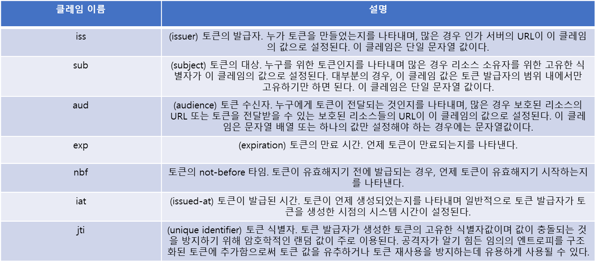

# OAUth 토큰
클라이언트는 인가 서버로부터 토큰을 발급받아 보호된 리소스에 전달한다.
인가 서버는 토큰을 생성해 클라이언트에게 발급하고, 토큰을 리소스 소유자의 권한 위임과 클라이언트의 권한과 연결시켜 관리한다.

보호된 리소스는 클라이언트로부터 전달받은 토큰이 클라이언트가 요청한 작업을 수행할 수 있는 권한이 있는지 확인한다.

토큰은 권한 위임 행위를 결과를 나타낸다.
리소스 소유자, 클라이언트, 인가 서버, 보호된 리소스, 권한 범위 그리고 권한 인가 결정에 대한 그 밖의 모든 것을 나타낸다.
클라이언트가 리소스 소유자를 거치지 않고 자신의 액세스 토큰을 갱신할 때는 리프레시 토큰을 이용한다.
OAuth 토큰은 OAuth의 전체 생태계에서 가장 중요한 메커니즘이며, 토큰이 없으면 OAuth도 없다고 할 수 있다.

OAuth 클라이언트는 토큰 자체의 내용에 대해서는 전혀 알 필요가 없다.
클라이언트는 토큰을 인가 서버로부터 어떻게 발급받고, 발급받은 토큰을 리소스 서버에 어떻게 사용해야 하는지만 알면 된다.
하지만 인가 서버와 리소스 서버는 토큰에 대해 알아야 한다.
인가 서버는 토큰을 어떻게 만들어 클라이언트에게 전달해야 하는지 알아야 하고, 리소스 서버는 클라이언트로부터 전달된 토큰을 어떻게 식별하고 검증해야 하는지 알아야 한다.

OAuth 핵심 스펙에서는 토큰에 대해 구체적으로 정의하지 않는 이유
토큰을 구체적으로 정의하지 않으면 OAuth를 특성이나 위험 환경 그리고 요구 사항이 각기 다른 다양한 곳에 적용해 사용할 수 있기 때문이다.
OAuth 토큰은 유효 기간이 만료되거나 폐기될 수 있으며 유효 기간을 무기한으로 해 사용하거나 환경에 따라 다양한 조합을 사용할 수도 있다.
또한 토큰은 시스템의 특정 사용자나 모든 사용자를 나타내거나 아무런 사용자도 나타내지 않을 수 있다.
토큰은 내부 구조를 가지거나 임의의 값으로 만들어질 수 있다.
또는 토큰의 내용을 암호화해 보호할 수도 있고, 여러 가지 형태를 조합할 수도 있다.
OAuth 의 유연성과 모듈성으로 인해 토큰의 포맷이 명확해야 하고, 시스템상의 모든 구성 요소가 그것을 알아야 하는 다른 포괄적인 보안 프로토콜에는 적용하기 어려울 수 있다.

토큰을 만들고 검증하는 데에는 몇 가지 일반적인 기술이 있다.
인가 서버가 토큰을 만들면 그것을 공유된 디스크상의 데이터베이스에 저장한다.
보호된 리소스는 클라이언트로부터 토큰을 전달받으면 동일한 데이터베이스에 해당 토큰 값이 있는지 확인해 토큰이 정상적인 것인지 판단한다.
그런 경우, 토큰에는 어떤 정보도 없고 대신 데이터를 조회하기 위한 단순한 핸들 역할을 한다.
이는 액세스 토큰을 만들고 관리하는 매우 유효하고 일반적인 방법이며, 많은 양의 엔트로피를 제공하면서 토큰 자체를 작게 유지할 수 있다는 장점이 있다.

인가 서버와 보호된 리소스가 데이터베이스를 공유하는 것이 항상 실용적인 것은 아니다.
특히, 하나의 인가 서버가 여러 개의 서로 다른 보호된 리소스를 보호하고 있을 때 그렇다.

# 구조화된 토큰 : JSON Web Token
토큰의 유효 기간이나 발급받은 사용자 정보와 같이 보호된 리소스가 필요로 하는 어떤 정보든 인가 서버는 토큰에 담으면 된다.
필요한 정보가 담긴 토큰은 클라이언트에게 전달되지만, 모든 OAuth 2.0 시스템에서는 토큰의 구조가 불명확한 상태로 유지되기 때문에 클라이언트는 토큰의 내용을 알지 못한다.
일단 클라이언트가 토큰을 얻게 되면 랜덤 값으로 만들어진 토큰을 이용했을 때처럼 클라이언트는 토큰을 보호된 리소스에 전달하면 된다.
이때 보호된 리소스는 자신에게 전달된 토큰의 내용을 알아야 한다.
그래서 토큰을 파싱해 그 안에 담긴 정보를 보고 접근을 허용할 것인지 여부를 판단한다.

## JWT의 구조
토큰을 만들기 위해서는 전달할 정보를 구조화하고 직렬화하는 방법이 필요하다.
JWT는 전달한 정보를 JSON 객체 형식으로 표현하는 것이다.

서명하지 않은 간단한 JWT는 다음과 같이 보인다.

`soeifjaefjn32risdfoijfowifje.vja9sf879flwkejfosei8fj9032rosodfijseoifjefosefse98013.`

랜덤한 값으로 만든 토큰처럼 보이지만 많은 차이가 있다.
우선 "." 자로 구분돼 두 부분으로 나뉜다.
각각 서로 다른 부분이다.

각 부분은 랜덤한 값이 아니며 Base64URL 인코딩 방식으로 인코딩된 JSON 객체다.

헤더는 항상 JSON 객체고 토큰의 나머지 부분에 대한 정보를 설명하는 데 사용된다.
typ 헤더는 토큰의 나머지 부분을 처리하는 애플리케이션에게 두 번쨰 섹션인 페이로드가 무엇인지를 알려준다.
위 예에서 alg 헤더의 값은 none으로 이는 해당 토큰이 서명되지 않았다는 뜻이다.

두번째 섹션은 토큰 자체의 페이로드 부분이며, 헤더와 동일하게 Base64URL 인코딩 방식으로 직렬화된 JSON 객체다.
JWT에서 페이로드는 어떤 형태의 JSON 객체든지 가능하다.

## JWT 클레임
일반적인 데이터 구조체와 달리 JWT는 다양한 애플리케이션에서 사용할 수 있는 클레임 셋을 제공한다.
JWT에는 어떤 JSON 데이터든 포함할 수 있다.
그럼에도 불구하고 JWT 클레임은 일반적인 작업을 위해 사용된다.
물론 모든 JWT 클레임은 선택적으로 사용할 수 있지만, 특정 서비스에서는 자체적인 요구 사항으로 특정 클레임을 사용하도록 정의할 수도 있다.

특정 애플리케이션에 필요한 필드를 추가하는 것도 가능하다.
앞의 토큰 예에서는 사용자의 이름을 나타내기 위한 name과 사용자가 관리자인지를 나타내는 boolean 필드인 admin 필드를 페이로드에 추가했다.

JWT 스펙에는 JWT 구현과의 충돌을 피하기 위한 몇 가지 가이드가 있지만, 유효한 JSON 문자열이라면 필드의 이름으로 사용할 수 있다.
이는 JSON 객체에서도 마찬가지이다.
JWT 스펙의 가이드는 JWT가 다양한 클레임을 정의되고 그것이 서로 다른 의미로 사용되는 보안 도메인들 사이에서 사용될 때 유용하다.

# 암호화를 통한 토큰 보호: JOSE
JOSE는 서명을 위한 JWS (JSON Web Signatures)와 암호화를 위한 JWE(JSON Web Encryption)를 제공하며, 기본적인 데이터 모델로써 JSON 을 이용한 키 저장 포맷인 JWK(JSON Web Keys)를 제공한다.
대표적으로 HMAC 시그니처를 이용한 대칭 서명과 검증이고, RSA 시그니처를 이용한 비대칭 서명과 검증이다.

