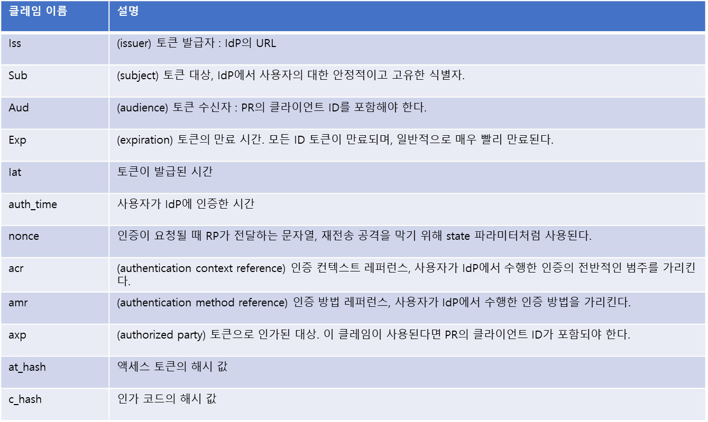

# OAuth 2.0이 인증 프로토콜이 아닌 이유
인증은 현재 사용자가 누구인지 그리고 현재 사용자가 애플리케이션을 사용하고 있는지 여부를 애플리케이션에게 알려주는 것이다.
일반적으로 자격 증명을 애플리케이션에 제공함으로써 사용자가 현재 주장하는 자신임을 알리는 보안 아키텍처의 일부분이라고 할 수 있다.
실제 인증 프로토콜은 사용자에 대한 여러가지 속성 정보를 알려줄 수도 있다.

하지만 OAuth 2.0은 자체적으로 사용자에 대한 어떤 것도 알려주지 않을 뿐만 아니라 사용자가 자신의 존재를 어떻게 증명했는지 또는 존재했는지에 대해서도 알려주지 않는다.
OAuth 2.0 클라이언트는 토큰을 요청해 토큰을 획득하고 결국 그 토큰을 이용해 API에 접근한다.
하지만 누가 해당 클라이언트를 인가했는지 또는 인가되는 과정에 사용자가 있었는지에 대해서는 전혀 알지 못한다.
사실 OAuth 2.0은 사용자가 상호 작용해 더 이상 애플리케이션에게 권한을 인가할 수 없을 때 애플리케이션이 액세스 토큰을 얻기 위해 주로 사용된다.

# 인증 vs 인가
OAuth 2.0은 오늘날 수많은 웹상의 여러 가지 보안 아키텍처를 위한 다재다능한 재료이다.
OAuth 2.0의 권한 위임 모델은 독특하며 항상 동일한 역할과 요소로 구성된다.
RESTful API와 웹 리소스를 보호하는 데 OAuth 2.0을 사용할 수 있다.
웹 서버상의 클라이언트뿐만 아니라 네이티브 애플리케이션도 OAuth 2.0을 사용할 수 있다.
또한 제한된 권한 위임을 위해 사용자가 사용하거나 백 체널 데이터를 전송하기 위해 신뢰된 애플리케이션이 사용할 수도 있다.
심지어 식별과 인증 API를 만드는 데에도 사용될 수 있으며 그 경우 OAuth 2.0이 핵심 기술임을 분명히 보여준다.

인증이 적절하고 안전하게 작동되도록 몇 가지 중요한 구성 요소와 과정이 올바른 방법으로 통함돼야 하며, 그런 구성 요소와 과정에는 다양한 선택사항이 있다.
시스템은 PKI와 인증서, 연합된 신뢰 프레임워크, 웹 브라우저 쿠키 또는 전용 하드웨어와 소프트웨어를 사용할 수도 있다.
OAuth 2.0은 이와 같은 기술 요소 중 하나일 수 있지만 그렇지 않을 수도 있다.
다른 요소 없이 OAuth 2.0은 사용자 인증을 수행하기에는 충분하지 않다.

OAuth로도 OAuth 기반의 인증 프로토콜을 만들기 위한 패턴이 있다.
그런 것들 중 대부분이 페이스북과 트위터, 링크드인, 깃허브와 같은 특정 서비스 제공자들을 위해 만들어졌으며 OpenID 커넥트처럼 여러 서로 다른 제공자를 위해 오픈 표준으로 만들어진 것도 있다.
그런 프로토콜을 모두 OAuth를 기반으로 하고 있으며 각기 조금씩 다른 방식으로 인증을 제공하기 위해 자체적으로 추가 구성 요소를 사용한다.

# OAuth 2.0 인증 방법
OAuth의 권한 위임 프로세스가 동작하기 위해서는 여러 가지 형태의 인증이 요구된다.
즉 리소스 소유자는 인가 서버의 인가 엔드 포인트에 대해 인증하고, 클라이언트는 토큰 엔드 포인트에서 인가 서버에 인증하고, 설정에 따라 그 외 다른 형태의 인증이 있을 수 있다.
인가 프로토콜 위에 인증 프로토콜을 구축하면 인가 프로토콜 자체는 인증 프로토콜에 의존하게 되는데 그것이 다소 복잡하다고 생각될 수 있다.

그렇게 하면 사용자가 인가 서버에서 인증한다는 사실을 활용할 수 있고 OAuth 2.0 프로토콜을 통해 사용자의 자격 증명이 클라이언트 애플리케이션에 전달되는 지점이 없다는 것을 활용할 수 있다.
각 구성 요소가 필요로 하는 정보를 제한함으로써 트랜잭션을 보다 안전하고 좀처럼 실패하지 않게 만들 수 있으며, 보안 도메인 전체에서 제대로 동작하게 만들 수 있다.
사용자는 클라이언트가 그러하듯 단일 구성 요소에 직접 인증을 수행해야 하며, 다른 사용자로 가장하지 않아야 한다.

인가 프로토콜 위에 인증 프로토콜을 구축하는 또 다른 이점은 사용자 동의가 실시간으로 수행될 수 있다는 것이다.
사용자가 자신들의 신원 정보를 어느 애플리케이션에게 공개할지를 결정하게 함으로써 OAuth 2.0 기반의 신원 확인 프로토콜은 보안 도메인을 인터넷으로 확장할 수 있다.
모든 사용자가 시스템에 로그인할 수 있는지 여부를 미리 결정하는 방식이 아닌 각 개별 사용자가 자신들이 선택한 곳에 로그인할 것인지를 결정한다.
이는 OAuth 2.0의 TOFU 모델에 부합한다.

또한 사용자는 자신들의 신원 정보와 함께 다른 보호된 API에 대한 권한을 위임할 수 있다.
한 번의 호출만으로 애플리케이션은 사용자의 로그인 여부와 애플리케이션이 사용자에게 요청해야 하는 내용을 알 수 있고, 인쇄된 사진을 다운로드하고 사용자의 메시지를 업데이트해 게시할 수 있다.
서비스가 이미 OAuth 2.0으로 보호된 API를 제공하고 있다면, 인증 서비스도 함께 제공하도록 하는 것이 그렇게 부담되는 작업은 아니다.
서비스가 식별 기능을 제공하는 것은 오늘날의 웹 API 중심 세계에서 유용하다는 것이 입증됐다.

# 인증을 위해 OAuth 2.0을 사용하는 데 있어서의 일반적인 함정
OAuth를 기반으로 인증 프로토콜을 구축하는 것이 가능하다고 설명해왔다.
하지만 그렇게 하는 데 있어서 많은 실수가 있을 수 있다.
그러한 실수는 식별 제공자 쪽이나 식별 정보를 처리하는 쪽 모두에서 발생할 수 있으며, 대부분은 프로토콜이 말하고자 하는 것에 대한 오해에서 비롯된다.

## 인증의 증거로서의 액세스 토큰
리소스 소유자는 일반적으로 액세스 토큰이 발급되기에 앞서 인가 엔드 포인트에 인증을 해야 하기 때문에 액세스 토큰이 있으면 그것이 인증을 수행한 증거로 간주하기도 한다.
하지만 토큰 자체는 인증과 관련된 어떤 정보도 전달하지 않으며 실제로 인증이 수행됐는지 여부를 나타내지 않는다.

토큰을 어떻게 얻었든 클라이언트는 액세스 토큰으로서 사용자나 그들의 인증 상태에 대해 어떤 것도 말할 수 없다.
이는 클라이언트가 OAuth 2.0 액세스 토큰의 의도된 수신 대상자가 아니라는 사실 때문이다.
클라이언트가 토큰에서 어떤 사용자 정보를 추출할 필요가 있을 수 있지만, OAuth 2.0에서는 액세스 토큰이 클라이언트에게 그 내용이 불투명하도록 설계됐다.
클라이언트는 액세스 토큰을 전달하고 보호된 리소스는 그것을 받아들이도록 돼 있다.

클라이언트가 해석하고 이해할 수 있는 형태의 토큰 포맷을 정의할 수도 있다.
그런 토큰에는 클라이언트가 읽고 검증할 수 있는 사용자 관련 정보와 인증 관련 정보를 포함할 수 있다.
하지만 일반적인 OAuth 2.0에서는 액세스 토큰을 위한 특정한 포맷이나 구조를 정의하지 않으며, 기존의 배포된 OAuth 시스템들은 각자 자체적인 토큰 포맷을 사용한다.
또한 액세스 토큰의 수명이 토큰 내부에 기술된 인증 이벤트보다 길어질 가능성이 높다.
토큰은 보호된 리소스에 전달되기 떄문에 그중 일부는 식별과 관련이 없을 수 있고, 보호된 리소스가 사용자의 로그인 이벤트에 대한 민감한 정보를 아는 것이 잠재적인 문제가 될 수 있다.
이와 같은 한계를 극복하기 위해 OpenID 커넥트와 페이스북 커넥트의 Signed Response와 같은 프로토콜에서는 클라이언트에게 인증 정보를 직접 전달하기 위해 액세스 토큰과 더불어 또 하나의 토큰을 추가로 제공한다.
즉 액세스 토큰은 기존 OAuth와 동일하게 클라이언트에 불투명하게 만들고, 인증 토큰은 클라이언트가 제대로 해석할 수 있도록 정의해 만든다.

## 인증의 증거로서의 보호된 API에 대한 접근
클라이언트가 토큰의 내용을 모르더라도 클라이언트는 항상 그것을 보호된 리소스에 전달할 수 있다.
만약, 클라이언트에게 누가 토큰을 발급한 것인지를 알려주는 보호된 리소스를 정의하면 어떻게 될까?
액세스 토큰을 사용자 속성 정보와 교환할 수 있다면 유효한 액세스 토큰을 소유하고 있다는 것만으로 사용자가 인증됐음을 증명하는 데 충분하다고 생각할 가능성이 있다.

이는 인가 서버에서 인증되는 사용자의 컨텍스트 내에서 새로 만들어진 액세스 토큰인 경우에만 해당하는 내용이다.
하지만 OAuth에서는 다른 방법으로도 액세스 토큰을 얻을 수 있다.
사용자 없이 리프레시 토큰과 어설션을 이용해 액세스 토큰을 얻을 수도 있고, 경우에 따라서는 사용자 인증 없이 접근 권한을 얻을 수도 있다.

더욱이 액세스 토큰은 일반적으로 사용자가 로그아웃한 이후에도 사용된다.
일반적으로 보호된 리소스는 사용자가 있는지 여부를 토큰만으로 알 수 있는 위치에 있지 않다.
OAuth 2.0 프로토콜 속성상 사용자는 클라이언트와 보호된 리소스 사이의 연결에 위치하지 않기 때문이다.
많은 대규모 OAuth 2.0 생태계에서 사용자는 보호된 리소스에 인증할 수 있는 수단을 절대 갖지 않는다.
보호된 리소스가 원래 어떤 사용자가 토큰을 인가했는지 말할 수 있을지 모르지만, 사용자의 현재 상태에 대해서는 일반적으로 말하지 못한다.

인가 이벤트와 보호된 리소스에 대한 토큰 사용 간의 시간 간격이 큰 경우에 특히 문제가 발생할 수 있다.
OAuth 2.0은 사용자가 현재 없을 때 클라이언트나 인가 서버 모두에서 제대로 동작할 수 있지만, 인증 프로토콜의 대부분이 사용자가 있는지 여부를 확인하기 위한 것이기 때문에 클라이언트는 기능 중인 액세스 토큰의 존재 여부에 의존해 사용자가 있는지를 결정할 수 없다.
클라이언트는 토큰이 상대적으로 최신의 것이라는 것을 알 때만 사용자 정보를 확인함으로써 문제를 해결할 수 있다.
액세스 토큰만 있으면 사용자는 API에 접근할 수 있기 때문에 액세스 토큰이 있다고 해서 사용자가 현재 있다고 가정하면 안된다.
또한 서명된 요청이나 ID 토큰의 경우처럼 IdP에서 직접적으로만 받아들여진다는 것을 직접 클라이언트에게 알려줌으로써 문제를 해결할 수도 있다.
그런 토큰은 액세스 토큰과는 다른 라이프사이클을 가지며, 보호된 리소스는 그 안에 포함된 추가 정보를 이용할 수 있다.

## 액세스 토큰 삽입
클라이언트가 토큰 엔드 포인트로 요청을 보내 전달받는 것 외의 소스에서 액세스 토큰을 받아들인다면 또 다른 위협이 발생한다.

애플리케이션의 구성 요소 간에 액세스 토큰을 공유하기 위해 액세스 토큰이 전달될 때도 문제가 발생할 수 있다.
이는 액세스 토큰이 외부의 구성 요소에 의해 애플리케이션에 주입될 가능성이 있고 애플리케이션 외부로 유출될 수 있는 길이 열리기 때문에 문제가 된다.
클라이언트 애플리케이션이 액세스 토큰을 검증하지 않는다면 유효한 토큰과 공격자의 토큰을 구분할 수 있는 방법이 없다.

이는 암시적 플로 대신 인가 코드 플로를 사용하면 해결할 수 있다.
즉 클라이언트는 인가 서버의 토큰 엔드 포인트에서 전달된 토큰만 받아들이면 된다.
state 파라미터를 사용하면 클라이언트는 공격자가 추측할 수 없는 값을 제공할 수 있다.
토큰이 전달될 때 state 파라미터가 없거나 state 파라미터의 값이 틀리면 클라이언트는 토큰이 유효하지 않다고 판단해 거부할 수 있다.

## 수신자 제한의 결여
대부분의 OAuth 2.0 API는 반환되는 정보에 대해 수신자를 제한하는 어떤 메커니즘도 제공하지 않는다.
즉 클라이언트가 액세스 토큰이 자신에게 발급된 것인지, 다른 클라이언트를 위해 발급된 것인지 여부를 말할 수 있는 방법이 없다.
보호된 리소스는 API를 호출하는 클라이언트의 식별 정보를 모르기 때문에 토큰에 대한 검증만 수행할 수 있고, 결국 유효한 사용자 정보를 반환하게 될 것이다.
하지만 반환되는 정보는 원래 다른 클라이언트가 사용하기 위한 정보였을 수 있다.

이 문제는 클라이언트가 인식하고 자체적으로 검증할 수 있는 식별자를 인증 정보와 함께 클라이언트에게 전달함으로써 대응할 수 있다.
이를 통해 클라이언트는 자기자신에 대한 인증과 다른 애플리케이션에 대한 인증을 구별할 수 있다.
또한 OAuth 2.0이 처리되는 동안 클라이언트에게 인증 정보를 OAuth 2.0으로 보호된 API와 같은 부가적인 메커니즘을 통하지 않고 직접 전달하면 클라이언트로 신뢰되지 않은 정보가 삽입돼 전달되는 것을 막을 수 있다.

# 잘못된 정보 삽입
공격자가 클라이언트로부터의 호출 중 하나를 가로채거나 선택할 수 있다면 클라이언트 모르게 반환되는 사용자 정보의 내용을 변경할 수 있다.
예를 들면 사용자 정보 API의 반환 값이나 클라이언트로 전달되는 토큰의 내용을 바꿀 수 있다.
이를 통해 공격자는 사용자의 식별 정보를 교체할 수 있고 순진한 클라이언트에서 다른 사용자로 가장할 수 있다.

이 공격을 막으려면 클라이언트로 전달되는 인증 정보를 암호화로 보호하고 검증하면 된다.
클라이언트와 인가 서버 사이의 모든 통신은 TLS로 보호해야 하고, 클라이언트는 서버에 접속할 때 서버의 인증서를 검증해야 한다.
추가로 서버는 사용자 정보나 토큰을 서명할 수 있고, 클라이언트는 그것을 검증할 수 있다.
추가 시그니처를 통해 네트워크가 탈취된다고 하더라도 사용자 정보가 변조되거나 삽입되는 것을 막을 수 있다.

# 식별 제공자마다 다른 프로토콜 사용
OAuth 2.0 기반 식별 API의 가장 큰 문제점 중 하나는 식별 제공자가 표준적인 OAuth 를 기반으로 하더라도 각기 다르게 식별 API를 구현한다는 것이다.
예를 들면, 사용자의 고유 식별자를 어느 한 식별 제공자에서는 user_id 필드에서 찾을 수 있다면, 다른 식별 제공자에서는 sub 필드에서 찾을 수도 있다.
해당 필드들은 모두 의미적으로 동일한 것이지만, 각기 다른 별도의 코드 처리가 필요하다.
각 식별 제공자에서 수행되는 인가는 동일한 방법으로 이뤄지지만 인증 정보의 전달은 다를 수 있다.

이 문제는 여기에서 논의된 인증 정보 전달을 위한 메커니즘이 OAuth 2.0의 범위를 벗어나기 때문에 발생한다.
OAuth 2.0은 토큰의 포맷을 정의하지 않고, 액세스 토큰을 위한 공통적인 권한 범위를 정의하지 않고 보호된 리소스가 액세스 토큰을 검증하는 방법을 설명하지 않는다.
따라서 OAuth 표준 위에 구축된 표준 인증 프로토콜을 이용하면 문제가 해결될 수 있으므로 식별 정보가 어디서 전달되든 동일한 방법으로 전송된다.

# OpenID 커넥트: OAuth 2.0 기반의 인증과 식별 표준
OpenID 커넥트는 OpenID 재단에서 공개한 오픈 표준으로서 OAuth 2.0으로 사용자 인증을 수행하기 위한 상호 운용 방식을 정의한다.
프로토콜이 상호 운용 가능하게 설계됐기 때문에 OpenID 클라이언트 애플리케이션은 각각의 식별 제공자를 위해 각기 다른 프로토콜을 구현하지 않고 하나의 프로토콜로 많은 식별 제공자와 대화할 수 있다.

OpenID 커넥트는 OAuth 2.0 위에 직접 구축되며 OAuth 2.0과 호환된다.
많은 경우 API를 보호하기 위한 일반적인 OAUth 기반 위에 배포된다.
OAuth 2.0뿐만 아니라 OpenID 커넥트도 정보를 암호화하고 서명해 보낼 때 JOSE를 이용한다.
JOSE를 이용하는 OAuth 2.0과 OpenID 커넥트 간의 차이는 상대적으로 작기 때문에 이미 완전한 호환의 길에 접어들었다고 할 수 있다.
반면 OpenID 커넥트는 OAuth 2.0에 몇 가지 중요한 구성요소를 추가함으로써 앞서 논의된 많은 위험을 피할 수 있도록 관리한다.

# ID 토큰
OpenID 커넥트의 ID 토큰은 서명된 JWT로서 일반적인 OAuth 액세스 토큰과 함께 클라이언트 애플리케이션에게 전달된다.
액세스 토큰과 달리, ID 토큰은 RP로 보내져 그것의 내용이 파싱된다.

ID 토큰에는 인증 세션에 대한 클레임이 포함된다.
즉 사용자 식별자와 토큰을 발급한 이슈 제공자를 위한 식별자 그리고 생성된 토큰을 발급받는 클라이언트 식별자 클레임이 포함된다.
또한 ID 토큰은 자체의 유효 시간 윈도우에 대한 정보뿐만 아니라 클라이언트에게 전달되는 인증 컨텍스트에 대한 추가 정보를 포함한다.
예를 들면, 토큰을 통해 사용자가 얼마나 오래전에 인증 메커니즘상에 있었는지 또는 IdP에 어떤 종류의 인증을 수행했는지를 알 수 있다.
ID 토큰은 표준 JWT 클레임뿐만 아니라 OpenID 커넥트 프로토콜을 위해 확장된 클레임도 포함할 수 있다.

ID 토큰은 토큰 엔드 포인트의 응답 데이터 내의 id_token 멤버로 액세스 토큰과 함께 전달된다.
두 토큰은 각각 의도된 사용자와 목적이 다르다.
토큰이 하나 추가돼 기능을 확장하는 것이기 때문에 액세스 토큰은 기존 OAuth과 동일하게 클라이언트에게 불투명한 구조로 남을 수 있고 반면 ID 토큰은 그 내용을 해석할 수 있다.
또한 두 토큰은 각기 다른 라이프 사이클을 가지며, ID 토큰은 유효 기간이 보다 빨리 만료된다.
ID 토큰은 하나의 인증 이벤트만 나타내며 다른 외부 서비스로는 절대 전달되지 않는다.
하지만 액세스 토큰은 사용자가 떠난 이후에도 보호된 리소스에 접속하는 데 사용될 수 있다.
액세스 토큰을 사용해 처음에 누가 클라이언트를 인가했는지 물어볼 수는 있지만 그렇다고 해서 사용자가 여전히 있다고 말하는 용도로는 사용할 수 없다.