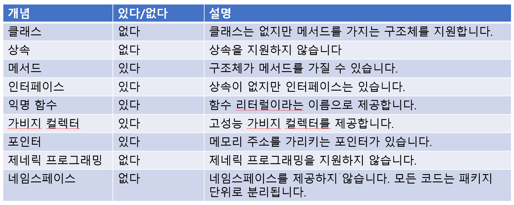

# Go 언의 소개
Go 언어는 구글에서 만든 오픈소스 프로그래밍 언어입니다.
Go 언어는 심플한 문법 구조를 가지고 있어서 누구나 배우기 쉽고 강력한 성능을 자랑합니다.
적은 코딩으로 빠르고 강력한 성능을 낼 수 있습니다.

# Go 언어의 특징

Go 언어는 정적 컴파일 언어이기 때문에 각 플랫폼에 맞는 실행 파일을 따로 만들어주어야 합니다.
하지만 Go 내부 환경 변수만 바꿔서 다양한 플랫폼에 맞도록 실행 파일을 만들 수 있어서 비교적 쉽게 대응할 수 있습니다.

Go 언어는 다른 강타입 언어에서 지원하는 자동 타입 변환까지도 지원하지 않는 최강 타입 언어입니다.
그래서 사용하기 좀 까다롭지만 타입이 달라서 발생할 수 있는 문제점이 전혀 발생하지 않습니다.

Go 언어는 가비지 컬렉터를 제공하기 때문에 사용자가 메모리를 일일이 지우지 않아도 됩니다.
또 Go 언어는 매우 발전된 형태의 가비지 컬렉터를 제공해 성능 손실이 크지 않습니다.



# 코드가 실행되기까지
1. 폴더 생성
2. .go 파일 생성 및 작성
3. Go 모듈 생성
4. 빌드
5. 실행


### 폴더 생성
Go 언어에서 모든 코드는 패키지 단위로 작성됩니다.
같은 폴더에 위치한 .go 파일은 모두 같은 패키지에 포함되고 패키지명은 폴더명을 사용합니다.

### .go 파일 생성 및 작성
코딩은 Go 문법을 사용해서 Go 코드를 만드는 과정입니다.
확장자는 반드시 go로 끝나야 합니다.

### Go 모듈 생성
Go 1.16 버전 이후로 Go 모듈이 기본으로 적용됩니다.
따라서 모든 Go 코드는 빌드하기 전에 모듈을 생성해야 합니다.

모듈 생성은 go mod init 명령으로 실행합니다.
go mod init 뒤에 모듈 이름을 적어주면 됩니다.

Go 모듈을 생성하면 go.mod 파일이 생성됩니다. go.mod 파일에는 모듈명과 Go 버전, 필요한 패키지 목록 정보가 담겨 있습니다.

### 빌드
go build 명령은 Go 코드를 기계어로 변환하여 실행 파일을 만듭니다.
GOOS와 GOARCH 환경변수를 조정해서 다른 운영체제와 아키텍처에서 실행되는 파일을 만들 수 있습니다.

예를 들어 AMD64 계열 칩셋을 사용하는 리눅스 실행 파일을 만들때는 다음과 같이 옵션을 주면 됩니다.

```
GOOS=linux GOARCH=amd64 go build
```

현재 시스템에서 실행되는 실행 파일을 만들 때는 그냥 go build만 하면 됩니다.

### 실행
이렇게 만들어진 실행 파일을 명령어로 실행하면 됩니다.

# Hello Go World 코드 뜯어보기

```
package main

import "fmt"

func main() {
    // Hello Go World 출력
    fmt.Println("Hello Go World")
}
```

### package main
패키지 선언은 이 코드가 어떤 패키지에 속하는지 알려줍니다.
Go 언어의 모든 코드는 반드시 패키지 선언으로 시작해야 합니다.
**main 패키지는 프로그램 시작점을 포함하는 패키지입니다.**
main() 함수가 없는 패키지는 패키지 이름으로 main을 쓸 수 없습니다.
main() 함수가 없기 때문에 실행 파일을 만들 수는 없고 다른 패키지에서 외부 패키지로 사용됩니다.

### func main()
main() 함수를 선언하고 중괄호로 본문의 시작을 알립니다.
main() 함수는 프로그램 진입점 함수입니다.
그래서 프로그램은 항상 main() 함수에서 시작됩니다.
즉 Go 언어로 만든 모든 프로그램은 main() 함수부터 시작되고 main() 함수가 종료되면 프로그램이 종료됩니다.
즉, 프로그램의 시작과 끝이 main() 함수입니다.