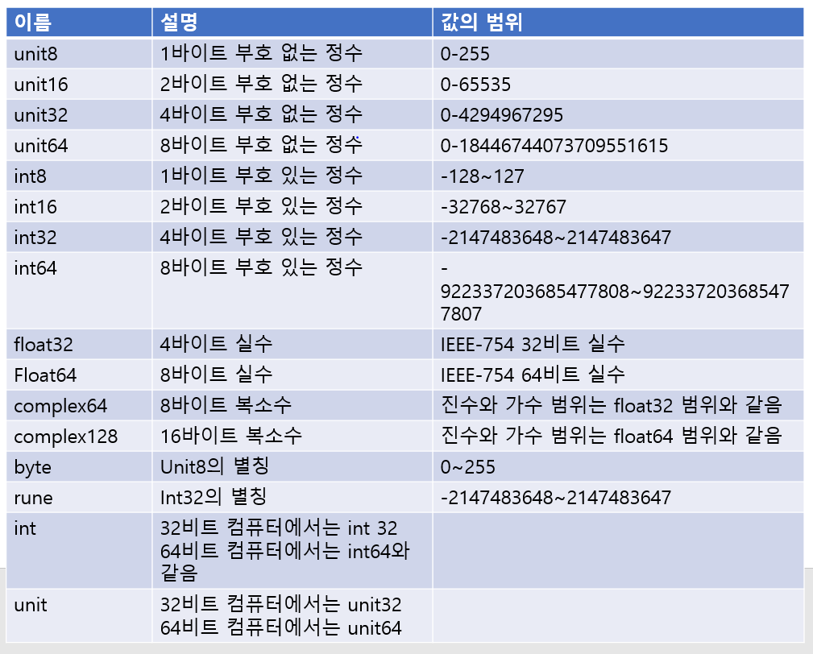
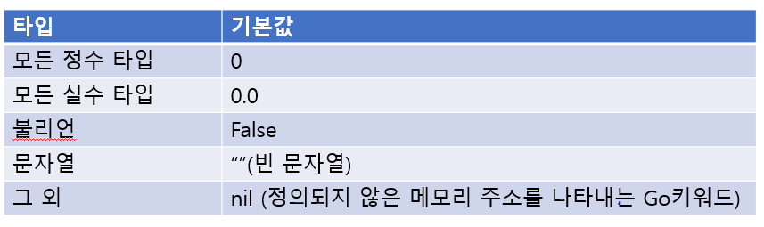

# 변수
변수란 값을 저장하는 메모리 상의 공간입니다.
값에 접근해 값을 변경하는데 사용합니다.
변수는 이름 값, 타입, 주소 속성을 갖습니다.
변수 간 값의 전달은 항상 복사로 일어납니다.

변수를 사용하려면 먼저 변수를 선언해야 합니다.
변수 선언은 컴퓨터에게 값을 저장할 공간을 마련하라고 명령을 내리는 겁니다.
이것을 메모리 할당이라고 부릅니다.

```
var a int = 10
```

- var 는 변수 영문인 variable 의 약자로 변수 선언을 알리는 키워드입니다.
- 이어서 변수 이름을 적습니다.
- 그다음은 타입을 적습니다.
- 대입 연산자 = 오른쪽에 초깃값을 적어서 변수 선언을 마칩니다.

Go 언어에서 변수명을 지을 때는 다음과 같은 규칙을 따라야 합니다.

변수명은 문자, _, 숫자를 사용해 지을 수 있지만 첫 글자는 반드시 문자나 _로 시작해야 합니다.

_를 제외한 다른 특수문자를 포함할 수 없습니다.

반드시 지켜야 하는 것은 아니지만 다음과 같은 권장 사항이 있습니다.

- 변수명은 영문자를 제외한 다른 언어의 문자를 사용하지 않습니다.
  - 하나, 둘 같은 한글이나 한자는 쓰지 않습니다.
- 변수명에 여러 단어가 이어지면 두 변째 단어부터는 대문자로 시작합니다.
- 변수명은 되도록 짧게 합니다. 잠시 사용되는 로컬 변수는 한 글자를 권장합니다.
- 밑줄 _ 은 일반적으로 사용하지 않습니다.

# 변수는 타입을 가지고 있다.

Go 언어에서 제공하는 숫자 타입 목록



그 외 타입
- boolean
- string
- array
- 슬라이스 Go 언어에서 제공하는 가변 길이 배열을 말합니다.
- struct
- 포인터
- 함수 타입
- 인터페이스
- 맵
- 채널 : 멀티 스레드 환경에 특화된 큐 형태 자료구조입니다.

# 변수 선언의 다른 형태

```go
pcakge main

import "fmt"

func main() {
    var a int = 3
    var b int
    var c = 4
    d := 5

    fmt.Println(a, b, c, d)
}
```

### 타입별 기본값



### 숫자값 기본 타입
타입을 생략하면 우변의 타입으로 좌변(변수)의 타입이 지정됩니다.
만약 우변이 숫자이면 기본 타입으로 결정됩니다.
정수는 int 실수는 float64가 기본 타입입니다.

### 선언 대입문 :=
선언 대입문이란 말 그대로 선언과 타입을 한꺼번에 하는 구문입니다.
선언 대입문을 사용하면 var 키워드와 타입을 생략해 변수를 선언할 수 있습니다.

```
var b = 3.1415 // b는 float64 타입으로 자동 지정됩니다.
c := 365 // c는 int 타입으로 자동 지정됩니다.
s := "hello world" // s는 string 타입으로 자동 지정됩니다.
```

# 타입 변환
프로그래밍 언어를 구분할 때 타입 검사를 하는가 안 하는가에 따라 강 타입 언어와 약 타입 언어로 나눕니다. Go 언어는 강 타입 언어 중에서도 가장 강하게 타입 검사를 하는 최강 타입 언어입니다.

Go 언어에서는 연산이나 대입에서 타입이 다르면 에러가 발생합니다.

``` go
a := 3
var b float64 = 3.5

var c int = b // Error - float64 변수를 int에 대입 불가
d := a * b // Error - 다른 타입인 int 변수와 float64 연산 불가

var e int 64 = 7
f := a * e // Error - a는 int 타입, e는 int64 타입으로 같은 정수값이지만
        // 타입이 달라서 연산 불가

var g int = b * 3 // Error - 실수가 정수로 자동으로 바뀌지 않습니다.
```

같은 숫자값이라도 타입이 다르면 안 되기 때문에 타입을 변환해서 연산을 해줘야 합니다.
이것을 타입 변환이라고 합니다.
타입 변환은 원하는 타입명을 적고 ()로 변화시키고 싶은 변수를 묶어줍니다.

타입 변환을 이용해서 위 예제를 에러 없이 다시 써보면 다음과 같습니다.

``` go
package main

import "fmt"

func main() {
    a := 3
    var b float64 = 3.5

    var c int = int(b)
    d := float64(a * c)

    var e int64 = 7
    f := int64(d) * e

    var g int = int(b * 3)
    var h int = int(b) * 3
}
```

타입 변환 시 두 가지 유의점
- 실수 타입에서 정수 타입으로 타입 변환하면 소수점 이하 숫자가 없어진다.
- 큰 범위를 갖는 타입에서 작은 범위를 갖는 타입으로 변환하면 값이 달라질 수 있다.
  
``` go
package main

import "fmt"

func main() {
    var a int16 = 3456
    var c int8 = int8(a)

    fmt.Println(a) // 3456
    fmt.Println(c) // -128
}
```

타입 변환을 했더니 c 값이 3456에서 -128로 변했습니다.
2바이트 정수 int16에서 1바이트 정수 int8로 변환할 때 상위 1바이트가 없어지기 때문입니다.

# 변수의 범위

변수는 자신이 속한 중괄호 {} 범위를 벗어나면 사라집니다.

``` go
package main

import "fmt"

var g int = 10 // 패키지 전역 변수 선언

func main() {
    var m int = 20 // 지역 변수 선언

    {
        var s int = 50 // 지역 변수 선언
        fmt.Println(m, s, g)
    } // s지역 변수는 사라짐

    m = s + 20 // Error
}
```

숫자 타입은 크기에 따라 표현할 수 있는 값의 범위가 다릅니다.
특히 실수 타입은 유효 자릿수가 정해져 있어 주의해서 사용해야 합니다.