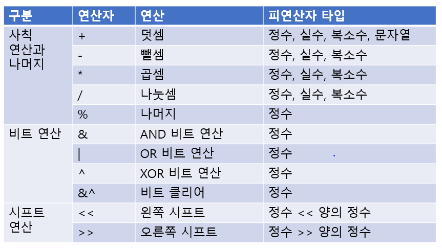
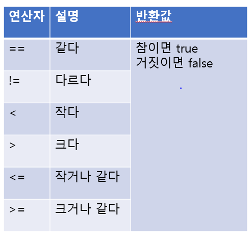
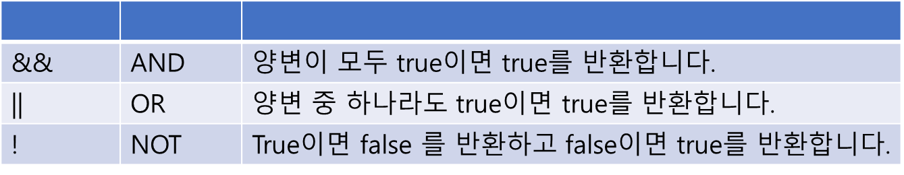
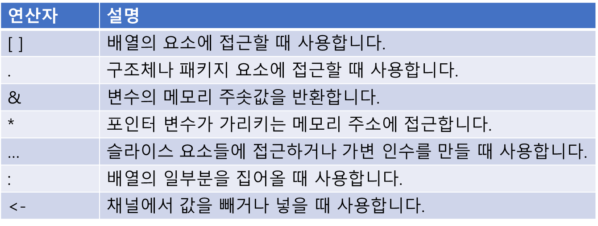
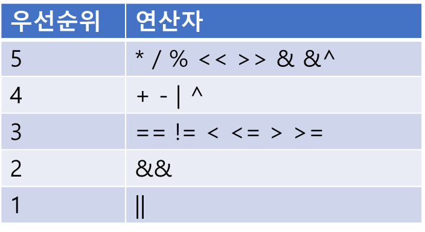

# 산술 연산자

산술 연산자는 숫자 연산을 하는 연산자입니다.
사칙 연산, 비트 연산, 시프트 연산이 속합니다.



Go 언어에서 모든 연산자의 각 항의 타입은 항상 같아야 합니다. (시프트 연산은 예외) 예를 들어 정수 타입과 실수 타입을 서로 더하거나 뺄 수 없습니다.
그래서 타입 변환을 통해서 타입을 같도록 맞춰준 다음에 연산해야 합니다.

연산의 결과 타입도 인수 타입과 같습니다.
나머지 연산은 정수 타입만 가능합니다.

### &^ (비트 클리어 연산자)
특정 비트를 0으로 바꾸는 연산자입니다.
우변값에 해당하는 비트를 클리어하는 연산자입니다.
^를 먼저 수행하고 나서 &를 수행합니다.

# 비교 연산자



비교 연산자를 사용할 때는 부호가 있는 정수를 사용할 때 발생하는 오버플로와 언더플로 문제, 실수끼리의 비교를 주의해야 합니다.

## 정수 오버플로

``` go
package main

import "fmt"

func main() {
    var x int8 = 127

    fmt.Printf(x < x + 1) // false

    var y int8 = -128

    fmt.Printf(y > y - 1) // false
}

```

부호가 있는 정수에서 최상위 비트는 부호를 뜻하는 특수한 기능을 합니다.
그래서 int8 타입은 값의 범위가 -128(1000 0000) ~ 127(0111 1111)입니다.
0111 1111에 1을 더하자 1000 0000이 되어 최상위 비트가 0에서 1로 바뀌게 됐습니다.
이처럼 값의 범위에서 가장 큰 값에 +1을 할 때 가장 작은 값으로 변화하는 현상이 오버플로입니다.
x가 127일 때 1을 더하면 오버플로가 일어나 128이 아니라 -128이 됩니다.
그래서 127 < 127 + 1은 false가 됩니다.

## 정수 언더플로
오버플로와 반대로 정수 타입이 표현할 수 있는 가장 작은 값에서 -1을 했을 때는 가장 큰 값으로 바뀝니다.
예를 들어 int8 타입에서 -128에서 -1을 하면 -129가 아니라 127이 됩니다.
이를 언더플로라고 합니다.

``` go
package main

import "fmt"

func main() {
    var a float64 = 0.1
    var b float64 = 0.2
    var c float64 = 0.3

    fmt.Printf(a + b == c) // false
    fmt.Printf(a + b) // 0.30000000000000004
}
```

## 실수 오차
컴퓨터에서 실숫값을 표현할 때 지수부와 소수부로 나눠서 표현합니다.
컴퓨터는 지수부와 소수부가 10진수 기준이 아니라 2진수 기준으로 되어 있습니다.
그래서 10진수 실수를 정확히 표현하기 어려운 문제가 있습니다.

그래서 타입에 최대한 가깝게 값을 표현합니다.
0.3의 정확한 실숫값을 2진수 체계로는 표현할 수 없습니다.
그래서 컴퓨터에서는 0.1 + 0.2 != 0.3 이 됩니다.

이 문제를 해결하는 방법

### 작은 오차 무시하기
실숫값을 정확히 표현할 수 없기 때문에 오차가 생길 수밖에 없습니다.
그래서 아주 작은 오차는 무시하는 방법으로 값을 비교할 수 있습니다.


## 오차를 없애는 더 나은 방법
Go 언어에서는 math 패키지에서 Nextafter() 함수를 제공합니다.

```
func Nextafter(x, y float64) (r float64)
```

이 함수는 float64 타입 두 개를 받아서 float64 타입 하나를 반환합니다.
이 함수 동작은 x에서 y를 향해서 1비트만 조정한 값을 반환합니다.
만약 x가 y보다 작다면 x에서 1비트만큼 증가시키고 그렇지 않다면 x에서 1 비트만큼 감소시킨 값을 반환합니다.

# 6.4 논리 연산자


# 6.5 대입 연산자
= 대입 연산자는 우변값을 좌변(메모리 공간)에 복사합니다.
좌변은 반드시 저장할 공간이 있는 변수가 와야 합니다.

## 6.5.1 복수 대입 연산자
여러 값을 한 번에 대입할 수 있습니다.
우변 개수에 맞춰서 좌변 변수 개수도 맞춰줘야 합니다.

첫 번째 우변값은 첫 번째 좌변 주소에, 두 번째 우변값은 두 번째 좌변 주소에 대입됩니다.

``` go
a, b = 3, 4
```

a 변수에는 3이 대입되고 b 변수에는 4가 대입됩니다.

``` go
package main

import "fmt"

func main() {
    var a int = 10
    var b int = 20

    a, b = b, a

    fmt.Println(a, b) // 20 10
}
```

## 6.5.2 복합 대입 연산자 
대입 연산자 앞에 다른 산술 연산자를 붙여서 변수의 값과 연산의 결과를 다시 변수에 대입하는 복합 대입 연산자를 쓸 수 있습니다.

``` go
var a = 10
a += 2 // a = a + 2
```

모든 산술 연산자는 다 복합 대입 연산자로 쓸 수 있습니다.

## 6.5.3 증감 연산자
 변숫값을 1 증가하거나 1 감소하는 구문은 자주 사용되어 특별히 증감문을 제공합니다.
 ++ 와 -- 두 종류를 제공합니다.

 ## 그 외 연산자
 


 # 연산자 우선순위
 