# 처리율 제한 장치의 설계

네트워크 시스템에서 처리율 제한 장치는 클라이언트 또는 서비스가 보내는 트래픽의 처리율을 제어하기 위한 장치이다.

특정 기간 내에 전송되는 클라이언트의 요청 횟수를 제한한다.

API 요청 횟수가 임계치를 넘어서면 추가로 도달한 모든 호출은 처리가 중단된다.

**처리율 제한 장치 장점**

- DoS 공격에 의한 자원 고갈을 방지할 수 있다.

- 서버의 수, 과금되는 외부 API 사용량 등을 줄여 비용을 절감한다.

- 서버 과부하를 막는다.

## 1단계 문제 이해 및 설계 범위 확정

처리율 제한 장치를 구현하는 데는 여러 알고리즘을 사용할 수 있다.

각각의 알고리즘은 고유한 장단점을 갖고 있다.

면접관과 소통하면 어떤 제한 장치를 구현해야 하는지 분명히 알 수 있다.

**요구사항**

- 설정된 처리율을 초과하는 요청은 정확하게 제한한다.

- 낮은 응답시간 : 처리율 제한 장치가 응답시간에 영향을 주어서는 안된다.

- 가능한 한 적은 메모리를 써야 한다.

- 분산형 처리율 제한 : 하나의 처리율 제한 장치를 여러 서버나 프로세스에서 공유할 수 있어야 한다.

- 예외 처리 : 요청이 제한되었을 때는 그 사실을 사용자에게 분명하게 보여주어야 한다.

- fault tolerance (높은 결함 감내성) : 제한 장치에 장애가 생기더라도 전체 시스템에 영향을 주어서는 안된다.

## 2단계 개략적 설계안 제시 및 동의 구하기

### 처리율 제한 장치는 어디에 둘 것인가?
**클라이언트**
- 장점
  - 재요청, 타임아웃 처리, 요청취소 등 다양한 처리가 가능하다.  
- 단점
  - 클라이언트 요청은 쉽게 위변조가 가능하고 모든 클라이언트의 구현을 통제하는 것도 어렵다.

**미들웨어**
- 장점
  - 서버로 트래픽을 보내지 않고 요청 처리 제한 처리가 가능하다.
  - 각 서비스별로 요청 처리 제한을 구현하지 않아도 된다.
- 단점
  - 서비스 개별로 정책을 가져가기 힘들다.
  - 미들웨어의 장애가 서비스의 장애로 이어질 수 있다.

**서버**
- 장점
  - 서비스별로 다양한 조건을 설정하여 트래픽을 제한할 수 있다.
- 단점
  - 서비스마다 요청 처리 제한기가 구현되어야 한다.
  - 서버가 rate limit 하는 로직의 트래픽을 직접 받아야 한다.

  
**API Gateway**

클라우드 마이크로서비스의 경우 처리율 제한 장치는 보통 API 게이트웨이라 불리는 컴포넌트에 구현한다.

보통 API 게이트웨이이는 
처리율 제한, SSL Termination, Authentication, IP whitelist 관리 등을 지원하는 서비스로 주로 MSP가 유지보수를 담당하는 서비스다.

처리율 제한 기능을 설계할 때 중요하게 따져야 하는 것은 처리율 제한 장치는 어디 두어야 하나? 이다.

정답은 없다. 기술 스택이나 엔지니어링 인력, 우선순위, 목표에 따라 달라질 수 있기 때문이다.
다만 일반적으로 적용될 수 있는 몇 가지 지침이 있다.

- 현재 기술 스택이 구현을 지원하기 충분할 정도로 효율이 높은지 확인하라

- 필요에 맞는 처리율 제한 알고리즘을 찾아라. 직접 구현하면 알고리즘을 자유롭게 선택할 수 있지만 매니지드 서비스를 쓰는 경우 제한적일 수 있다.

- 이미 API 게이트웨이를 설계에 포함시켰다면 처리율 제한 기능 또한 게이트웨이에 포함시켜야 할 수도 있다.

- 처리율 제한 서비스를 직접 만드는 데는 시간이 든다. 상용 솔루션을 쓰는게 바람직할 수 있다.

### 처리율 제한 알고리즘
- 토큰 버킷 알고리즘 (token bucket)

- 누출 버킷 (leaky bucket)

- 고정 윈도 카운터 (fixed window counter)

- 이동 윈도 로그 (sliding window log)

- 이동 윈도 카운터 (sliding window counter)

### 토큰 버킷 알고리즘
토큰 버킷 알고리즘은 간단하고 세간의 이해도도 높은 편이며 아마존과 스트라이프 등 인터넷 기업들이 보편적으로 사용하고 있다.

토큰 버킷은 지정된 용량을 갖는 컨테이너이다.
이 버킷에는 사전 설정된 양의 토큰이 주기적으로 채워진다.
토큰이 꽉 찬 버킷에는 더 이상의 토큰은 추가되지 않는다.

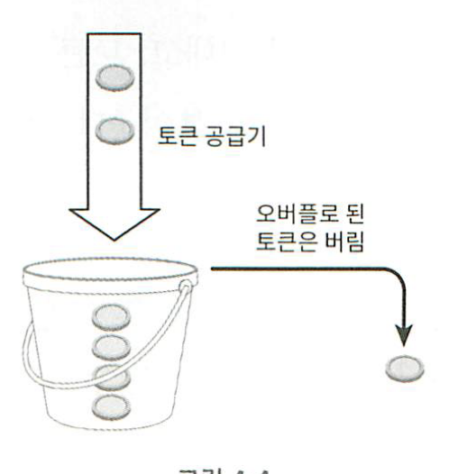

각 요청은 처리될 때마다 하나의 토큰을 사용한다.
요청이 도착하면 버킷에 충분한 토큰이 있는지 검사하게 된다.
- 충분한 토큰이 있는 경우 버킷에서 토큰 하나를 꺼낸 후 요청을 시스템에 전달한다.
- 충분한 토큰이 없는 경우 해당 요청은 버려진다.

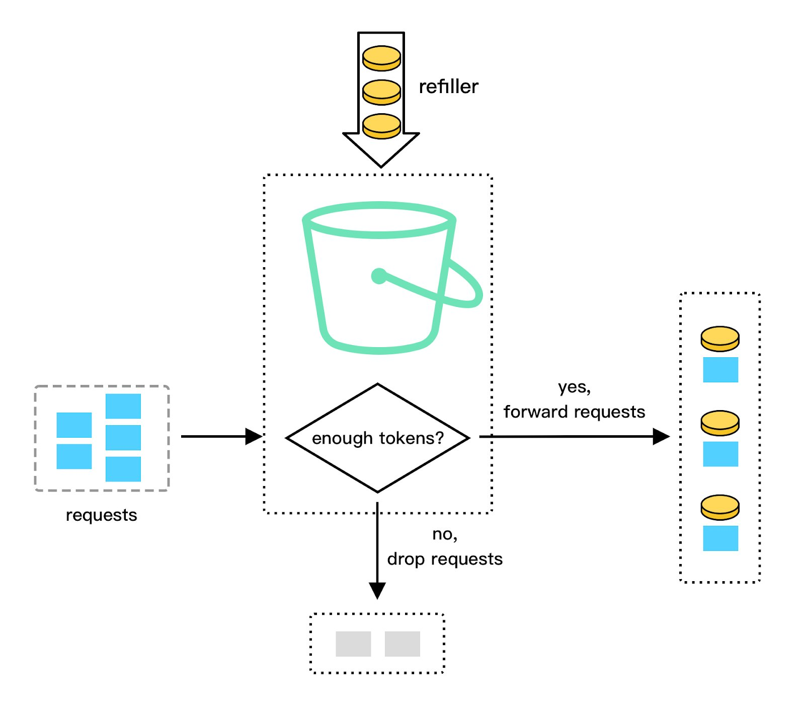

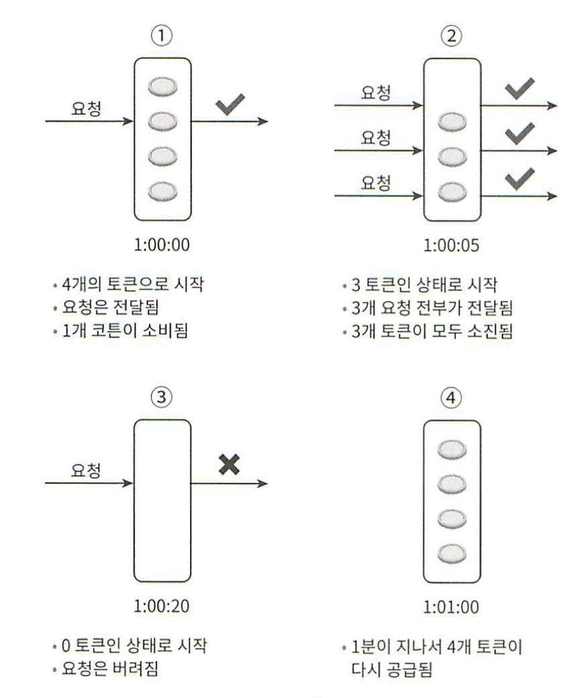

토큰 버킷 알고리즘은 2개 인자를 받는다.

- 버킷 크기 : 버킷에 담을 수 있는 토큰의 최대 개수
- 토큰 공급률 : 초당 몇개의 토큰이 버킷에 공급되는가

버킷은 몇 개나 사용해야 하나? 공급 제한 규칙에 따라 달라진다.

- 통상적으로 API 엔드포인트마다 별도의 버킷을 둔다. 예를들어 사용자마다 포스팅, 친구추가, 좋아요 기능이 있다면 사용자마다 3개의 버킷을 두어야 한다.

- IP 주소별로 처리율 제한을 적용해야 한다면 IP 주소마다 버킷을 하나씩 할당해야 한다.

- 시스템의 처리율을 초당 10,000개 요청으로 제한하고 싶다면 모든 요청이 하나의 버킷을 공유하도록 해야 한다.

**장점**
- 구현이 쉽다.
- 메모리 사용 측면에서도 효율적이다.
- 짧은 시간에 집중되는 트래픽도 처리가 가능하다.

**단점**
- 이 알고리즘은 버킷 크기와 토큰 공급률이라는 두 개 인자를 가지고 있는데 이 값을 적절하게 튜닝하는 것은 까다로운 일이다.

### 누출 버킷 알고리즘
누출 버킷 알고리즘은 보통 FIFO 큐로 구현하고 요청 처리율이 고정되어 있다.

- 요청이 도착하면 큐가 가득차 있는지 본다. 빈자리가 있는 경우 큐에 요청을 추가한다.
- 큐가 가득 차 있는 경우에는 새 요청은 버린다.
- 지정된 시간마다 큐에서 요청을 꺼내어 처리한다.

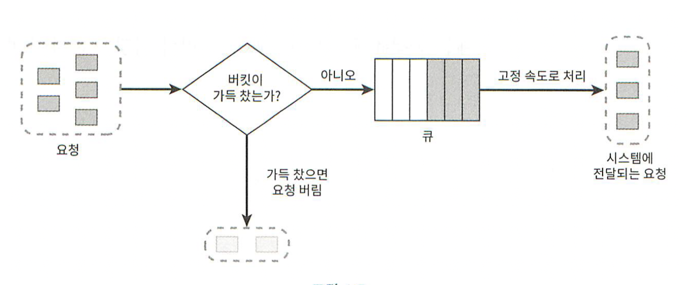

누출 버킷 알고리즘은 다음의 두 인자를 사용한다.

- 버킷 크기 : 큐 사이즈와 같은 값이다. 큐에 처리될 항목들이 보관된다.
- 처리율 (outflow rate) : 지정된 시간당 몇 개의 항목을 처리할지 지정하는 값이다. 보통 초단위로 표현한다.

**장점**
- 큐의 크기가 제한되어 있어 메모리 사용량 측면에서 효율적이다.

- 고정된 처리율을 갖고 있기 때문에 안정적 출력 (stable outflow rate) 이 필요한 경우 적합하다.

**단점**
- 단 시간에 많은 트래픽이 몰리는 경우 큐에는 오래된 요청들이 쌓이게 되고, 그 요청들을 제때 처리 못하면 최신 요청들은 버려지게 된다.

- 두 개 인자를 갖고 있는데, 이들을 올바르게 튜닝하기 까다로울 수 있다.

### 고정 윈도 카운터 알고리즘
- 타임라인을 고정된 간격의 윈도우로 나누고, 각 윈도우마다 카운터를 붙인다.
- 요청이 접수될 때마다 이 카운터의 값은 1씩 증가한다.
- 이 카운터의 값이 사전에 설정된 임계치에 도달하면 새로운 요청은 새 윈도우가 열릴 때까지 버려진다.

타임라인의 시간 단위는 1초다.
시스템은 초당 3개까지의 요청만을 허용한다.
매초마다 열리는 윈도에 3개 이상의 요청이 밀려오면 초과분은 그림에 보인 대로 버려진다.

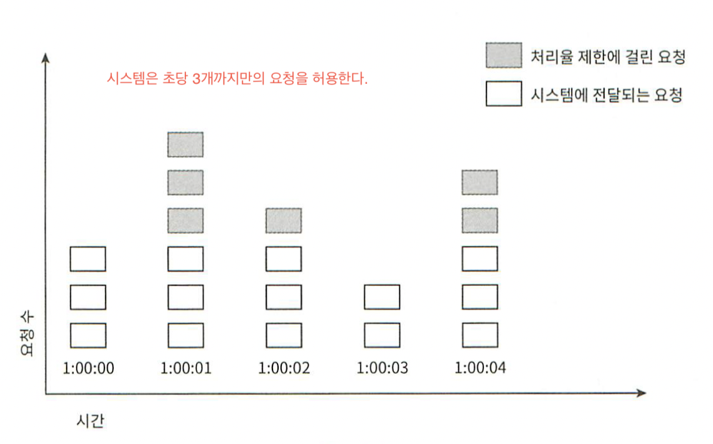

이 알고리즘의 문제는 윈도우 경계 부근에 순간적으로 많은 트래픽이 집중될 경우 윈도우에 할당된 양보다 더 많은 요청이 처리될 수 있다는 것이다.

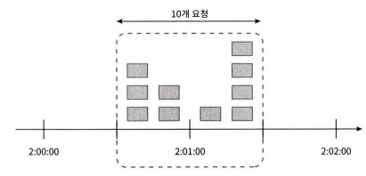

고정된 간격으로 처리될 트래픽을 정하기 때문에 윈도우 경계 부근에 요청이 몰리게 되면 경계 부근의 트래픽은 의도한 숫자를 넘기게 된다.

**장점**
- 메모리 효율이 좋다.
- 이해하기 쉽다.
- 윈도우가 닫히는 시점에 카운터를 초기화하는 방식은 특정한 트래픽 패턴을 처리하기에 적합하다.

**단점**
윈도 경계 부근에서 일시적으로 많은 트래픽이 몰려드는 경우 기대했던 시스템의 처리 한도보다 많은 양의 요청을 처리하게 된다.

### 이동 윈도 로깅 알고리즘
이동 윈도 로깅 알고리즘은 고정 윈도 카운터 알고리즘의 문제점을 해결한 방식이다.

- 이 알고리즘 요청은 타임스탬프를 추적한다. 타임스탬프는 보통 캐시의 sorted set에 보관한다.

- 새 요청이 오면 만료된 타임스탬프는 제거한다. 만료된 타임스탬프는 그 값이 현재 윈도우의 시작 시점보다 오래된 타임스탬프를 말한다.

- 새 요청의 타임스탬프를 로그에 추가한다.

- 로그의 크기가 허용치보다 같거나 작으면 요청을 시스템에 전달한다. 그렇지 않은 경우에는 처리를 거부한다.

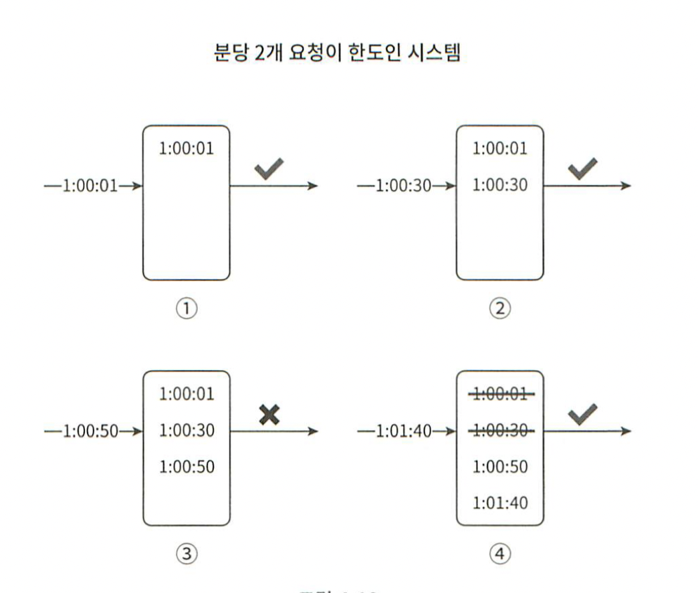

**장점**
- 어느 순간의 윈도를 보더라도 허용되는 요청의 개수는 시스템의 처리율 한도를 넘지 않는다.

 
**단점**
- 거부된 요청의 타임스탬프도 보관하기 때문에 다량의 메모리를 사용한다.

### 이동 윈도 카운터 알고리즘
고정 윈도 카운터 알고리즘과 이동 윈도 로깅 알고리즘을 결합한 것이다.

계산 방법

현재 1분간의 요청 수 + 직전 1분간의 요청 수 * 이동 윈도우와 직전 1분이 겹치는 비율

3 + 5 * 0.7 = 6.5

**장점**
- 이전 시간대의 평균 처리율에 따라 현재 윈도우 상태를 계산하므로 짧은 시간에 몰리는 트래픽에도 잘 대응한다.

- 메모리 효율이 좋다.

**단점**
- 직전 시간대에 도착한 요청이 균등하게 분포되어 있다고 가정한 상태에서 추정치를 계산하기 때문에 다소 느슨하다.

### 개략적인 아키텍처
처리율 제한 알고리즘은 얼마나 많은 요청이 접수되었는지를 추적할 수 있는 카운터를 추적 대상별로 두고 (사용자? IP? API 엔드포인트? 서비스 단위로?) 이 카운터 값이 어떤 한도를 넘어서면 한도를 넘어 도착한 요청은 거부하는 것이다.

카운터 값은 빠르고 시간에 기반한 만료 정책을 지원하는 캐시에 두는 것이 바람직하다.
레디스가 자주 사용되며 INCR (1 증가) 과 EXPIRE (타임아웃 설정) 두 가지 명령어를 지원한다.

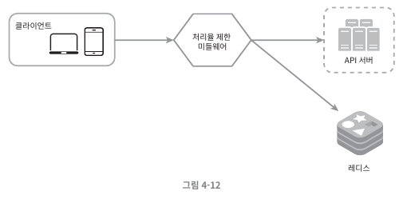

### 동작 원리
- 클라이언트가 처리율 제한 미들웨어에게 요청을 보낸다.

- 처리율 제한 미들웨어는 레디스의 지정 버킷에서 카운터를 가져와서 한도에 도달했는지 아닌지를 검사한다.
  - 한도에 도달했다면 요청은 거부된다.
  - 한도에 도달하지 않았다면 요청은 API 서버로 전달된다. 미들웨어는 카운터의 값을 증가시킨 후 다시 레디스에 저장한다.

## 3단계 상세 설계
개략적 설계는 다음과 같은 사항을 알 수 없다.
- 처리율 제한 규칙은 어떻게 만들어지고 어디에 저장는가?

- 처리가 제한된 요청들은 어떻게 처리되는가?

### 처리율 제한 규칙
처리율 제한 규칙은 보통 설정 파일 형태로 디스크에 저장된다.

### 처리율 한도 초과 트래픽의 처리
어떤 요청이 한도 제한에 걸리면 API는 HTTP 429 응답 (too many requests) 를 클라이언트에게 보낸다.
경우에 따라서는 한도 제한에 걸린 메시지를 나중에 처리하기 위해 큐에 보관할 수도 있다.

**처리율 제한 장치가 사용하는 HTTP 헤더**
클라이언트는 자기 요청이 처리율 제한이 걸리고 있는지, 처리율 제한에 걸리기까지 얼마나 많은 요청을 보냈는지 HTTP 응답 헤더를 통해 알 수 있다.

- X-Ratelimit-Remaining : 윈도우 내에 남은 처리 가능 요청의 수

- X-Ratelimit-Limit : 매 윈도우마다 클라이언트가 전송할 수 있는 요청의 수

- X-Ratelimit-Retry-After : 한도 제한에 걸리지 않으려면 몇 초 뒤에 요청을 다시 보내야 하는지 알림

사용자가 너무 많은 요청을 보내면 429 too many requests 오류를 X-Ratelimit-Retry-After 헤더와 함께 반환하도록 한다.

### 상세 설계
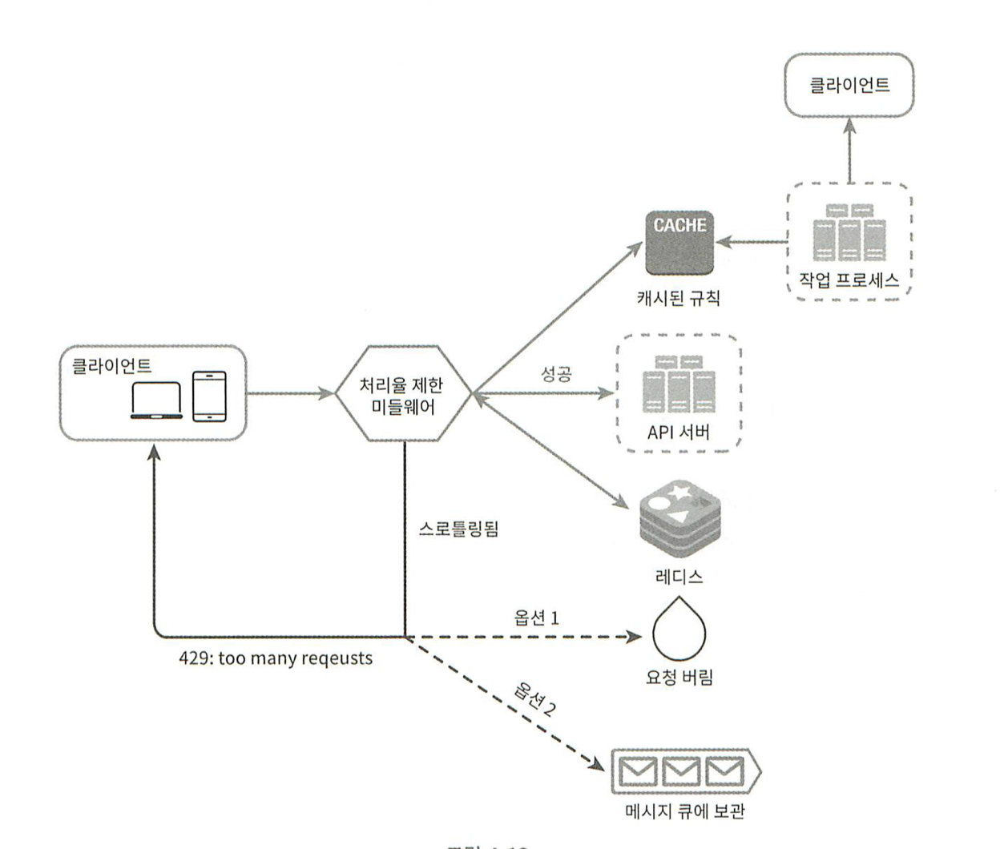

- 처리율 제한 규칙은 디스크에 보관한다. 작업 프로세스는 수시로 규칙을 디스크에 읽어 캐시에 저장한다.

- 클라이언트가 요청을 서버에 보내면 요청은 먼저 처리율 제한 미들웨어에 도달한다.

- 처리율 제한 미들웨어는 제한 규칙을 캐시에서 가져온다. 아울러 카운터 및 마지막 요청의 타임스탬프를 레디스 캐시에서 가져온다. 가져온 값들에 근거하여 해당 미들웨어는 다음과 같은 결정을 내린다.
  - 해당 요청이 처리율 제한에 걸리지 않은 경우에는 API 서버로 보낸다.
  - 해당 요청이 처리율 제한에 걸렸다면 429 too many requests 에러를 클라이언트에 보낸다. 해당 요청은 버릴 수도 메시지 큐에 보관할 수도 있다.

### 분산 환경에서의 처리율 제한 장치의 구현
여러 대의 서버와 병렬 스레드를 지원하도록 시스템을 확장하려면 두 가지 어려운 문제를 풀어야 한다.

- Race Condition
- Synchronization

**Race Condition**
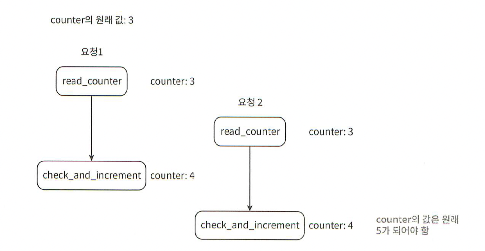

경쟁 조건 문제를 해결하는 가장 널리 알려진 해결책은 Lock 이다.
하지만 Lock 은 성능을 떨어뜨린다는 문제가 있다.
락 대신 Lua Script 또는 Sorted Set 으로 해결할 수 있다.

**Synchronization**
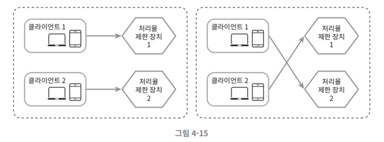

수백만 사용자를 지원하려면 한 대의 처리율 제한 장치 서버로는 충분하지 않을 수 있다.
그래서 여러 대 두게 되면 동기화가 필요해진다.

웹 계층은 무상태이므로 각기 다른 제한 장치로 보내 제한 장치 1은 클라이언트 2에 대해서 아무것도 모르므로 처리율 제한을 올바르게 수행할 수 없을 것이다.

해결책으로 Sticky Session 을 활용할 수 있지만 확장 가능하지도 유연하지도 않기 때문에 중앙 집중형 데이터 저장소를 쓰는 것이 좋다.

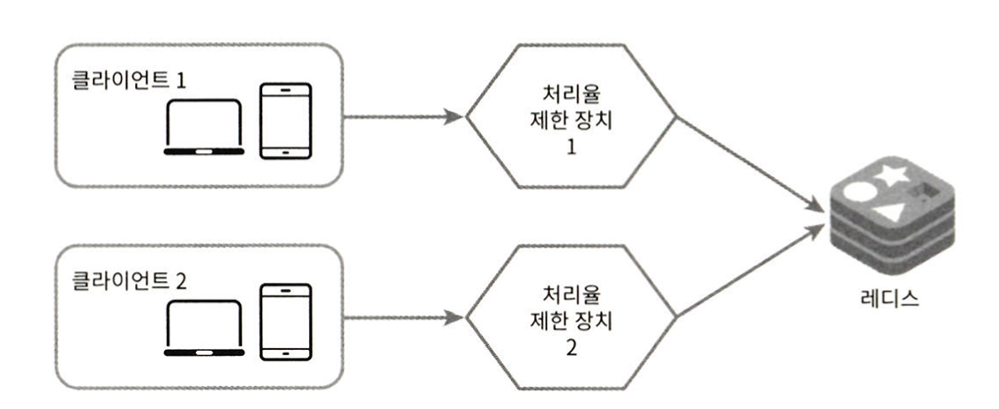

### 성능 최적화
성능 최적화는 시스템 설계 면접 단골 주제다.
지금까지 살펴본 설계는 두가지 지점에서 개선이 가능하다.

1. 여러 데이터 센터를 지원하는 경우

    데이터센터에서 멀리 떨어진 사용자를 지원하려다 보면 Latency 가 증가할 수밖에 없다. 사용자의 트래픽을 가장 가까운 엣지 서버로 전달하여 지연시간을 줄이자.

2. Eventual Consistency Model
    
    제한 장치 간에 데이터를 동기화할 때 Eventual Consistency Model (결과적 일관성 모델) 을 사용하면 성능을 올릴 수 있다.

### 모니터링
처리율 제한 장치를 설치한 이후에는 효과적으로 동작하고 있는지 보기 위해 데이터를 모을 필요가 있다.

기본적으로 모니터링을 통해 확인하려는 것은 다음 두 가지다.

- 채택된 처리율 제한 알고리즘이 효과적인가?

- 정의한 처리율 제한 규칙이 효과적이다.

처리율 제한 규칙이 너무 빡빡하게 설정되었다면 많은 유효 요청이 처리되지 못하고 버려질 것이다. 그런 일이 벌어지면 규칙을 다소 완화할 필요가 있다.

이벤트 때문에 트래픽이 급증할 때 처리율 제한 장치가 비효율적으로 동작한다면 그런 트래픽 패턴을 잘 처리할 수 있도록 알고리즘을 바꾸는 것을 생각해 봐야 한다. 그런 상황에는 토큰 버킷이 적합할 것이다.

## 4단계 마무리

처리율 제한을 구현하는 여러 알고리즘과 장단점을 살펴보았다.
알고리즘 이외에도 해당 알고리즘을 구현하는 아키텍처, 분산환경에서의 처리율 제한 장치, 성능 최적화와 모니터링 주제를 살펴보았다.

### 생각해볼만한 부분

- 경성 또는 연성 처리율 제한
  - 경성 처리율 제한 : 요청의 개수는 임계치를 절대 넘어설 수 없다.
  - 연성 처리율 제한 : 요청 개수는 잠시 동안은 임계치를 넘어설 수 있다.

- 다양한 계층에서의 처리율 제한
  - 애플리케이션 계층이 아닌 Iptables 를 사용하면 IP 주소에 처리율 제한을 적용할 수 있다.

- 처리율 제한을 회피하는 방법
  - 클라이언트 측 캐시를 사용하여 API 호출 횟수를 줄인다.
  - 처리율 제한의 임계치를 이해하고, 짧은 시간 동안 너무 많은 메시지를 보내지 않도록 한다.
  - 예외나 에러를 처리하는 코드를 도입하여 클라이언트가 예외적 상황으로부터 Gracefully 복구될 수 있도록 한다.
  - Retry 로직을 구현할 때는 충분한 Back-Off 시간을 둔다. 

# 참고자료
https://dev.gmarket.com/69

https://engineering.linecorp.com/ko/blog/high-throughput-distributed-rate-limiter

https://engineering.classdojo.com/blog/2015/02/06/rolling-rate-limiter

https://redis.io/learn/develop/java/spring/rate-limiting
