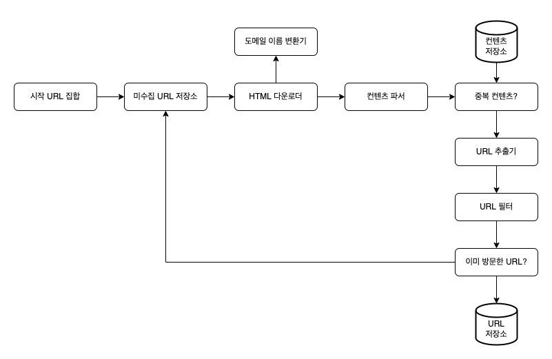
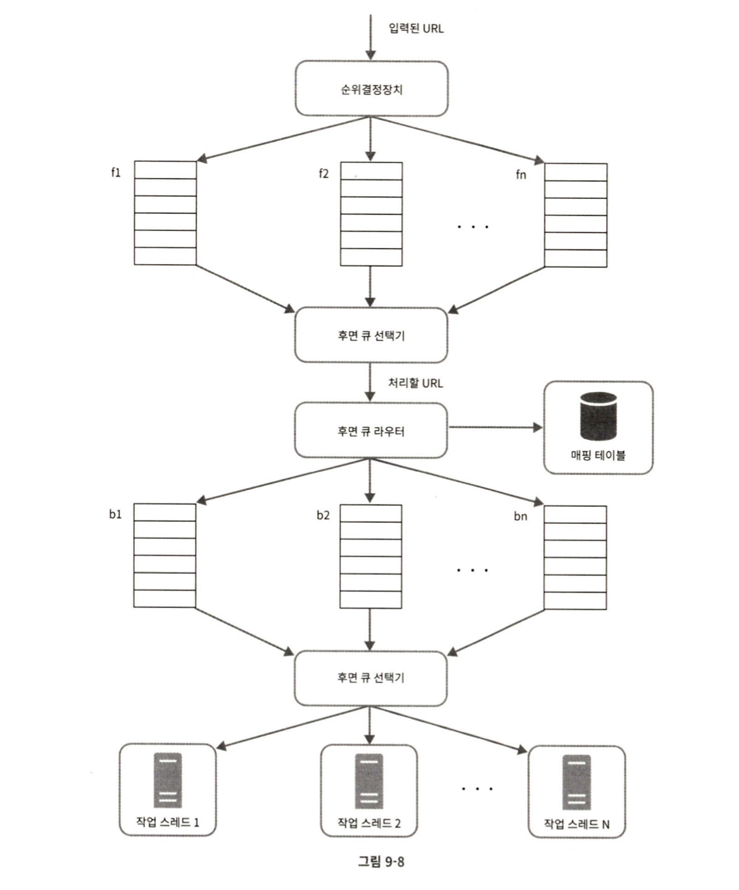

# 웹 크롤러 설계

## 크롤러 이용 사례

### 검색 엔진 인덱싱

크롤러는 웹 페이지를 모아 검색 엔진을 위한 로컬 인덱스를 만든다.

### 웹 아카이빙

나중에 사용할 목적으로 장기보관하기 위해 웹에서 정보를 모으는 절차이다.

### 웹 마이닝

웹 마이닝을 통해 인터넷에서 유용한 지식을 도출해 낼 수 있는 것이다.

### 웹 모니터링

크롤러를 사용하면 인터넷이나 저작권이나 상표권이 침해되는 사례를 모니터링할 수 있다.

# 1단계 문제 이해 및 설계 범위 확정

### 웹 크롤러의 기본 알고리즘

1. URL 집합이 입력으로 주어지면, 해당 URL들이 가리키는 모든 웹 페이지를 다운로드한다.

2. 다운받은 웹 페이지에서 URL들을 추출한다.

3. 추출된 URL들을 다운로드할 URL 목록에 추가하고 위의 과정을 처음부터 반복한다.

### 개략적인 규모 추정

- 매달 10억 개의 웹 페이지를 다운로드한다.
- QPS = 10억 / 30일 / 24시간 / 3600초 = 대략 400페이지/초
- 최대 QPS = 2 * QPS = 800
- 웹 페이지의 크기 평균 500k 라고 가정
- 10억 페이지 * 500k = 500TB/월
- 1개월치 데이터를 보관하는 데는 500TB 5년간 보관하면 500TB * 12 * 5년 = 30PB

# 2단계 개략적 설계안 제시 및 동의 구하기

### 시작 URL 집합

시작 URL 집합은 웹 크롤러가 크롤링을 시작하는 출발점이다.

크롤러가 가능한 한 많은 링크를 탐색할 수 있도록 하는 URL을 고르는 것이 바람직할 것이다.

### 미수집 URL 저장소

대부분의 현대적 웹 크롤러는 크롤링 상태를 (1) 다운로드할 URL (2) 다운로드된 URL 두 가지로 나눠 관리한다.

이 중 다운로드할 URL 을 저장 관리하는 컴포넌트를 미수집 URL 저장소(URL Frontier)라고 부른다.

FIFO 큐 라고 생각하면 된다.

### HTML 다운로더

HTML 다운로더는 인터넷에서 웹 페이지를 다운로드하는 컴포넌트다.

다운로드할 페이지의 URL은 미수집 URL 저장소가 제공한다.

### 도메인 이름 변환기

웹 페이지를 다운로드받으려면 URL을 IP주소로 변환하는 절차가 필요하다.

HTML 다운로더는 도메인 이름 변환기를 사용하여 URL에 대응되는 IP주소를 알아낸다.

### 콘텐츠 파서

웹 페이지를 다운로드하면 파싱과 검증 절차를 거쳐야 한다.

### 중복 콘첸츠?

웹에는 중복 콘텐츠가 많다.

이 문제를 해결하기 위한 자료 구조를 도입하여 데이터 중복을 줄이고 데이터 처리에 소요되는 시간을 줄인다.

두 문서를 문자열로 보고 비교할 수도 있지만 해시 값을 비교하면 더 효율적이다.

### 콘텐츠 저장소

콘텐츠 저장소는 HTML 문서를 보관하는 시스템이다.

저장소를 구현하는 데 쓰일 기술을 고를 때는 저장할 데이터의 유형, 크기, 저장소 접근 빈도, 데이터의 유효 기간 등을 종합적으로 고려해야 한다.

### URL 추출기

URL 추출기는 HTML 페이지를 파싱하여 링크들을 골라내는 역할을 한다.

상대 경로는 전부 절대 경로로 변환한다.

### URL 필터

URL 필터는 특정한 콘텐츠 타입이나 파일 확장자를 갖는 URL 접속 시 오류가 발생하는 URL, 접근 제외 목록에 포함된 URL 등을 크롤링 대상에서 배제하는 역할을 한다.

### 이미 방문한 URL?

이미 방문한 URL이나 미수집 URL 저장소에 보관된 URL을 추적할 수 있도록 하는 자료 구조를 사용할 것이다.

이미 방문한 적이 있는 URL인지 추적하면 같은 URL을 여러 번 처리하는 일을 방지할 수 있으므로 서버 부하를 줄이고 무한 루프에 빠지는 일을 방지할 수 있다.

### URL 저장소

URL 저장소는 이미 방문한 URL을 보관하는 저장소다.

## 웹 크롤러 작업 흐름

1. 시작 URL들을 미수집 URL 저장소에 저장한다.

2. HTML 다운로더는 미수집 URL 저장소에서 URL 목록을 가져온다.

3. HTML 다운로더는 도메인 이름 변환기를 사용하여 URL의 IP 주소를 알아내고, 해당 IP 주소로 접속하여 웹 페이지를 다운받는다.

4. 콘텐츠 파서는 다운된 HTML 페이지를 파싱하여 올바른 형식을 갖춘 페이지인지 검증한다.

5. 콘텐츠 파싱과 검증이 끝나면 중복 콘텐츠인지 확인하는 절차를 개시한다.

6. 중복 콘텐츠인지 확인하기 위해서, 해당 페이지가 이미 저장소에 있는지 본다.
    - 이미 저장소에 있는 콘텐츠인 경우에는 처리하지 않고 버린다.
    - 저장소에 없는 콘텐츠인 경우에는 저장소에 저장한 뒤 URL 추출기로 전달한다.

7. URL 추출기는 해당 HTML 페이지에서 링크를 골라낸다.

8. 골라낸 링크를 URL 필터로 전달한다.

9. 필터링이 끝나고 남은 URL만 중복 URL 판별 단계로 전달한다.

10. 이미 처리한 URL인지 확인하기 위하여, URL 저장소에 보관된 URL인지 살핀다. 이미 저장서에 있는 URL은 버린다.

11. 저장소에 없는 URL은 URL 저장소에 저장할 뿐 아니라 미수집 URL 저장소에도 전달한다.

# 3단계 상세 설계

- DFS vs BFS
- 미수집 URL 저장소
- HTML 다운로더
- 안정성 확보 전략
- 확장성 확보 전략
- 문제 있는 콘텐츠 감지 및 회피 전략

## DFS를 쓸 것인가 BFS를 쓸 것인가

웹은 유향 그래프 (directed graph) 나 같다.
페이지는 노드이고 하이퍼링크(URL) 는 엣지이다.
크롤링 프로세스는 이 유향 그래프를 에지를 따라 탐색하는 과정이다.

DFS 는 그래프의 크기가 클 경우 어느 정도로 깊숙이 가게 될지 가늠하기 어렵다.
웹 크롤러는 보통 BFS 를 사용한다.
하지만 이 구현법에는 문제점이 있다.

- 한 페이지에서 나오는 링크의 상당수는 같은 서버로 되돌아간다. naver.com 에서 추출한 모든 링크는 naver.com 서버의 다른 페이지를 참조하는 링크다.

- 표준적인 BFS 알고리즘은 URL 간에 우선순위를 두지 않는다. 모든 웹 페이지가 같은 수준의 중요성을 갖지는 않는다. 그러니 페이지 순위, 사용자 트래픽 양, 업데이트 빈도 등 여러가지 척도에 비추어 처리
  우선순위를 구별해야 한다.

## 미수집 URL 저장소

미수집 URl을 사용하면 이런 문제를 해결할 수 있다.

### 예의

웹 크롤러는 수집 대상 서버로 짧은 시간 안에 너무 많은 요청을 보내는 것을 삼가야 한다.

동일 웹 사이트에 대해서는 한 번에 한 페이지만 요청해야 한다.

이 요구사항을 만족시키려면 웹 사이트의 호스팅명과 다운로드를 수행하는 작업 스레드 사이의 관계를 유지하면 된다.

각 다운로드 스레드는 별도의 FIFO 큐를 가지고 있어 해당 큐에 꺼낸 URL 만 다운로드 한다.

- 큐 라우터 : 같은 호스트에 속한 URL은 언제나 같은 큐로 가도록 보장하는 역할을 한다.

- 매핑 테이블 : 호스트 이름과 큐 사이의 관계를 보관하는 테이블

- FIFO 큐 : 같은 호스트에 속한 URL은 언제나 같은 큐에 보관된다.

- 큐 선택기 : 큐 선택기는 큐들을 순회하면서 큐에서 URL을 꺼내서 해당 큐에서 나온 URL을 다운로드하도록 지정된 작업 스레드에 전달하는 역할을 한다.

- 작업 스레드 : 작업 스레드는 전달된 URL을 다운로드하는 작업을 수행한다. 전달된 URL은 순차적으로 처리될 것이며, 작업들 사이에는 일정한 지연시간을 둘 수 있다.

### 우선순위

우선순위를 나눌 때는 페이지랭크, 트래픽 양, 갱신 빈도 등 다양한 척도를 사용할 수 있다.

- 순위결정장치 : URL을 입력으로 받아 우선순위를 계산한다.

- 큐 (f1, ... fn) : 우선순위별로 큐가 하나씩 할당된다. 우선순위가 높으면 선택될 확률도 올라간다.

- 큐 선택기 : 임의 큐에서 처리할 URL을 꺼내는 역할을 담당한다.

### 신선도

웹 페이지는 수시로 추가되고, 삭제되고, 변경된다.

데이터의 신선함을 유지하기 위해선 이미 다운로드 한 페이지라도 재수집할 필요가 있다.

그러나 모든 URL을 재수집하는 것은 비효율적이므로 작업을 최적화할 수 있다.

- 웹 페이지의 변경 이력 활용

- 우선순위를 활용하여 중요한 페이지는 좀 더 자주 재수집

### 미수집 URL 저장소를 위한 지속성 저장장치

검색 엔진을 위한 크롤러의 경우 처리해야 하는 URL의 수는 엄청 많다.
그러니 모두 메모리에 보관하는 것은 바람직하지 않다.
전부 디스크에 저장하는 것도 병목이 생기므로 좋은 방법은 아니다.
대부분의 URL은 디스크에 두고 IO 비용을 줄이기 위해 메모리 버퍼에 큐를 둔다.
버퍼에 있는 데이터는 주기적으로 디스크에 기록할 것이다.

## HTML 다운로더

### Robots.txt

Robots.txt 는 웹사이트가 크롤러와 소통하는 표준적 방법이다.
이 파일에는 크롤러가 수집해도 되는 페이지 목록이 들어 있다.
웹 사이트를 긁어 가기 전에 크롤러는 해당 파일에 나열된 규칙을 먼저 확인해야 한다.

### 성능 최적화

1. 분산 크롤링

성능을 높이기 위해 크롤링 작업을 여러 서버에 분산하는 방법이다.

각 서버는 여러 스레드를 돌려 다운로드 작업을 처리한다.

이 구성을 위해 URL 공간은 작은 단위로 분할하여 각 서버는 그중 일부의 다운로드를 담당하도록 한다.

2. 도메인 이름 변환 결과 캐시

DNS Resolver는 크롤러 성능의 병목 중 하나이다.

이는 DNS 요청을 보내고 결과를 받는 작업의 동기적 특성 때문이다.

따라서 DNS 조회 결과로 얻어진 도메인 이름과 IP 주소 사이의 관계를 캐시에 보관해 놓고 크론 잡 등을 돌려 주기적으로 갱신하도록 해 놓으면 성능을 효과적으로 높일 수 있다.

3. 지역성

크롤링 작업을 수행하는 서버를 지역별로 분산하는 방법이다.

크롤링 서버가 크롤링 대상 서버와 지역적으로 가까우면 페이지 다운로드 시간은 줄어들 것이다.

지역성을 활용하는 전략은 서버, 캐시, 큐, 저장소 등 대부분의 컴포넌트에 적용 가능하다.

4. 짧은 타임아웃

어떤 웹 서버는 응답이 느리거나 아예 응답하지 않는다.

최대 대기 시간을 설정해 서버가 응답하지 않으면 크롤러는 해당 페이지 다운로드를 중단하고 다음 페이지로 넘어간다.

### 안정성

- 안정 해시 : 이 기술을 이용하면 다운로더 서버를 쉽게 추가하고 삭제할 수 있다.

- 크롤링 상태 및 수집 데이터 저장 : 장애가 발생한 경우에도 쉽게 복구할 수 있도록 크롤링 상태와 수집된 데이터를 지속적으로 저장장치에 기록해 두는 것이 바람직하다.

- 예외 처리 : 예외가 발생해도 전체 시스템이 중단되는 일 없이 그 작업을 우아하게 이어나갈 수 있어야 한다.

- 데이터 검증 : 시스템 오류를 방지하기 위한 중요 수단 가운데 하나다.

### 확장성

진화하지 않는 시스템은 없는 법이라서 이런 시스템을 설계할 때는 새로운 형태의 콘텐츠를 쉽게 지원할 수 있도록 신경 써야 한다.

### 문제 있는 콘텐츠 감지 및 회피

1. 중복 콘텐츠

해시나 체크섬을 사용하면 중복 콘텐츠를 보다 쉽게 탐지할 수 있다.

2. 거미 덫

거미 덫은 크롤러를 무한 루프에 빠드리도록 설계한 웹 페이지다.

이런 덫은 URL의 최대 길이를 제한하면 회피할 수 있다.

하지만 모든 덫을 피할 수는 없다.

사람이 수작업으로 덫을 확인하고 찾아내는 것도 방법이다.

3. 데이터 노이즈

어떤 콘텐츠는 거의 가치가 없다.

이런 콘텐츠는 크롤러에게 도움될 것이 없으므로 가능하다면 제외해야 한다.

# 4단계 마무리

좋은 크롤러는 규모 확장성 (scalability), 예의, 확장성 (extensibility), 안정성을 갖추어야 한다.

## 추가 논의 사항

- 서버측 렌더링

많은 웹 사이트가 링크를 즉석에서 만들어 낸다.

그러니 웹 페이지를 있는 그대로 다운 받아서 파싱해보면 동적으로 생성되는 링크는 발견할 수 없다.

이 문제는 페이지를 파싱하기 전에 서버 측 렌더링을 적용하면 해결할 수 있다.

- 원치 않는 페이지 필터링

저장 공간 등 크롤링에 소요되는 자원은 유한하기 때문에 스팸 방지 컴포넌트를 두어 품질이 조악하거나 스팸성인 페이지를 걸러내도록 해 두면 좋다.

- 데이터베이스 다중화 및 샤딩

다중화 (replication) 나 샤딩 (sharding) 같은 기법을 적용하면 데이터 계층 (data layer) 의 가용성, 규모 확장성, 안정성이 향상된다.

- 수평적 규모 확장성

대규모 크롤링을 위해서는 다운로드를 실행할 서버가 많이 필요하다.

수평적 규모의 확장성을 달성하는 데 중요한 것은 무상태 서버로 만드는 것이다.

- 가용성, 일관성, 안정성

성공적인 대형 시스템을 만들기 위해 필수적으로 고려해야 한다.

- 데이터 분석 솔루션

데이터를 수집하고 분석하는 것은 어느 시스템에게나 중요하다.
