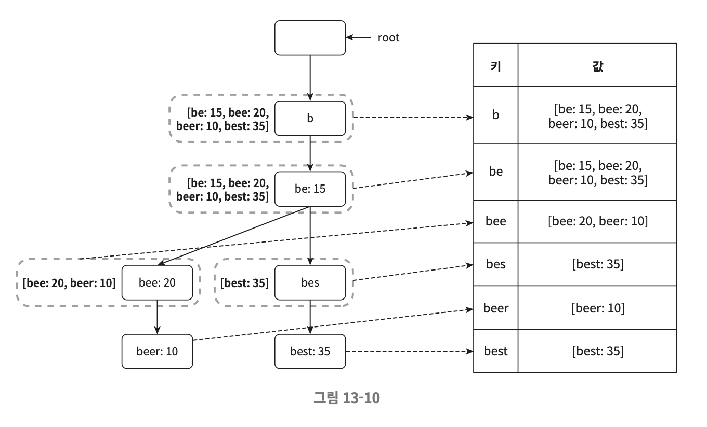

# 검색어 자동완성 시스템

# 1단계 문제 이해 및 설계 범위 확정

## 요구사항

- 빠른 응답 속도

사용자가 검색어를 입력함에 따라 자동완성 검색어도 충분히 빨리 표시되어야 한다.

- 연관성

자동완성되어 출력되는 검색어는 사용자가 입력한 단어와 연관된 것이어야 한다.

- 정렬

시스템의 계산 결과는 인기도 등의 순위 모델에 의해 정렬되어 있어야 한다.

- 규모 확장성

시스템은 많은 트래픽을 감당할 수 있도록 확장 가능해야 한다.

- 고가용성

시스템의 일부에 장애가 발생하거나, 느려지거나, 예상치 못한 네트워크 문제가 생겨도 시스템은 계속 사용 가능해야 한다.

## 계략적 규모 추정

- DAU 는 천만 명으로 가정한다.


- 평균적으로 한 사용자는 매일 10건의 검색을 수행한다고 가정한다.


- 질의할 때마다 평균적으로 20바이트의 데이터를 입력한다고 가정한다.


- 검색창에 글자를 입력할 때마다 클라이언트는 검색어 자동완성 백엔드에 요청을 보낸다.


- 대략 초당 24,000건의 QPS 가 발생할 것이다. ( = 10,000,000 사용자 X 10질의 / 일 X 20자 / 24시간 / 3,600초 )


- 최대 QPS = QPS X 2 = 대략 48,000


- 질의 가운데 20% 정도는 신규 검색어라고 가정하면 매일 신규 데이터가 시스템에 추가된다.

# 2단계 개략적 설계안 제시 및 동의 구하기

개략적으로 보면 시스템은 두 부분으로 나뉜다.

- 데이터 수집 서비스

사용자가 입력한 질의를 실시간으로 수집하는 시스템이다.

- 질의 서비스

주어진 질의에 다섯 개의 인기 검색어를 정렬해 내놓는 서비스이다.

## 데이터 수집 서비스


사용자가 'twitch', 'twitter', 'twitter', 'twillo' 를 순서대로 검색하면 상태가 다음과 같이 바뀌어 나간다.

## 질의 서비스

query : 질의문을 저장하는 필드

frequency : 질의문이 사용된 빈도를 저장하는 필드


이 상태에서 "tw" 를 검색창에 입력하면 top5 자동완성 검색어가 표시되어야 한다.


가장 많이 사용된 5개의 검색어 ("top5") 는 아래의 SQL 질의문을 사용해 계산할 수 있다.

```sql
SELECT *
FROM frequency_table
WHERE query LIKE 'prefix%'
ORDER BY frequency DESC
LIMIT 5
```

데이터 양이 적을 때는 나쁘지 않지만 데이터가 아주 많아지면 데이터베이스가 병목이 될 수 있다.

# 3단계 상세 설계

- 트라이 자료구조


- 데이터 수집 서비스


- 질의 서비스


- 규모 확장이 가능한 저장소


- 트라이 연산

## 트라이 자료구조

RDBMS 를 이용해 다섯 개 질의문을 골라내는 방안은 효율적이지 않다.
이 문제는 트라이를 사용해 해결할 것이다.

트라이는 문자열들을 간략하게 저장할 수 있는 자료구조다.
트라이 자료구조의 핵심 아이디어는 다음과 같다.

- 트라이는 트리 형태의 자료구조다.


- 이 트리의 루트 노드는 빈 문자열을 나타낸다.


- 각 노드는 글자 하나를 저장하며 26개의 자식 노드를 가질 수 있다.


- 각 트리 노드는 하나의 단어 또는 접두어 문자열을 나타낸다.


기본 트라이 자료구조는 노드에 문자들을 저장한다.

이용 빈도에 따라 정렬된 결과를 내놓기 위해서는 노드에 빈도 정보까지 저장할 필요가 있다.


- p : 접두어 (prefix) 의 길이


- n : 트라이 안에 있는 노드 개수


- c : 주어진 노드의 자식 노드 개수

**가장 많이 사용된 질의어 k개는 다음과 같이 찾을 수 있다.**

- 해당 접두어를 표현하는 노드를 찾는다. 시간 복잡도는 O(p) 이다.


- 해당 노드부터 시작하는 하위 트리를 탐색하여 모든 유효 노드를 찾는다. 유효한 검색어 문자열을 구성하는 노드가 유효 노드다. 시간 복잡도는 O(c) 이다.


- 유효 노드들을 정렬하여 가장 인기 있는 검색어 k 개를 찾는다. 시간 복잡도는 O(clogc) 이다.

이 알고리즘은 직관적이지만 최악의 경우에는 k개 결과를 얻으려고 전체 트라이를 다 검색해야 하는 일이 생길 수 있다.

이 문제를 해결할 방법으로는 다음 두 가지가 있다.

1. 접두어의 최대 길이를 제한

2. 각 노드에 인기 검색어를 캐시

### 접두어 최대 길이 제한

사용자가 검색창에 긴 검색어를 입력하는 일은 거의 없다.

따라서 p 값은 작은 정숫값 (가량 50 같은) 이라고 가정해도 안전하다.

검색어의 최대 길이를 제한할 수 있다면 "접두어 노드를 찾는" 단계의 시간 복잡도는 O(p) 에서 O(작은 상숫 값) = O(1) 로 바뀔 것이다.

### 노드에 인기 검색어 캐시

각 노드에 k 개의 인기 검색어를 저장해 두면 전체 트라이를 검색하는 일을 방지할 수 있다.

각 노드에 이렇게 인기 질의어를 캐시하면 검색어를 질의하는 시간 복잡도를 엄청나게 낮출 수 있다.

하지만 각 노드에 저장할 공간이 많이 필요하다는 단점도 있지만 빠른 응답속도가 아주 중요할 때는 저장공간을 희생할 만한 가치가 있다.


앞의 두 가지 최적화 기법을 적용하면 다음과 같이 시간 복잡도가 달라진다.

1. 접두어 노드를 찾는 시간 복잡도는 O(1) 로 바뀐다.


2. 최고 인기 검색어를 찾는 질의의 시간 복잡도도 결과가 이미 캐시되어 있어 O(1) 로 바뀐다.

## 데이터 수집 서비스

사용자가 검색창에 뭔가 타이핑을 할 때마다 실시간으로 데이터를 수정하는 방법은 그다지 실용적이지 못하다.

- 매일 수천만 건의 질의가 입력될 텐데 그때마다 트라이를 갱신하면 질의 서비스는 심각하게 느려질 것이다.


- 일단 트라이가 만들어지고 나면 인기 검색어는 그다지 자주 바뀌지 않을 것이다. 그러니 트라이를 자주 갱신할 필요가 없다.

규모 확장이 쉬운 데이터 수집 서비스를 만들려면 데이터가 어디서 오고 어떻게 이용되는지를 살펴야 한다.


### 데이터 분석 서비스 로그

데이터 분석 서비스 로그에는 검색창에 입력된 질의에 관한 원본 데이터가 보관된다.

새로운 데이터가 추가될 뿐 수정은 이루어지지 않으며 로그 데이터에는 인덱스를 걸지 않는다.


### 로그 취합 서버

데이터 분석 서비스로부터 나오는 로그는 보통 그 양이 엄청나고 데이터 형식도 제각각인 경우가 많다.

따라서 이 데이터를 잘 취합하여 (aggregation) 우리 시스템이 쉽게 소비할 수 있도록 해야 한다.

데이터의 취합 방식은 서비스에 따라 달라질 수 있다.

### 취합된 데이터

time 필드는 해당 주가 시작한 날짜를 나타낸다.

frequency 필드는 해당 주에 사용된 횟수의 합이다.


### 작업 서버

작업 서버는 주기적으로 비동기적 작업을 실행하는 서버 집합이다.

트라이 자료구조를 만들고 트라이 데이터베이스에 저장하는 역할을 담당한다.

### 트라이 캐시

트라이 캐시는 분산 캐시 시스템으로 트라이 데이터를 메모리에 유지하여 읽기 연산 성능을 높이는 구실을 한다.

매주 트라이 데이터베이스의 스냅샷을 떠서 갱신한다.

### 트라이 데이터베이스

트라이 데이터베이스는 지속성 저장소다.

트라이 데이터베이스로 사용할 수 있는 선택지로는 두 가지가 있다.

1. Document Store : 새 트라이를 매주 만들 것이므로 주기적으로 트라이를 직렬화하여 데이터베이스에 저장할 수 있다.


2. Key-Value Store : 트라이는 아래 로직을 적용하면 해시 테이블 형태로 변환이 가능하다.

- 트라이에 보관된 모든 접두어를 해시 테이블 키로 변환


- 각 트라이 노드에 보관된 모든 데이터를 해시 티에블 값으로 변환



## 질의 서비스


1. 검색 질의가 로드밸런서로 전송된다.
2. 로드밸런서는 해당 질의를 API 서버로 보낸다.
3. API 서버는 트라이 캐시에서 데이터를 가져와 해당 요청에 대한 자동완성 검색어 제안 응답을 구성한다.
4. 데이터가 트라이 캐시에 없는 경우에는 데이터를 DB에서 가져와 캐시에 채운다.

질의 서비스는 번개처럼 빨라야 한다.

이를 위해 다음과 같은 최적화 방안을 생각해 보기를 제안한다.

- AJAX 요청 : 웹 애플리케이션의 경우 브라우저는 보통 AJAX 요청을 보내어 자동완성된 검색어 목록을 가져온다. 이 방법의 장점은 요청을 보내도 새로고침을 할 필요가 없다.


- 브라우저 캐싱 : 대부분 애플리케이션의 경우 자동완성 검색어 제안 결과는 짧은 시간 안에 자주 바뀌지 않는다. 따라서 검색어들을 브라우저 캐시에 넣어두면 후속 질의 결과는 해당 캐시에서 바로 가져갈 수 있다.


- 데이터 샘플링 : 대규모 시스템의 경우 모든 질의 결과를 로깅하도록 해놓으면 CPU 자원과 저장공간을 엄청나게 소진한다. 데이터 샘플링 기법으로 N개 요청 가운데 1개만 로깅하도록 한다.

## 트라이 연산

트라이는 검색어 자동완성 시스템의 핵심 컴포넌트다.

### 트라이 생성

트라이 생성은 작업 서버가 담당하며 데이터 분석 서비스의 로그나 데이터베이스로부터 취합된 데이터를 이용한다.

### 트라이 갱신

트라이를 갱산하는 데는 두 가지 방법이 있다.

1. 매주 한 번 갱신하는 방법. 새로운 트라이를 만든 다음 기존 트라이를 대체한다.


2. 트라이의 각 노드를 개별적으로 갱신하는 방법. 성능이 좋지 않지만 트라이가 작을 때는 고려해봄직한 방안이다. 트라이 노드를 갱신할 때는 상위 노드에도 인기 검색어 질의 결과가 보관되기 때문에 그 모든 상위
   노드도 갱신해야 한다.

## 저장소 규모 확장

트라이의 크기가 한 서버에 넣기엔 너무 큰 경우에도 대응할 수 있도록 규모 확장성 문제를 해결해보자.

간단하게는 첫 글자를 기준으로 샤딩할 수 있다.

이 방법을 쓰는 경우 사용 가능한 서버는 영어 알파벳 숫자인 최대 26대로 제한된다.

이 이상으로 서버 대수를 늘리려면 샤딩을 계층적으로 해야 한다.

이 문제를 해결하기 위해서는 과거 질의 데이터의 패턴을 분석하여 샤딩하는 방법이 있다.

이 그림에서는 검색어 대응 샤드 관리자는 어떤 검색어가 어느 저장소 서버에 저장되는지에 대한 정보를 관리한다.

예를 들어 's' 로 시작하는 검색어의 양이 'u', 'v', 'w', 'x', 'y', 'z' 로 시작하는 검색어를 전부 합친 것과 비슷하다면 's' 에 대한 샤드 하나와 'u', 'z' 까지의 검색어를 위한 샤드
하나를 두어도 충분할 것이다.


# 4단계 마무리

다루어 볼만한 아이디어

- 트라이를 CDN에 저장하여 국가별 인기 검색어 순위가 다른 경우에 응답속도를 높이는 방법


- 실시간으로 변하는 검색어의 추이를 반영하는 방안


- 샤딩을 통하여 작업 대상 데이터 양을 줄인다.


- 순위 모델을 바꾸어 최근 검색어 보다 높은 가중치를 주도록 한다.


- 데이터가 스트림 형태로 올 수 있다는 점, 즉 한번에 모든 데이터를 동시에 사용할 수 없을 가능성이 있다는 점을 고려해야 한다. 데이터가 스트리밍 된다는 것은 데이터가 지속적으로 생성된다는 뜻이다. 스트림
  프로세싱에는 특별한 종류의 시스템이 필요하다.
