# 키-값 저장소 설계

## 키-값 저장소 특징
- 키-값 저장소 (key-value store) 는 비 관계형 데이터베이스이다.

- 저장소에 저장되는 값은 고유 식별자를 키로 가져야 한다.

- 키는 텍스트일 수도 있고 해시 값일 수도 있다.

- 성능상의 이유로 키는 짧을수록 좋다.

- 키-값 저장소는 보통 값으로 무엇이 오든 상관하지 않는다.

### 키 값 저장소 종류
- [Amazon Dynamo](https://aws.amazon.com/ko/dynamodb/)

- [memcached](https://memcached.org/)

- [redis](https://redis.io/)

# 문제 이해 및 설계 범위 확정
완벽한 설계는 없다.

읽기, 쓰기 그리고 메모리 사용량 사이에 어떤 균형을 찾고 데이터의 일관성과 가용성 사이에서 타협적 결정을 내린 설계를 만들었다면 쓸만한 답안일 것이다.

# 단일 서버 키-값 저장소
한 대 서버에 해시 테이블로 모든 키-값 저장소를 저장하는 것이 가장 빠르고 쉽지만 다음과 같은 문제점이 있다.

**문제점**
- SPOF 가 될 수 있다.

- 용량이 제한적이다. 데이터 압축이나 메모리를 사용해도 데이터의 크기가 한 대 서버로 부족한 때가 찾아온다.

이를 해결하기 위해 분산 키-값 저장소를 만들 필요가 있다.

# 분산 키-값 저장소
분산 키-값 저장소는 키-값 쌍을 여러 서버에 분산시키기 때문에 분산 해시 테이블이라고도 불린다.

# CAP 정리
CAP 정리는 **Consistency(일관성), Availability(가용성), Partition tolerance(파티션 감내)** 라는 세 가지 요구사항을 동시에 만족하는 분산 시스템을 설계하는 것은 불가능하다는 정리다.

### Consistency 
분산 시스템에 접속하는 모든 클라이언트는 어떤 노드에 접속했느냐에 관계없이 언제나 같은 데이터를 보게 되어야 한다.

### Availability
분산 시스템에 접속하는 클라이언트는 일부 노드에 장애가 발생하더라도 항상 응답을 받을 수 있어야 한다.

### Partition Tolerance
파티션은 두 노드 사이에 통신 장애가 발생하였음을 의미한다.

파티션 감내는 네트워크에 파티션이 생기더라도 시스템은 계속 동작하여야 한다는 것을 뜻한다.

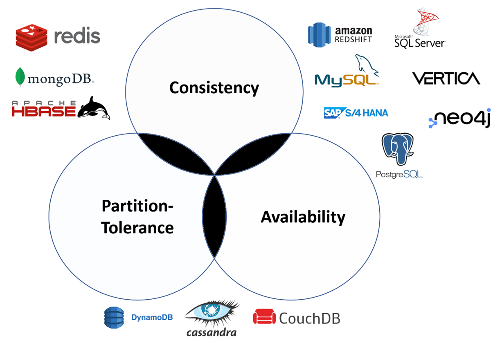

키 값 저장소는 세 가지 요구사항 가운데 어느 두 가지를 만족하느냐에 따라 다음과 같이 분류할 수 있다.

### CP 시스템
일관성과 파티션 감내를 지원하는 키-값 저장소.

### AP 시스템
가용성과 파티션감내를 지원하는 키-값 저장소.

### CA 시스템
일관성과 가용성을 지원하는 키-값 저장소.

파티션 감내는 지원하지 않지만 통상 네트워크 장애는 피할 수 없는 일로 여겨지므로 분산 시스템은 반드시 파티션 문제를 감내할 수 있도록 설계되어야 한다.

그러므로 실세계에 CA 시스템은 존재하지 않는다.

# 사례
## 이상적 상태
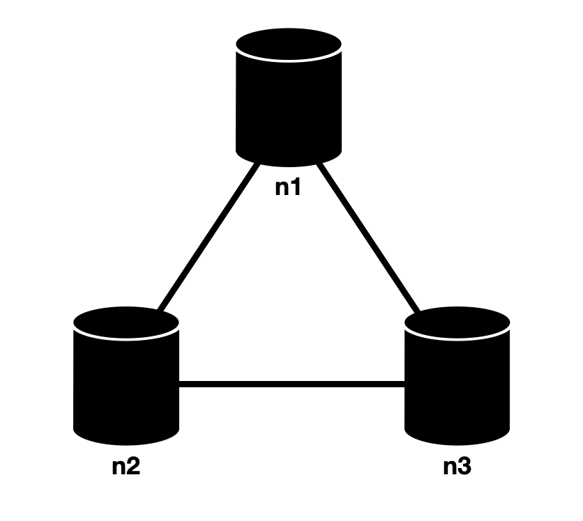

이상적 환경이라면 네트워크가 파티션되는 상황은 절대로 일어나지 않을 것이다.

n1에 기록된 데이터는 자동적으로 n2와 n3에 복제된다.

데이터 일관성과 가용성도 만족된다.

## 실세계의 분산 시스템
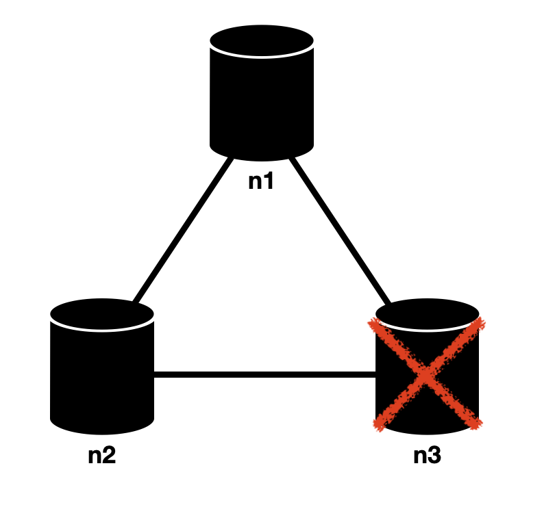

분산 시스템은 파티션 문제를 피할 수 없으므로 파티션 문제가 발생하면 일관성과 가용성 사이에서 하나를 선택해야 한다.

위 그림에서 n3에 기록된 데이터가 n1 과 n2 에 복제되기 전이라 낡은 데이터를 들고 있을 수 있다.

**일관성 선택 경우**

일관성을 선택한다면 하나의 노드에 장애가 발생했을 경우 쓰기 연산을 중단시켜야 하는데 그렇게 하면 가용성이 깨진다.

**가용성 선택 경우**

가용성을 선택한다면 낡은 데이터를 반환할 위험이 있더라도 계속 쓰기 연산을 허용해야 한다.

## 시스템 컴포넌트
**키-값 저장소 핵심 컴포넌트**
- 데이터 파티션

- 데이터 다중화 (replication)

- 일관성 (consistency)

- 일관성 불일치 해소 (inconsistency resolution)

- 장애 처리

- 시스템 아키텍처 다이어그램

- 쓰기 경로 (write path)

- 읽기 경로 (read path)

### 데이터 파티션

대규모 데이터를 한 대의 서버에 저장할 수 없다.

단순한 해결책은 데이터를 작은 파티션들로 분할한 다음 여러 대 서버에 저장하는 것이다.

데이터를 파티션으로 나눌 때는 다음 두 가지 문제를 중요하게 따져봐야 한다.

- 데이터를 여러 서버에 고르게 분산할 수 있는가?

- 노드가 추가되거나 삭제될 때 데이터의 이동을 최소화할 수 있는가?

안정 해시를 사용해 이러한 문제를 해소할 수 있다.

### 데이터 다중화

높은 가용성과 안정성을 확보하기 위해서는 데이터를 N개 서버에 비동기적으로 다중화 (replication) 할 필요가 있다.

N은 우리가 튜닝이 가능한 값이다.

**N개 서버를 선정하는 방법**

1. 어떤 키를 해시 링 위에 배치한다.

2. 그 지점으로부터 시계 방향으로 링을 순회하면서 만나는 첫 N개 서버에 데이터 사본을 보관하는 것이다.

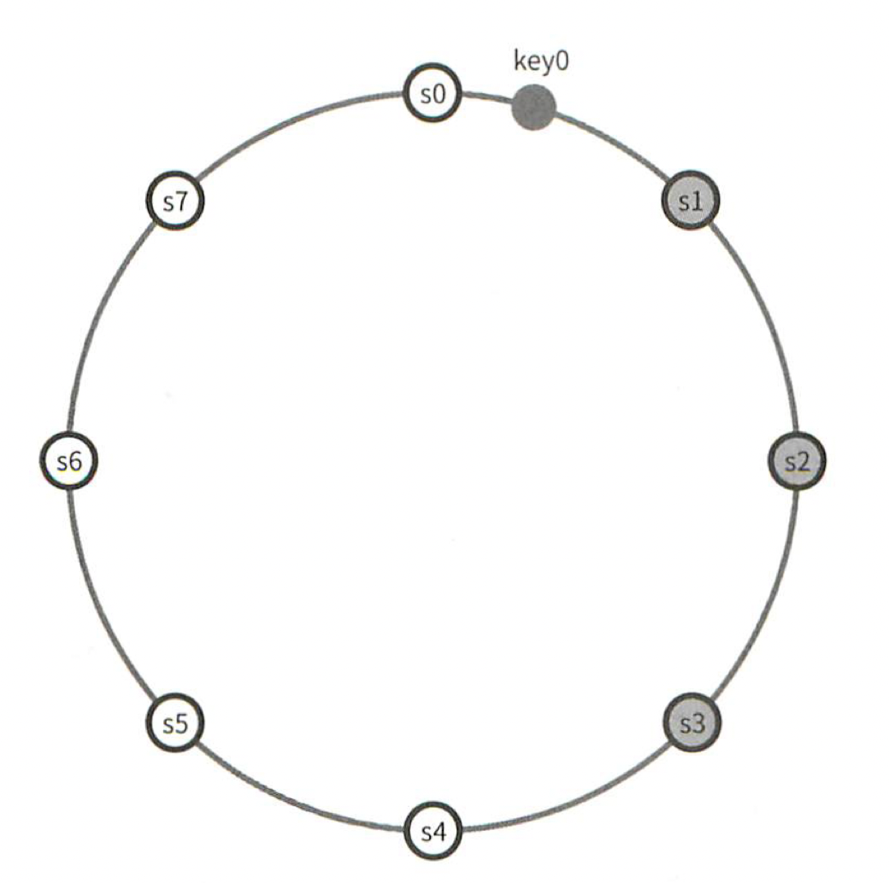

위 그림에서 N이 3이라면 s1, s2, s3 에 저장된다.

**주의점**
- 가상 노드를 사용한다면 대응될 실제 물리 서버의 개수가 N 보다 작아질 수 있다. 이 문제를 피하려면 노드를 선택할때 같은 물리 서버를 중복 선택하지 않도록 해야 한다.

- 같은 데이터 센터에 속한 노드는 정전, 네트워크 이슈, 자연재해 등의 문제를 동시에 격을 가능성이 있다. 따라서 안정성을 담보하기 위해 데이터 사본은 다른 센터의 서버에 보관하고 센터들은 고속 네트워크로 연결한다.

### 데이터 일관성
여러 노드에 다중화된 데이터는 적절히 동기화가 되어야 한다.

정족수 합의 (Quorum Consensus) 프로토콜을 사용하면 읽기/쓰기 연산 모두에 일관성을 보장할 수 있다.

**N** = 사본의 개수

**W** = 쓰기 연산에 대한 정족수. 쓰기 연산이 성공한 것으로 간주되려면 적어도 W 개의 서버로부터 쓰기 연산이 성공했다는 응답을 받아야 한다.

**R** = 읽기 연산에 대한 정족수. 읽기 연산이 성공한 것으로 간주되려면 적어도 R 개의 서버로부터 응답을 받아야 한다.

N = 3인 경우

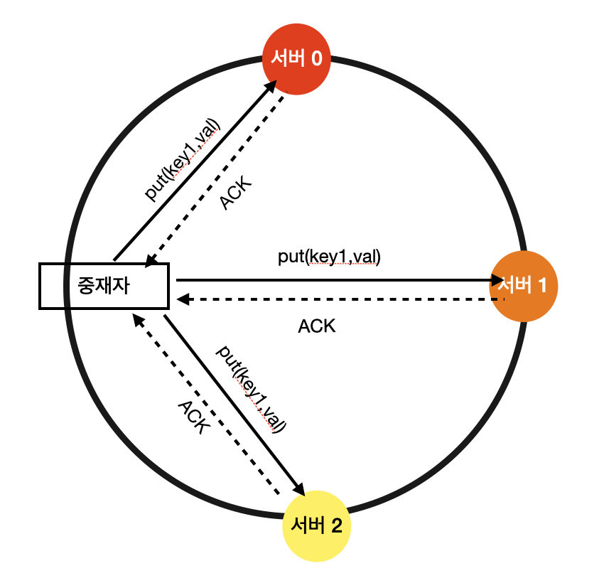

W = 1 은 중재자가 최소 한 대 서버로부터 쓰기 성공 응답을 받아야 한다는 뜻이다.

따라서 s1으로부터 성공 응답을 받았다면 s0, s2 로부터의 응답을 기다릴 필요가 없다.

중재자는 클라이언트와 노드 사이에서 프락시 역할을 한다.

W, R, N 의 값을 정하는 것은 응답 지연과 데이터 일관성 사이의 타협점을 찾는 전형적인 과정이다.

### W, R, N 값의 조합
- R = 1, W = N : 빠른 읽기 연산에 최적화된 시스템

- W = 1, R = N : 빠른 쓰기 연산에 최적화된 시스템

- W + R > N : 강한 일관성이 보장됨 (보통 N = 3, W = R = 2)

- W + R <= N : 강한 일관성이 보장되지 않음

## 일관성 모델
일관성 모델은 데이터 일관성 수준을 결정하는데 종류가 다양하다.

- 강한 일관성 : 모든 읽기 연산은 가장 최근에 갱신된 결과를 반환한다. 클라이언트는 절대 낡은 데이터를 보지 못한다.

- 약한 일관성 : 읽기 연산은 가장 최근에 갱신된 결과를 반환하지 못할 수 있다.

- 최종 일관성 : 약한 일관성의 한 형태로, 갱신 결과가 결국에는 모든 사본에 반영되는 모델이다.

## 비 일관성 해소 기법 : 데이터 버저닝
데이터를 다중화하면 가용성은 높아지지만 사본 간 일관성이 깨질 가능성은 높아진다.

버저닝과 벡터 시계는 그 문제를 해소하기 위해 등장한 기술이다.

### 데이터 일관성이 깨지는 경우

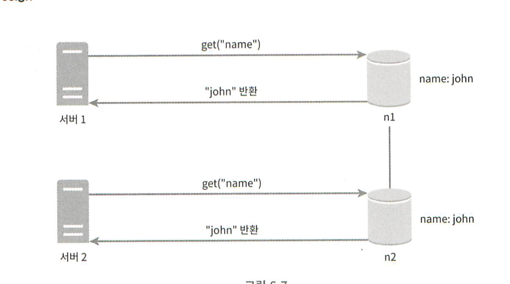

서버 1과 서버 2는 get("name") 연산의 결과로 같은 값을 얻는다.

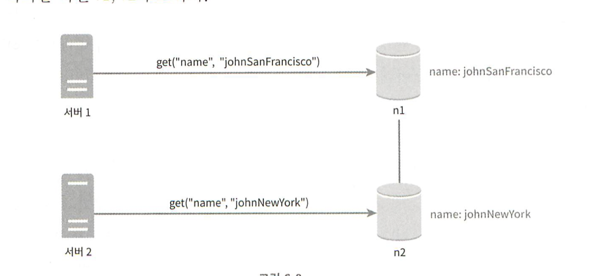

서버 1은 name 을 "johnSanFrancisco" 서버 2는 "johnNewYork" 으로 바꾼다.

이 두 연산이 동시에 일어나면 충돌하는 두 값이 생긴다.

이러한 충돌을 발견하고 자동으로 해결해 낼 버저닝 시스템이 필요하다.

벡터 시계는 이러한 문제를 푸는데 보편적으로 사용되는 기술이다.

### 벡터 시계
벡터 시계는 [서버, 버전] 의 순서쌍을 데이터에 매단 것이다.
어떤 버전이 선행 버전인지, 후행 버전인지, 아니면 다른 버전과 충돌이 있는지 판별하는데 쓰인다.

벡터 시계는 D([S1, v1], [S2, v2], ..., [Sn, vn]) 와 같이 표현한다고 가정한다.

D는 데이터, vi 는 버전 카운터, Si 는 서버 번호이다.

만일 데이터 D를 서버 Si에 기록하면, 시스템은 아래 작업 가운데 하나를 수행하여야 한다.

- [Si, vi] 가 있으면 vi를 증가시킨다.

- 그렇지 않으면 새 항목 [Si, 1] 를 만든다.

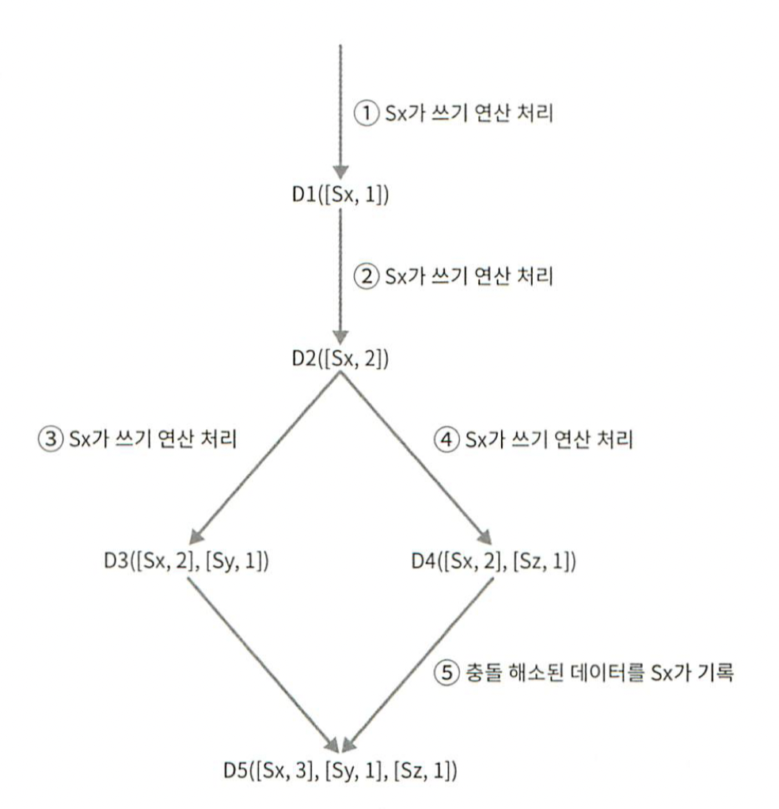

어떤 버전 X 와 Y 사이에 충돌이 있는지 보려면 Y 의 벡터 시계 구성요소 가운데 X 의 벡터 시계 동일 서버 구성요소보다 작은 값을 갖는 것이 있는지 보면 된다.

**벡터 시계 단점**

- 충돌 감지 및 해소 로직이 클라이언트에 들어가야 하므로 클라이언트 구현이 복잡해진다는 것이다.

- [서버:버전] 의 순서쌍 개수가 굉장히 빨리 늘어난다는 것이다.

## 장애 처리
### 장애 감지
분산 시스템에서 서버 한대가 장애를 감지 했다고 해서 바로 장애처리 하지는 않는다.

보통 두 대 이상의 서버가 똑같이 장애를 보고해야 해당 서버에 실제로 장애가 발생했다고 간주하게 된다.

### 멀티 캐스팅
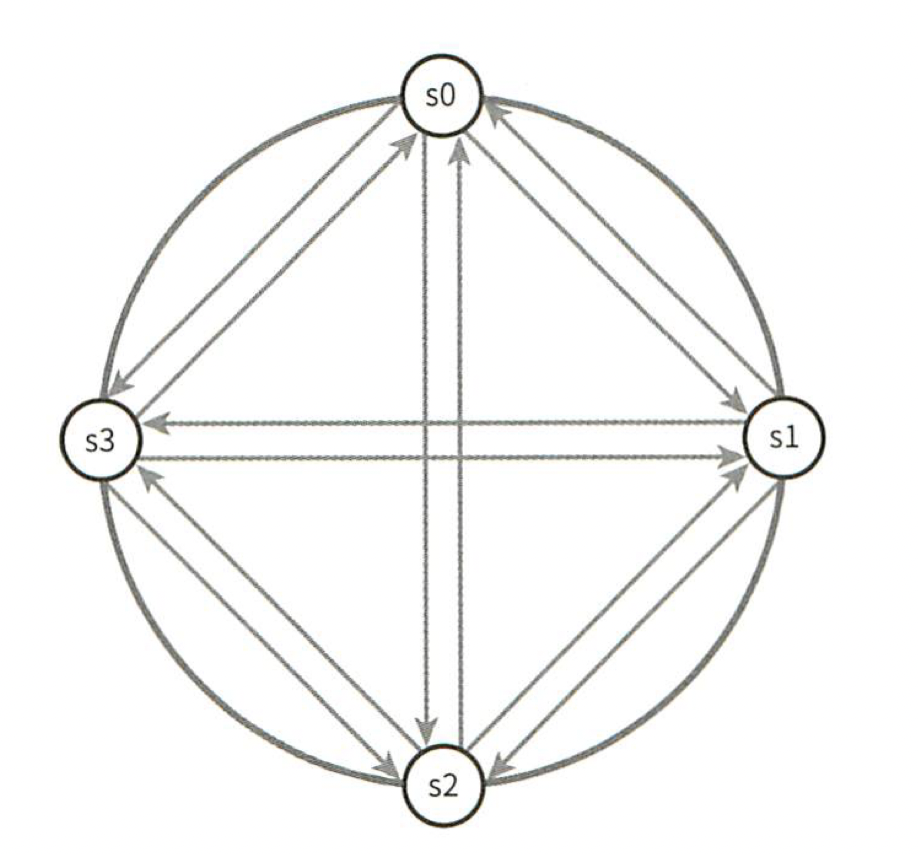

모든 노드 사이에 멀티캐스팅 채널을 구축하는 것이 서버 장애를 감지하는 가장 손쉬운 방법이다.

하지만 이 방법은 서버가 많을 때는 비효율적이다.

### 가십 프로토콜
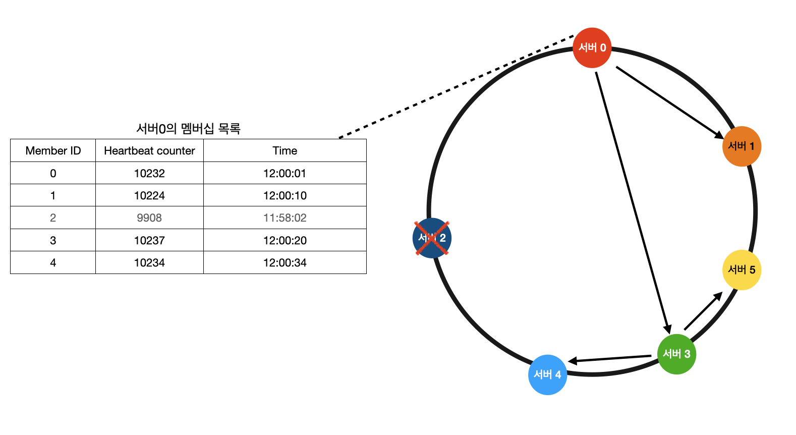

가십 프로토콜로 장애를 감지한 시스템은 가용성을 보장하기 위해 필요한 조치를 해야 한다.

느슨한 정족수 (sloppy quorum) 접근법은 조건을 완화하여 가용성을 높인다.
정족수 요구사항을 강제하는 대신, 쓰기 연산을 수행할 W 개의 건강한 서버와 읽기 연산을 수행할 R 개의 건강한 서버를 해시 링에서 고른다.
이때 장애 상태인 서버는 무시한다.

네트워크나 서버 문제로 장애 상태인 서버로 가는 요청은 다른 서버가 잠시 맡아 처리한다.
그동안 발생한 변경사항은 해당 서버가 복구되었을 때 일관 반영하여 데이터 일관성을 보존한다.
이를 위해 임시로 쓰기 연산을 처리한 서버에는 그에 관한 단서(hint) 를 남겨둔다.
따라서 이런 장애 처리 방안을 단서 후 임시 위탁 기법이라 부른다.

## 영구 장애 처리
영구 장애 처리 상황은 반-엔트로피 (anti-entropy) 프로토콜을 구현하여 사본들을 동기화할 것이다.

반-엔트로피 프로토콜은 사본들을 비교하여 최신 버전으로 갱신하는 과정을 포함한다.

사본 간의 일관성이 망가진 상태를 탐지하고 전송 데이터의 양을 줄이기 위해서는 머클(Merkle) 트리를 사용할 것이다.

### 머클 트리
각 노드에 그 자식 노드들에 보관된 값의 해시(자식 노드가 leaf 노드인 경우) 또는 자식 노드들의 레이블로부터 계산된 해시 값을 레이블로 붙여두는 트리다.

해시 트리를 사용하면 대규모 자료구조의 내용을 효과적이면서도 보안상 안전한 방법으로 검증할 수 있다.

1 단계 : 키 공간을 버킷으로 나눈다.

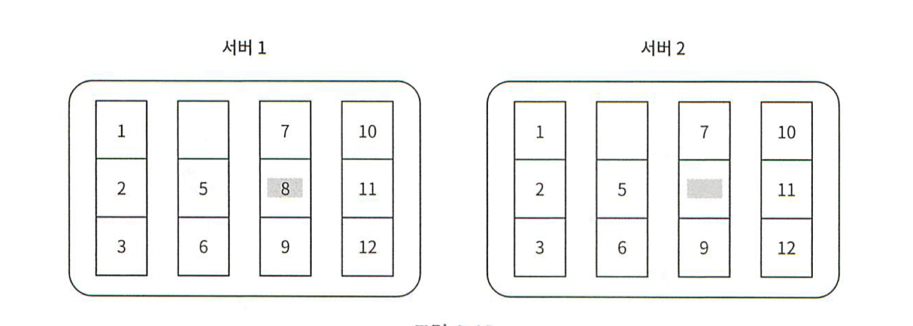

2 단계 : 버킷에 포함된 각각의 키에 균등 분포 해시 함수(uniform hash)를 적용하여 해시 값을 계산한다.

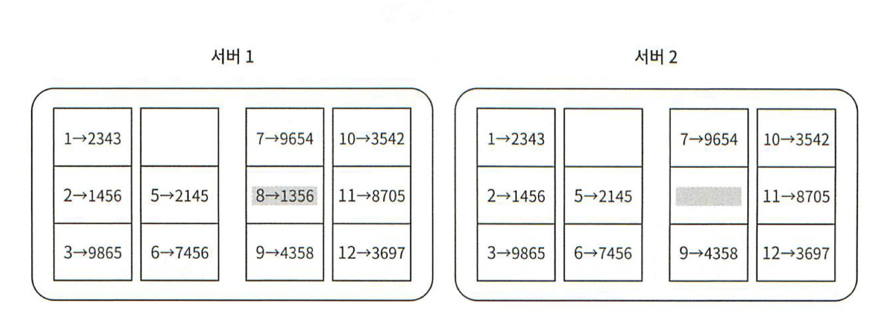

3 단계 : 버킷별로 해시값을 계산한 후, 해당 해시 값을 레이블로 갖는 노드를 만든다.

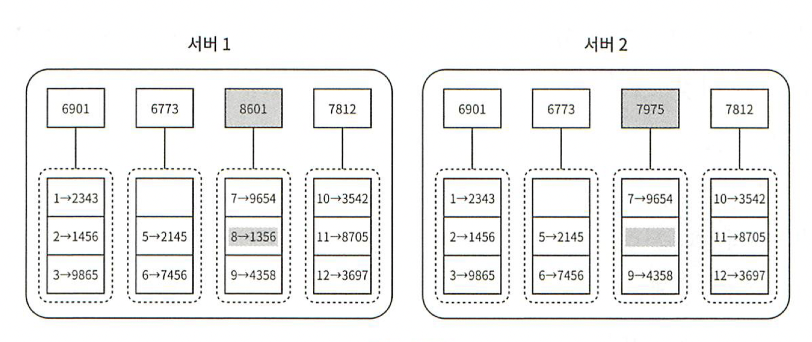

4 단계 : 자식 노드의 레이블로부터 새로운 해시 값을 계산하여 이진 트리를 상향식으로 구성해 나간다.

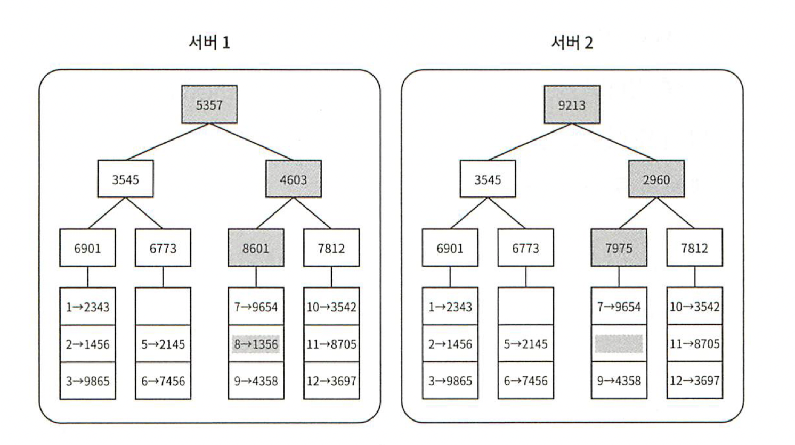

루트 노드의 해시 값이 일치한다면 두 서버는 같은 데이터를 갖는 것이다.

그 값이 다른 경우에는 왼쪽 자식 노드의 해시 값을 비교하고, 그 다음으로 오른쪽 자식 노드의 해시 값을 비교한다.

이렇게 하면서 아래쪽으로 탐색해 나가다 보면 다른 데이터를 갖는 버킷을 찾을 수 있으므로 그 버킷들만 동기화하면 된다.

## 데이터 센터 장애 처리
데이터 센터 장애는 정전, 네트워크 장애, 자연재해 등 다양한 이유로 발생할 수 있다.

데이터 센터 장애를 대응할 수 있는 시스템을 만들려면 데이터를 여러 데이터 센터에 다중화하는 것이 중요하다.

### 시스템 아키텍처 다이어그램

키-값 저장소 주된 기능
- 클라이언트는 키-값 저장소가 제공하는 get(key) 및 put(key, value) 와 통신한다.

- coordinator 는 클라이언트에게 키-값 저장소에 대한 proxy 역할을 하는 노드다.

- 노드는 안정 해시의 해시 링 위에 분포한다.

- 노드를 자동으로 추가 또는 삭제할 수 있도록 시스템은 완전히 분산된다.

- 데이터는 여러 노드에 다중화된다.

- 모든 노드가 같은 책임을 지므로 SPOF 는 존재하지 않는다.

### 제공해야 될 기능
완전히 분산된 키-값 저장소는 다음과 같은 기능을 제공해야 한다.
- 클라이언트 API

- 장애 감지

- 데이터 충돌 해소

- 장애 복구 메커니즘

- 다중화

- 저장소 엔진

- 그 외 ...

# 카산드라 예시
## 쓰기 경로
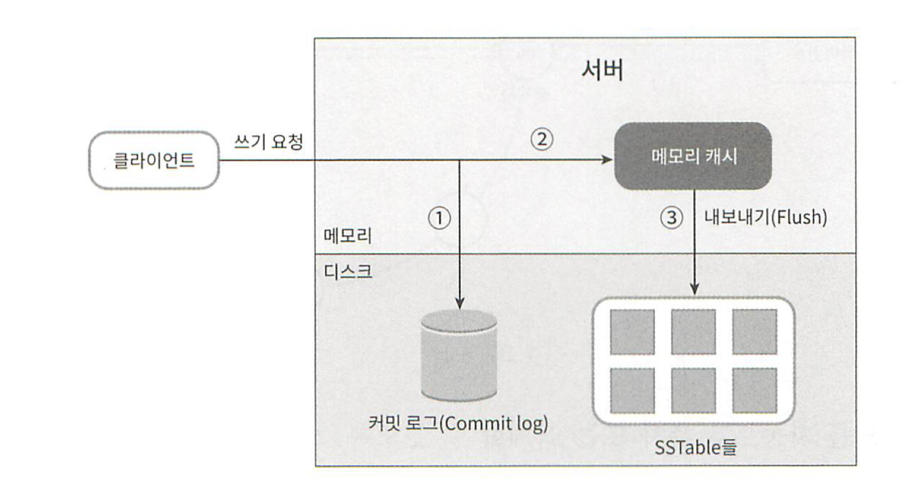

1. 쓰기 요청이 커밋 로그 (commit log) 파일에 기록된다.

2. 데이터가 메모리 캐시에 기록된다.

3. 메모리 캐시가 가득 차거나 사전에 정의된 임계치에 도달하면 데이터는 디스크에 있는 SSTable 에 기록된다.

## 읽기 경로
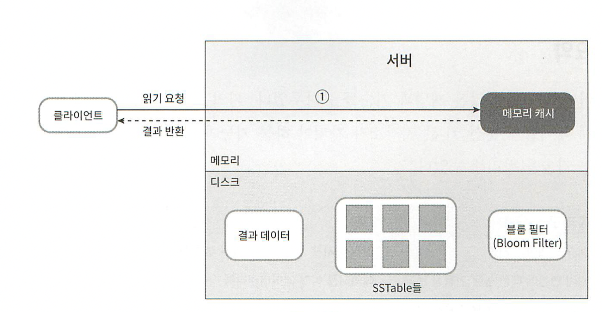

읽기 요청을 받은 노드는 데이터가 메모리 캐시에 있는지부터 살핀다.

- 있는 경우에는 해당 데이터를 클라이언트에게 반환한다.

- 데이터가 없는 경우에는 디스크에서 가져온다. 어느 SSTable 에 찾는 키가 있는지는 Bloom filter 가 흔히 사용된다.

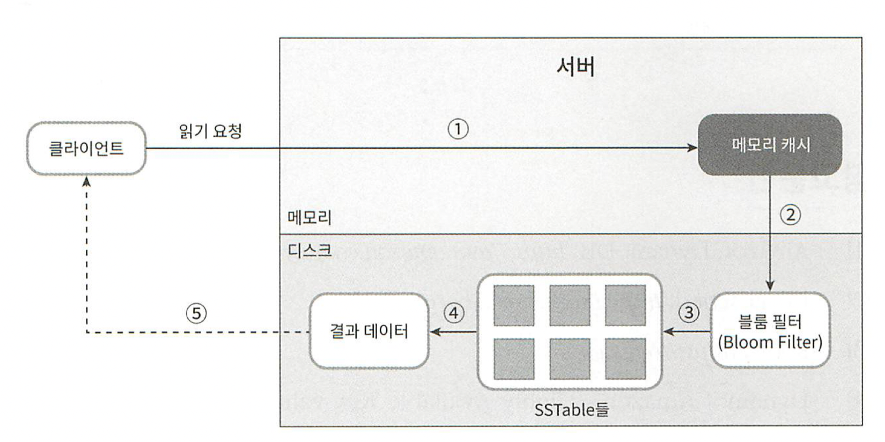
1. 데이터가 메모리에 있는지 검사한다.

2. 데이터가 메모리에 없으므로 블룸 필터를 검사한다.

3. 블룸 필터를 통해 어떤 SSTable 에 키가 보관되어 있는지 알아낸다.

4. SSTable 에서 데이터를 가져온다.

5. 해당 데이터를 클라이언트에게 반환한다.

# 요약
분산 키-값 저장소가 가져야 하는 기능과 그 기능 구현에 이용되는 기술 정리

