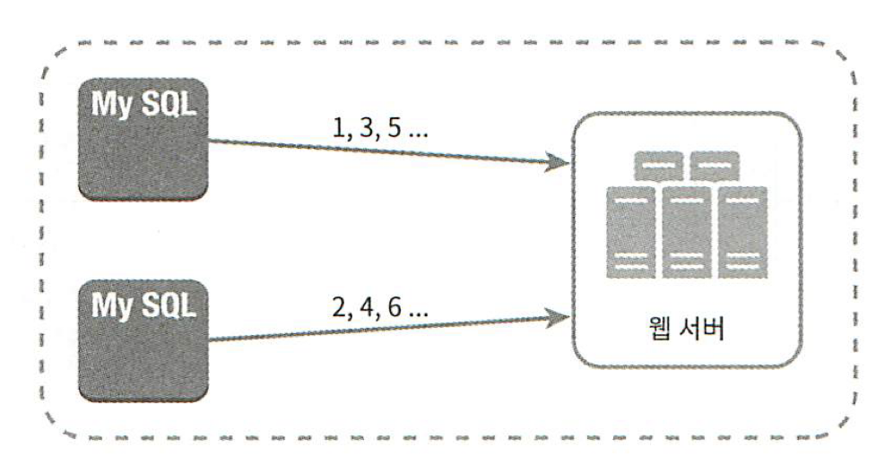
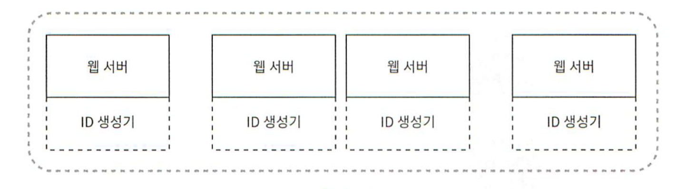
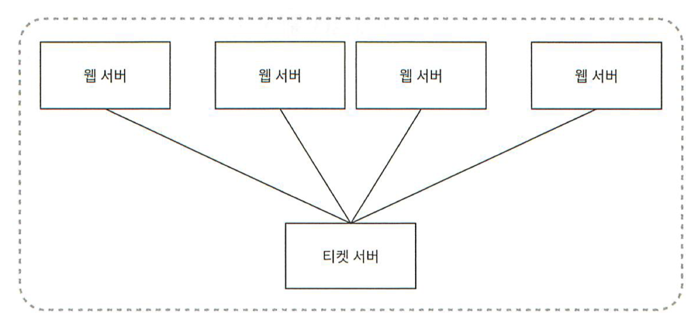
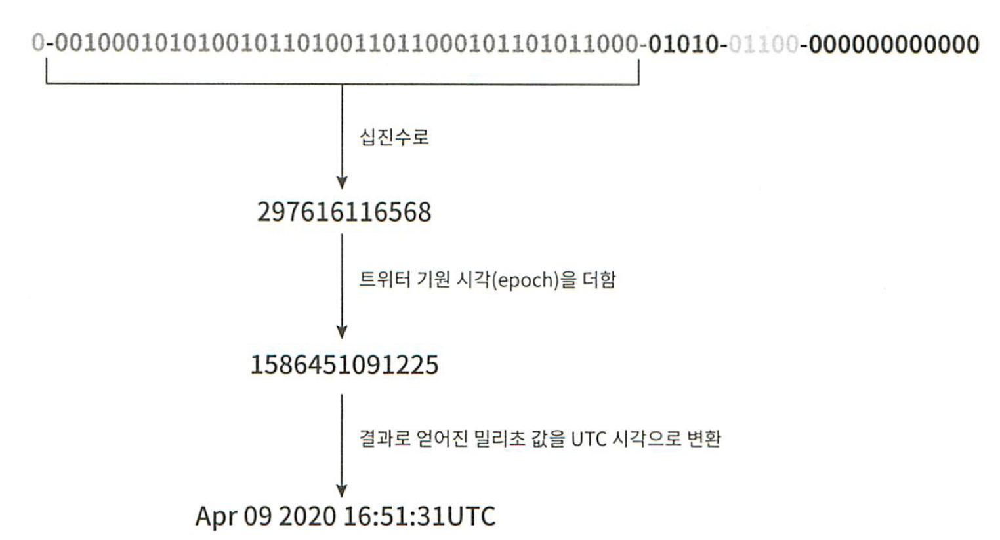

# 문제 이해 및 설계 범위 확정
- ID는 유일해야 한다.
- ID는 숫자로만 구성되어야 한다.
- ID는 64비트로 표현될 수 있는 값이어야 한다.
- ID는 발급 날짜에 따라 정렬 가능해야 한다.
- 초당 10,000개의 ID를 만들 수 있어야 한다.

# 개략적인 설계안 제시 및 동의 구하기

**설계 방법**
- 다중 마스터 복제 (multi-master replication)
- UUID (Universally Unique Identifier)
- 티켓 서버 (ticket server)
- 트위터 스노플레이크 (twitter snowflake) 접근법

## 다중 마스터 복제

데이터베이스의 auto_increment 기능을 활용한다.
ID 값을 구할 때 현재 사용 중인 데이터베이스 서버의 수인 K 만큼 증가시킨다.

단점
- 여러 데이터 센터에 걸쳐 규모를 늘리기 어렵다.
- ID 유일성은 보장되겠지만 그 값이 시간 흐름에 맞추어 커지도록 보장할 수는 없다.
- 서버를 추가하거나 삭제할 때도 잘 동작하도록 만들기 어렵다.

## UUID
UUID는 컴퓨터 시스템에 저장되는 정보를 유일하게 식별하기 위한 128비트짜리 수다.
UUID는 서버 간 조율 없이 독립적으로 생성 가능하다.

장점
- UUID 를 만드는 것은 단순하다.
- 서버 사이의 조율이 필요 없으므로 동기화 이슈도 없다.
- 각 서버가 자기가 쓸 ID를 알아서 만드는 구조이므로 확장도 쉽다.

단점
- ID가 128비트로 길다.
- ID를 시간순으로 정렬할 수 없다.
- ID에 숫자가 아닌 값이 포함될 수 있다.

## 티켓 서버

auto_increment 기능을 갖춘 티켓 서버를 중앙 집중형으로 하나만 사용하는 것이다.

장점
- 유일성이 보장되는 오직 숫자로만 구성된 ID를 쉽게 만들 수 있다.
- 구현하기 쉽고, 중소 규모 애플리케이션에 적합하다.

단점
- 티켓 서버가 SPOF 가 된다.

# 트위터 스노플레이크 접근법

사인 비트 : 1비트를 할당한다. 지금은 쓰임새가 없지만 나중을 위해 유보해 둔다. 음수와 양수를 구별하는 데 사용할 수 있을 것이다.

타임스탬프 : 41비트를 할당한다. 기원 시각 이후 몇 밀리초가 경과했는지를 나타내는 값이다.

데이터 센터 ID : 5비트를 할당한다. 따라서 2^5 = 32개 데이터 센터를 지원할 수 있다.

서버 : 5비트를 할당한다. 따라서 데이터센터당 32개 서버를 사용할 수 있다.

일련번호 : 12비트를 할당한다. 각 서버에는 ID를 생성할 때마다 이 일련 번호를 1만큼 증가시킨다. 이 값은 1밀리초가 경과할 때마다 0으로 초기화된다.

# 3단계 상세 설계

데이터센터 ID와 서버 ID는 시스템이 시작할 때 결정되며, 일반적으로 시스템 운영 중에는 바뀌지 않는다.
데이터센터 ID나 서버 ID를 잘못 변경하게 되면 ID 충돌이 발생할 수 있다.
타임스탬프나 일련번호는 ID 생성기가 돌고 있는 중에 만들어지는 값이다.

## 타임스탬프
타임스탬프는 시간이 흐름에 따라 점점 큰 값을 갖게 되므로 결국 ID는 시간 순으로 정렬 가능하게 될 것이다.

41비트로 표현할 수 있는 타임스탬프 최댓값은 대략 69년에 해당한다.
이 ID 생성기는 69년동안만 정상 동작한다.
69년이 지나면 기원 시각을 바꾸거나 ID 체계를 다른 것으로 이전하여야 한다.

## 일련번호
일련번호는 12비트 값으로 4096개의 값을 가질 수 있다.
어떤 서버가 같은 밀리초 동안 하나 이상의 ID를 만들어 낸 경우에만 0보다 큰 값을 갖게된다.

# 마무리
추가로 논의할 수 있는 사항
- 시계 동기화 : 여러 서버에서 ID를 생성할 경우 시계 동기화가 필요하다. NTP(Network Time Protocol) 은 이 문제를 해결하는 가장 보편적 수단이다.

- 각 절(section)의 길이 최적화 : 예를 들어 동시성이 낮고 수명이 긴 애플리케이션이라면 일련번호 절의 길이를 줄이고 타임스탬프 절의 길이를 늘리는 것이 효과적일 수도 있다.

- 고가용성(high availability) : ID 생성기는 필수 불가결 (mission critical) 컴포넌트이므로 아주 높은 가용성을 제공해야 할 것이다.

