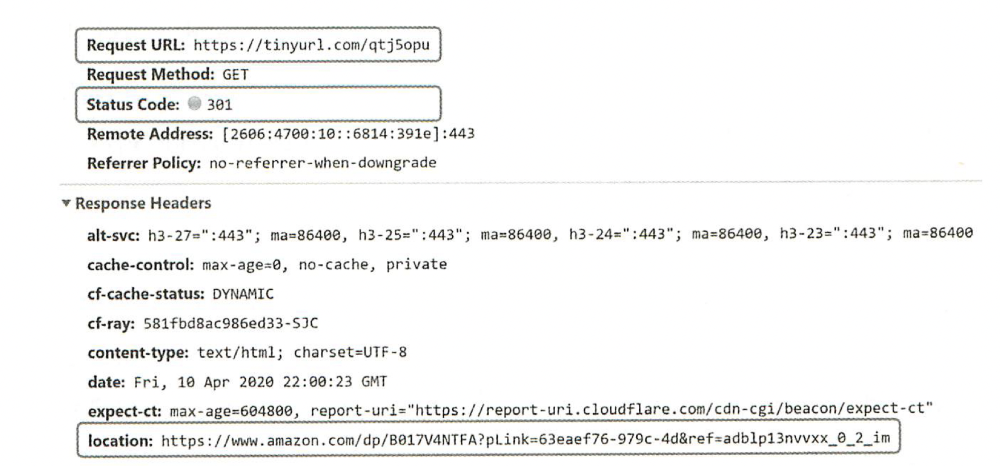
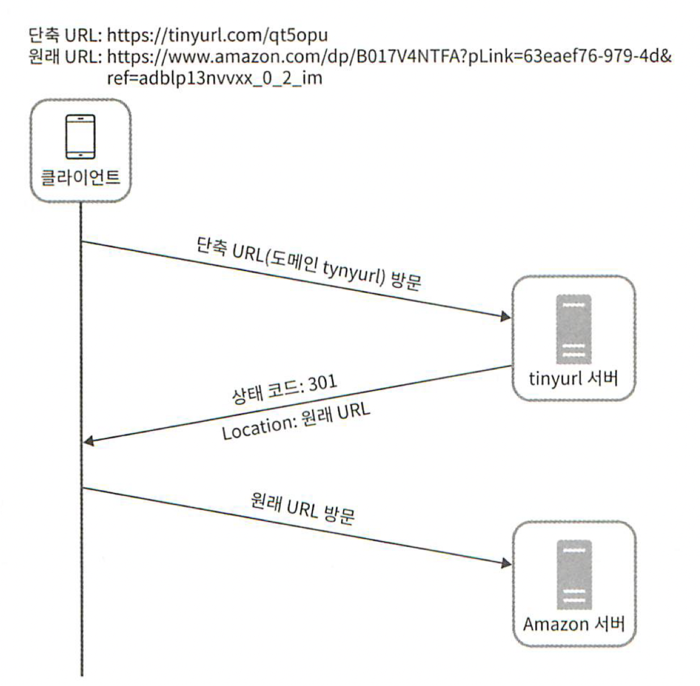
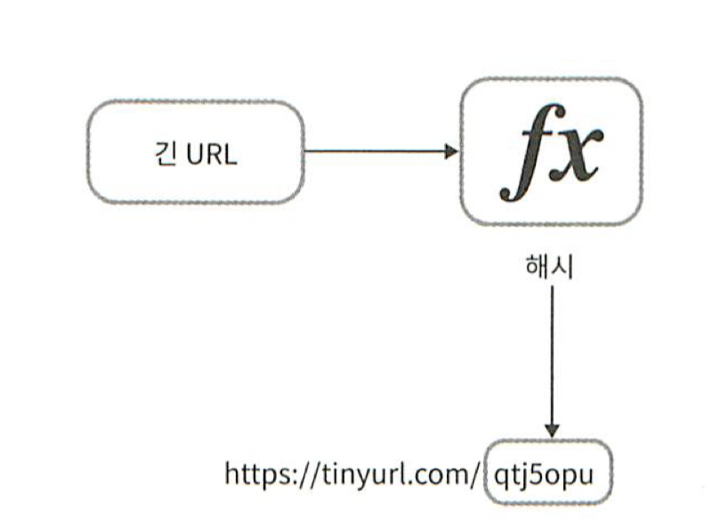
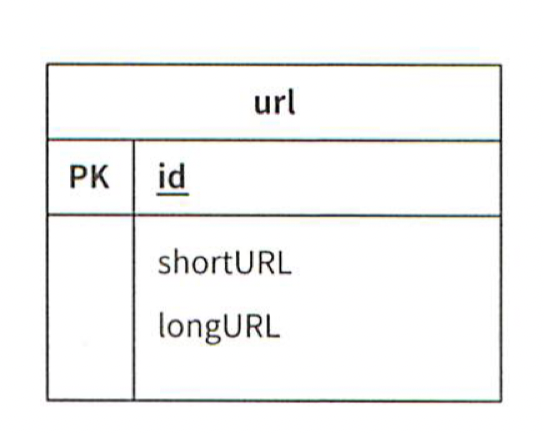
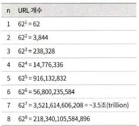
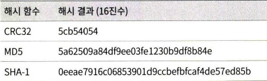
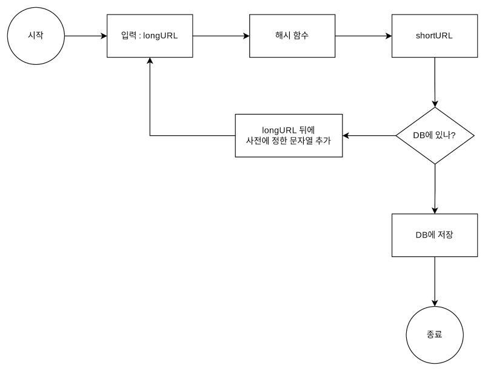
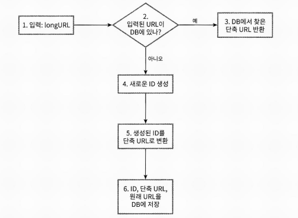
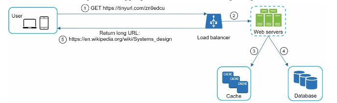

# URL 단축키 설계

# 1단계 문제 이해 및 설계 범위 확정

### 기본적인 기능

1. URL 단축 : 주어진 긴 URL을 훨씬 짧게 줄인다.
2. URL 리디렉션 : 축약된 URL 로 HTTP 요청이 오면 원래 URL로 안내
3. 높은 가용성과 규모 확장성, 그리고 장애 감내가 요구됨

### 개략적인 추정

- 쓰기 연산 : 매일 1억개 단축 URL 생성
- 초당 쓰기 연산 : 1억 / 24 / 3600 = 1160
- 읽기 연산 : 10:1 의 비율로 가정하면 초당 11,600 회
- URL 단축 서비스를 10년간 운영하면 1억 x 365 x 10 = 3650 억
- 축약전 URL 의 평균 길이는 100
- 따라서 10년 동안 필요한 저장 용량은 3650 억 x 100 바이트 = 36.5 TB

# 2단계 개략적인 설계안 제시 및 동의 구하기

### API 엔드포인트

클라이언트는 서버가 제공하는 API 엔드포인트를 통해 서버와 통신한다.

1. URL 단축용 엔드포인트
   새 단축 URL 을 생성하고자 하는 클라이언트는 이 엔드포인트에 단축할 URL 을 인자로 실어서 POST 요청을 보내야 한다.

2. URL 리디렉션용 엔드포인트
   단축 URL에 대해서 HTTP 요청이 오면 원래 URL 로 보내주기 위한 용도의 엔드포인트.

### URL 리디렉션

단축 URL 을 받은 서버는 그 URL 을 원래 URL로 바꿔서 301 응답의 Location 헤더에 넣어 반환한다.

301 과 302 응답은 차이가 있다.

- 301 Permanently Moved
  이 응답은 해당 URL 에 대한 HTTP 요청의 처리 책임이 영구적으로 Location 헤더에 반환된 URL 로 이전되었다는 응답이다.
  영구적으로 이전되었으므로 브라우저는 이 응답을 캐시한다.
  따라서 추후 같은 단축 URL 에 요청을 보낼 필요가 있을 때 브라우저는 캐시된 원래 URL 로 요청을 보내게 된다.

- 302 Found
  이 응답은 주어진 URL로의 요청이 일시적으로 Location 헤더가 지정하는 URL에 의해 처리되어야 한다는 응답이다.
  따라서 클라이언트의 요청은 언제나 단축 URL 서버에 먼저 보내진 후에 원래 URL로 리디렉션 되어야 한다.

서버의 부하를 줄이는 것이 중요하다면 301 Permanent Moved 를 사용하는 것이 좋은데 첫 번째 요청만 단축 URL 서버로 전송될 것이기 때문이다.
하지만 트래픽 분석이 중요할 때는 302 Found를 쓰는 쪽이 클릭 발생률이나 발생 위치를 추적하는 데 좀 더 유리할 것이다.

### URL 단축

단축 URL 이 www.tinyurl.com/{hashValue} 같은 형태라고 하면 긴 URL을 이 해시 값으로 대응시킬 해시 함수 fx를 찾는 일이 될 것이다.

이 해시 함수는 다음 요구사항을 만족해야 한다.

- 입력으로 주어지는 긴 URL 이 다른 값이면 해시 값도 달라야 한다.
- 계산된 해시 값은 원래 입력으로 주어졌던 긴 URL로 복원될 수 있어야 한다.

# 3단계 상세 설계

이번 절에서는 데이터 모델, 해시 함수, URL 단축 및 리디렉션에 관한 보다 구체적인 설계안을 만들어 본다.

### 데이터 모델

메모리는 유한하고 비싸기 때문에 다른 저장소를 사용해야 한다.
더 나은 방법은 <단축 URL, 원래 URL> 의 순서쌍을 관계형 데이터베이스에 저장하는 것이다.

### 해시 함수

해시 함수는 원래 URL을 단축 URL 로 변환하는 데 쓰인다.
편의상 해시 함수가 계산하는 단축 URL 값을 hashValue 라고 지칭하겠다.

해시 값의 길이
hashValue 는 [0-9, a-z, A-Z] 의 문자들로 구성된다.
따라서 사용할 수 있는 문자의 개수는 10 + 26 + 26 = 62개다.
hashValue 의 길이를 정하기 위해서는 3650억인 n의 최솟값을 찾아야 한다.
개략적으로 계산했던 추정치에 따르면 이 시스템은 3650억 개의 URL을 만들어 낼 수 있어야 한다.

n = 7 이면 3.5 조 개의 URL을 만들 수 있다.

해시 함수 구현에 쓰일 기술로는 '해시 후 충돌 해소' 방법과 'base-62 변환법' 에 대해 살펴본다.

### 해시 후 충돌 해소

긴 URL을 줄이려면 원래 URL을 7글자 문자열로 줄이는 해시 함수가 필요하다.
손쉬운 방법은 CRC32, MD5, SHA-1 같이 잘 알려진 해시 함수를 이용하는 것이다.

https://en.wikipedia.org/wiki/Systems_design 을 축한한 결과

CRC 32가 계산한 가장 짧은 해시값조차도 7보다는 길다.
이 문제를 해결할 첫 번째 방법은 해시된 값에서 처음 7개 글자만 이용하는 것이다.
하지만 이렇게 하면 해시 결과가 서로 충돌할 확률이 높아진다.
충돌이 실제로 발생했을 때는 충돌이 해소될 때까지 사전에 정한 문자열을 해시값에 덧붙인다.

이 방법을 쓰면 충돌을 해소할 수 있지만 단축 URL을 생성할 때 한 번 이상 데이터베이스 질의를 해야 하므로 오버헤드가 크다.
데이터베이스 대신 블룸 필터를 사용하면 성능을 높일 수 있다.
블룸 필터는 어떤 집합에 특정 원소가 있는지 검사할 수 있도록 하는 확률론에 기초한 공간 효율이 좋은 기술이다.

### base-62 변환

진법 변환은 URL 단축기를 구현할 때 흔히 사용되는 접근법 중 하나다.
이 기법은 수 표현 방식이 다른 두 시스템이 같은 수를 공유하여야 하는 경우에 유용하다.
62진법을 쓰는 이유는 hashValue에 사용할 수 있는 문자 개수가 62개이기 때문이다.

- 62진법은 수를 표현하기 위해 총 62개의 문자를 사용하는 진법이다. 따라서 0은 0으로 9는 9로 10은 a로 ... 61은 Z로 대응시켜 표현하도록 할 것이다.

### URL 단축기 상세 설계

URL 단축기는 시스템의 핵심 컴포넌트이므로 그 처리 흐름이 논리적으로 단순해야 하고 기능적으로는 언제나 동작하는 상태로 유지되어야 한다.

이 생성기의 주된 용도는 단축 URL을 만들 때 사용할 ID를 만드는 것이고 이 ID는 전역적 유일성이 보장되는 것이어야 한다.
여기에 분산 ID 를 사용해야 한다.

## URL 리디렉션 상세 설계

동작 흐름

1. 사용자가 단축 URL을 클릭한다.
2. 로드밸런서가 해당 클릭으로 발생한 요청을 웹 서버에 전달한다.
3. 단축 URL이 이미 캐시에 있는 경우에는 원래 URL을 바로 꺼내서 클라이언트에게 전달한다.
4. 캐시에 해당 단축 URL이 없는 경우에는 데이터베이스에서 꺼낸다.
5. 데이터베이스에서 꺼낸 URL을 캐시에 넣은 후 사용자에게 반환한다.

# 4단계 마무리

이번 장에서는 URL 단축기의 API, 데이터 모델, 해시 함수, URL 단축 및 리디렉션 절차를 설계해 보았다.

더 논의해볼만한 것들

- 처리율 제한 장치 (rate limiter) : 지금까지 살펴본 시스템은 엄청난 양의 URL 단축 요청이 밀려들 경우 무력화될 수 있다는 잠재적 보안 결함을 갖고 있다. 처리율 제한 장치를 두면, IP 주소를
  비롯한 필터링 규칙들을 이용해 요청을 걸러낼 수 있을 것이다.

- 웹 서버의 규모 확장 : 본 설계에 포함된 웹 계층은 무상태 계층이므로 웹 서버를 자유로이 증설하거나 삭제할 수 있다.

- 데이터베이스의 규모 확장 : 데이터베이스를 다중화하거나 샤딩하여 규모 확장성을 달성할 수 있다.

- 가용성, 데이터 일관성, 안정성 : 대규모 시스템이 성공적으로 운영되기 위해서는 반드시 갖추어야 할 속성들이다.
