# 안정 해시 설계
수평적 규모 확장성을 달성하기 위해서는 요청 또는 데이터를 서버에 균등하게 나누는 것이 중요하다.

안정 해시는 이 목표를 달성하기 위해 보편적으로 사용하는 기술이다.

## 해시 키 재배치 (rehash) 문제
N 개의 서버에 부하를 균등하게 나누는 보편적인 방법

> serverIndex = hash (key) % N (서버의 개수)

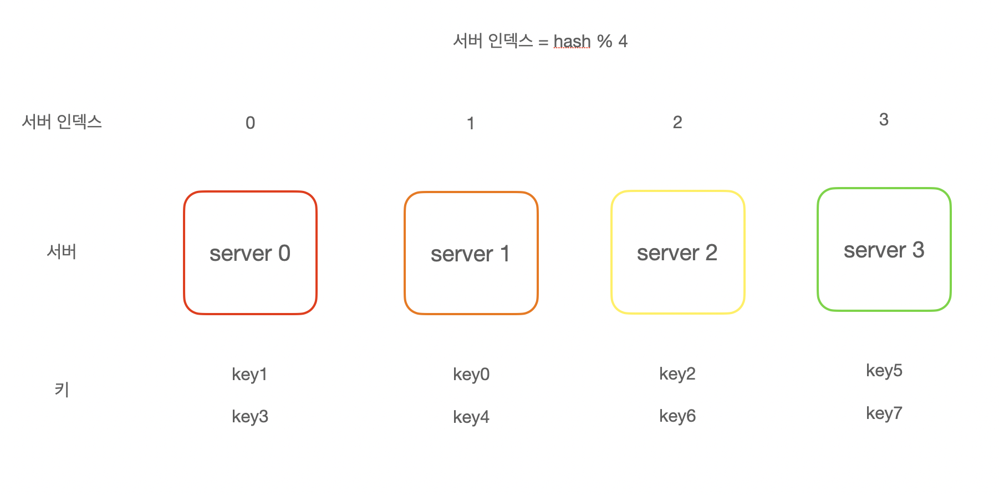

이 방법은 서버 풀의 크기가 고정되어 있을 때 그리고 데이터 분포가 균등할 때는 잘 동작한다.

하지만 서버가 추가되거나 기존 서버가 삭제되면 문제가 생긴다.

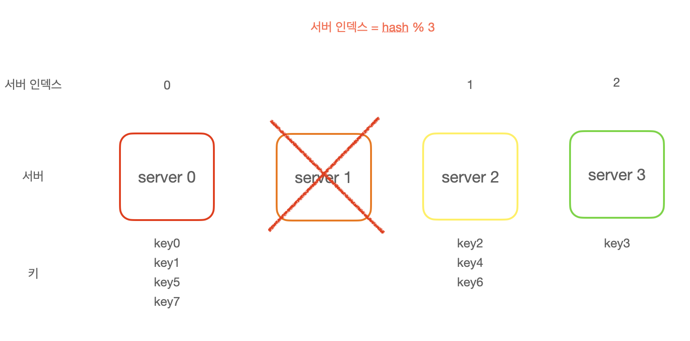

서버가 죽으면 키의 재분배가 일어나 캐시 클라이언트가 데이터가 없는 엉뚱한 서버에 접속하게 된다.

그 결과 대규모 캐시 미스가 발생하게 될 것이다.

## 안정 해시
전통적 해시 테이블은 슬롯의 수가 바뀌면 거의 대부분의 키를 재배치한다.

안정 해시는 해시 테이블 크기가 조정될 때 평균적으로 오직 k (키의 개수) / n (슬롯의 개수) 개의 키만 재배치하는 해시 기술이다.

### 해시 공간과 해시 링
해시 함수로는 SHA-1 을 사용하고 출력 값 범위는 x0, x1, x2, x3, ... xn 과 같다고 하자.

SHA-1 의 해시 공간 범위는 0 부터 2^160 -1 까지라고 알려져있다.

따라서 x0는 0, xn은 2^160 - 1 이며 나머지 x1 부터 xn - 1 까지는 그 사이의 값을 갖게 될 것이다.

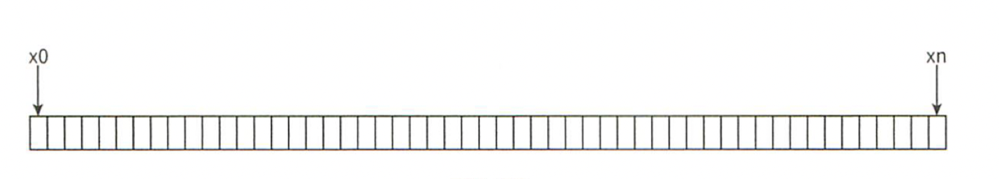

위와 같은 해시 공간을 구부려 접으면 다음과 같은 해시 링이 만들어진다.

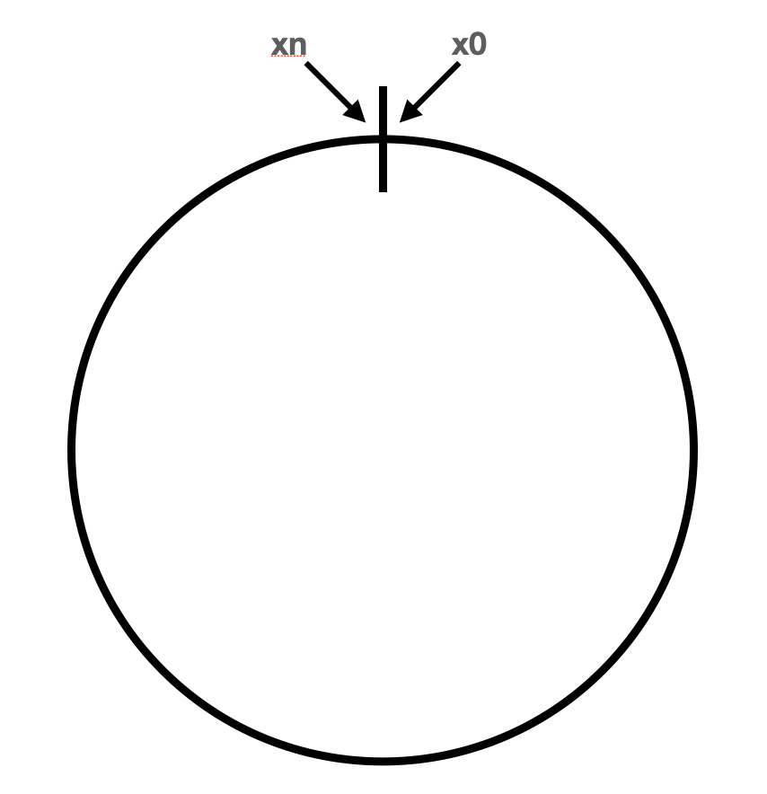

### 해시 서버
이 해시 함수 f 를 사용하면 서버 IP 나 이름을 이 링 위의 어떤 위치에 대응시킬 수 있다.

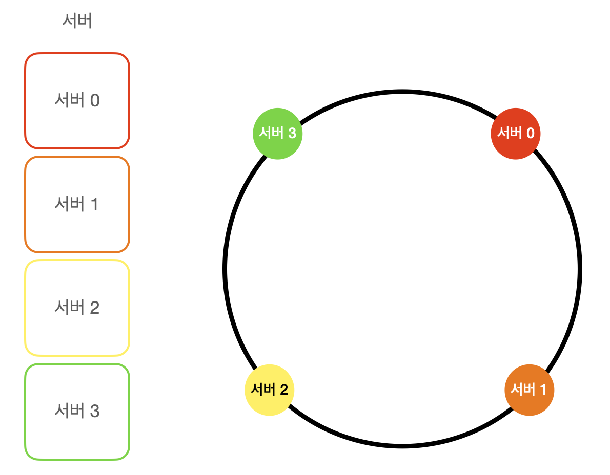

### 해시 키
** 여기서 사용한 함수는 "해시 키 재배치 문제" 에 언급된 함수가 아니다. **

캐시할 키 key0, key1, key2, key3 또한 해시 링 위의 어느 지점에 배치할 수 있다.

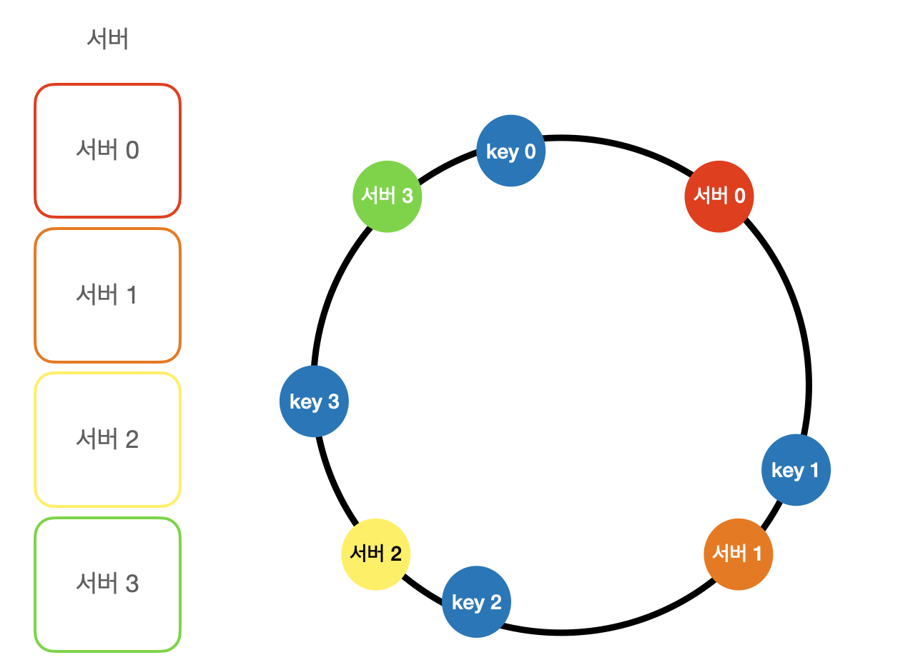

### 서버 조회
어떤 키가 저장되는 서버는 해당 키의 위치로부터 시계 방향으로 링을 탐색해 나가면서 만나는 첫 번째 서버다.

따라서 key0 은 서버 0 에 저장되고 key1 은 서버 1에 저장되며, key2 는  서버 2, key3 은 서버 3에 저장된다.

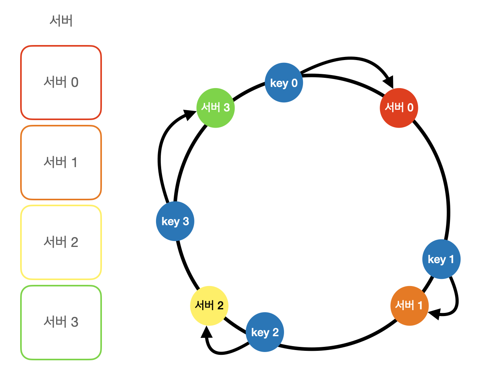

### 서버 추가

서버를 추가하더라도 키 가운데 일부만 재배치하면 된다.

시계 방향으로 순회했을 때 처음으로 만나게 되는 서버에 키를 재배치하고 다른 키들은 재배치되지 않는다.

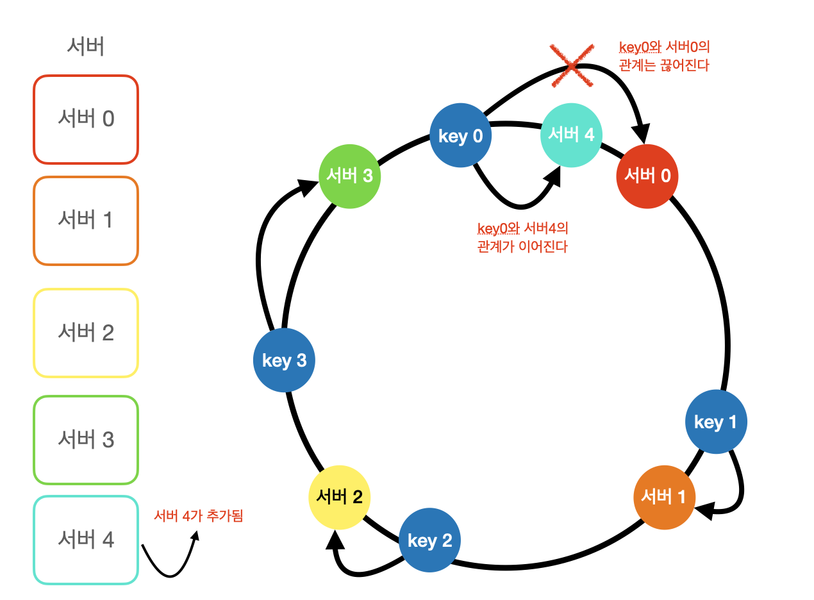

### 서버 제거
하나의 서버가 제거되면 키 가운데 일부만 재배치된다.

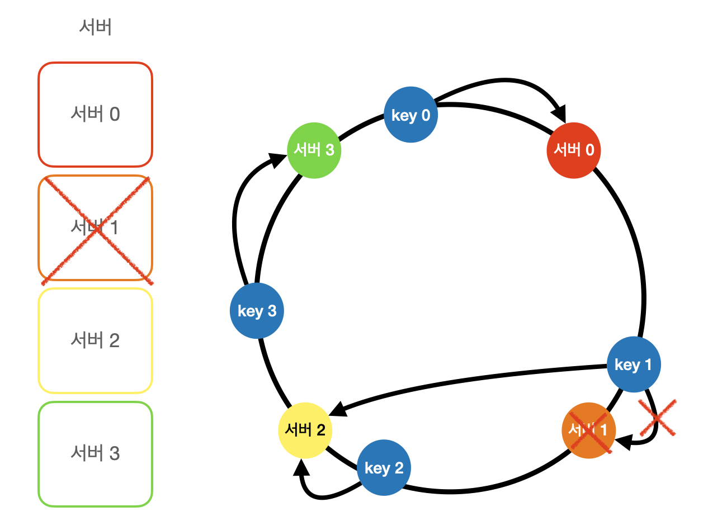

### 기본 구현법의 두 가지 문제

**안정 해시 기본 절차**

- 서버와 키를 균등 분포 (uniform distribution) 해시 함수를 사용해 해시 링에 배치한다.

- 키의 위치에서 링을 시계 방향으로 탐색하다 만나는 최초의 서버가 키가 저장될 서버다.

이 접근법에는 두 가지 문제가 있다.

1. 서버가 추가되거나 삭제되는 상황을 감안하면 파티션(서버 사이의 해시 공간)의 크기를 균등하게 유지하는게 불가능하다.

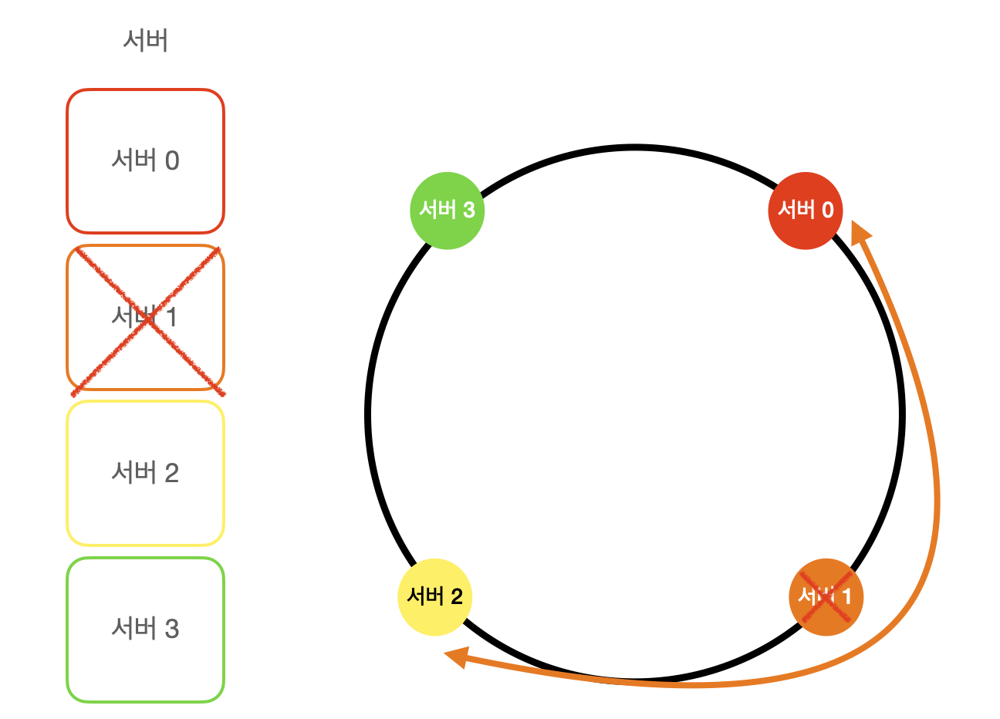

2. 키의 균등 분포 (uniform distribution) 를 달성하기가 어렵다.

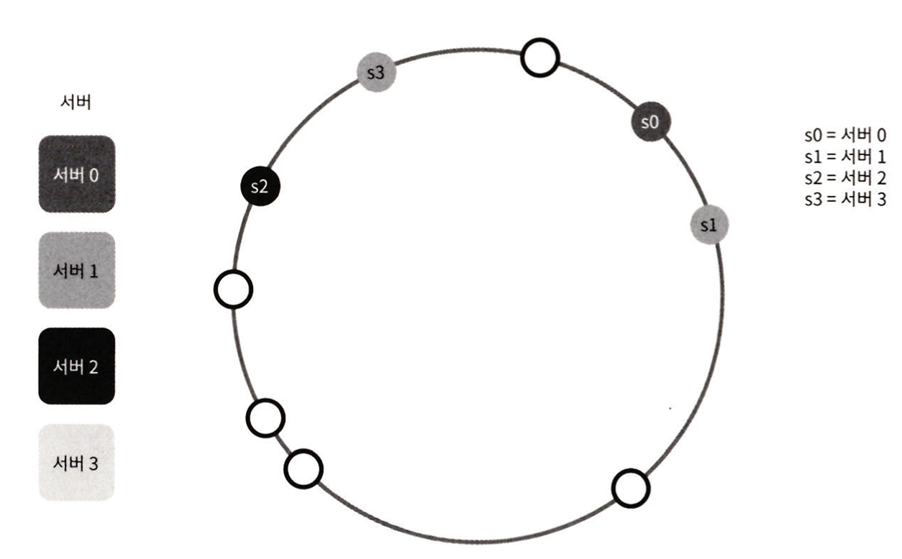

## 가상 노드
가상 노드는 위 문제를 해결하기 위해 제안된 기법이다.

가상 노드는 실제 노드 또는 서버를 가리키는 노드로서 하나의 서버는 링 위에 여러 개의 가상 노드를 가질 수 있다.

가상 노드를 배치하여 서버는 하나의 파티션이 아닌 여러개의 파티션을 관리해야 한다.

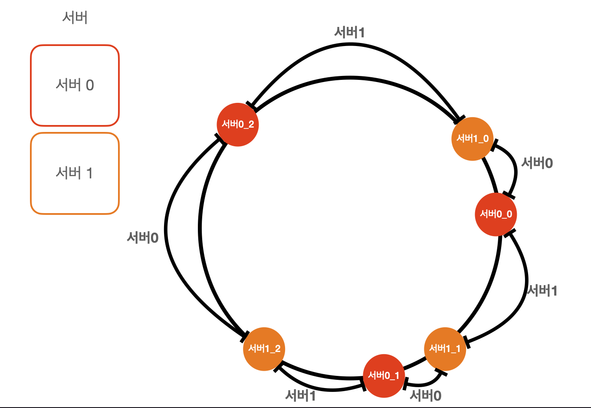

키의 위치로부터 시계 방향으로 링을 탐색하다 만나는 최초의 가상 노드가 해당 키가 저장될 서버가 된다.

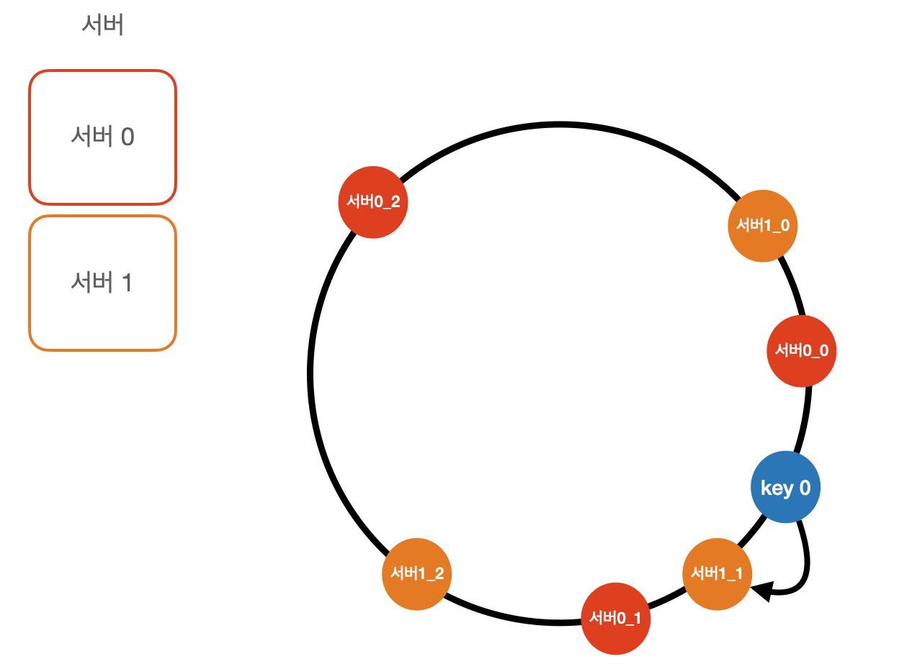

가상 노드의 개수를 늘리면 표준 편차가 작아져 키의 분포는 점점 더 균등해진다.

그러나 가상 노드 데이터를 저장할 공간은 더 많이 필요하게 될 것이다.

시스템 요구사항에 맞도록 가상 노드 개수를 적절히 조정하는 Tradeoff 가 필요하다.

# 정리
안정 해시가 왜 필요하며 어떻게 동작하는지를 자세히 살펴보았다.

### 안정 해시 이점
- 서버가 추가되거나 삭제될 때 재배치되는 키의 수가 최소화된다.

- 데이터가 보다 균등하게 분포하게 되므로 수평적 규모 확장성을 달성하기 쉽다.

- 핫스팟 키 문제를 줄인다. 안정 해시는 데이터를 좀 더 균등하게 분배하므로 이런 문제가 생길 가능성을 줄인다.

### 안정 해시가 사용되는 기술
- AWS Dynamo DB 의 파티셔닝 관련 컴포넌트

- Apache Cassandra 클러스터에서의 데이터 파티셔닝

- Discord 채팅 어플리케이션

- Akamai CDN

- Meglev 네트워크 부하 분산기
