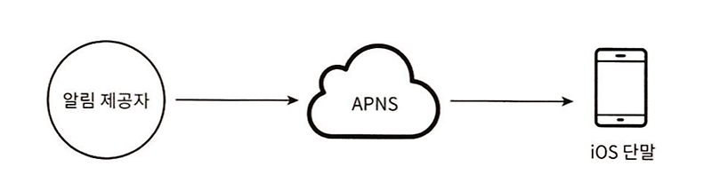
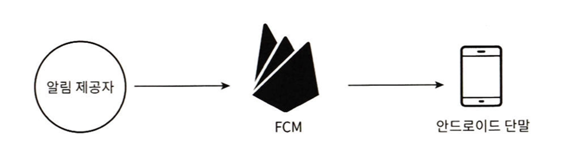
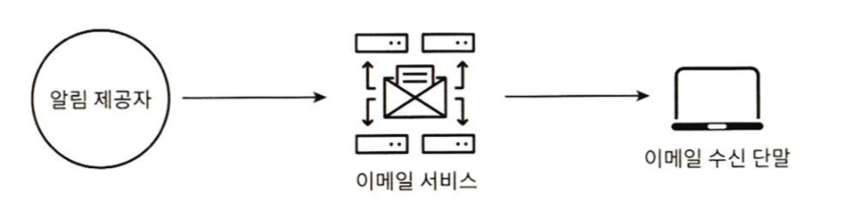
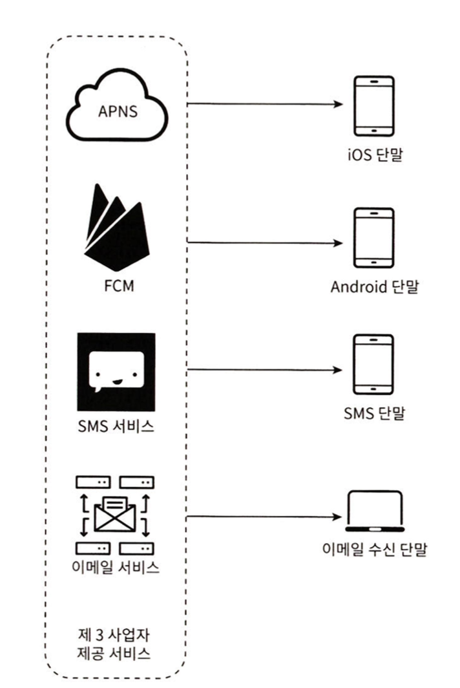
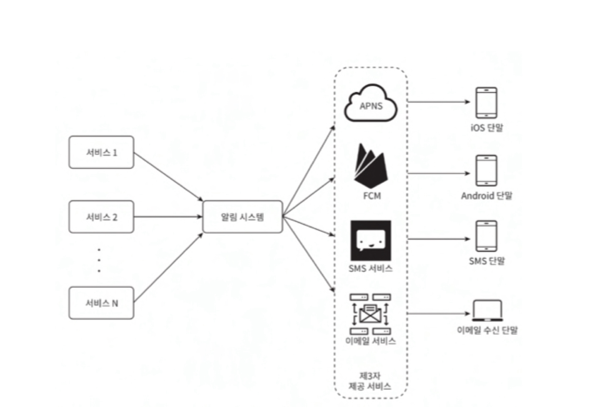
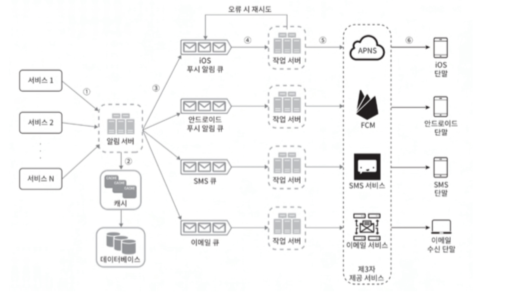
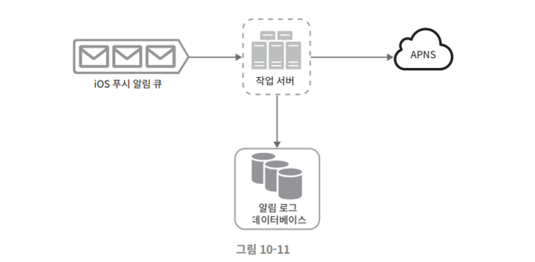
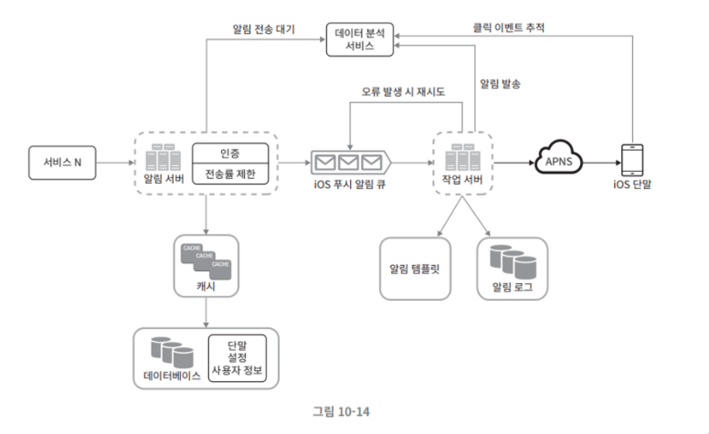

# 알림 시스템 설계

# 1단계 문제 이해 및 설계 범위 확정

알림 시스템이 어떻게 구현되는지 깊은 이해가 필요한 작업이다.

- 푸시 알림, SMS 메시지, 이메일을 지원해야 한다.

  
- 연성 실시간 (soft real-time) 시스템이어야 한다. 높은 부하가 걸렸을 때 약간의 지연은 무방하다.

- ios, 안드로이드, 랩톱/데스크톱을 지원해야 한다.

- 클라이언트, 서버 둘다 알림을 만들 수 있다.

- 알림을 받지 않도록 설정이 가능하다.

- 천만 건의 모바일 푸시 알림, 백만 건의 SMS 메시지, 5백만 건의 이메일 알림을 보낼 수 있어야 한다.

# 2단계 개략적 설계안 제시 및 동의 구하기

- 알림 유형별 지원 방안

- 연락처 정보 수집 절차

- 알림 전송 및 수신 절차

## 알림 유형별 지원 방안

### ios 푸시 알림

ios 에서 푸시 알림을 보내기 위해서는 세 가지 컴포넌트가 필요하다.

- 알림 제공자 : 알림 요청을 만들어 애플 푸시 알림 서비스 (APNS) 로 보내는 주체다. 알림 요청을 만들려면 다음과 같은 데이터가 필요하다.

    - 단말 토큰 : 알림 요청을 보내는 데 필요한 고유 식별자다.
    - 페이로드 : 알림 내용을 담은 JSON 딕셔너리다.
    - APNS : 애플이 제공하는 원격 서비스다. 푸시 알림을 ios 장치로 보내는 역할을 담당한다.
    - ios 단말 : 푸시 알림을 수신하는 사용자 단말이다.

### 안드로이드 푸시 알림

안드로이드 푸시 알림도 비슷한 절차로 전송된다.
APNS 대신 FCM 을 사용한다는 점만 다르다.

### SMS 메시지

SMS 메시지를 보낼 때는 보통 Twilio, Nexmo 같은 제 3 사업자의 서비스를 많이 이용한다.

이런 서비스는 대부분 상용 서비스라서 이용요금을 내야 한다.

### 이메일

많은 회사가 상용 이메일 서비스를 이용한다.
전송 성공률도 높고, 데이터 분석 서비스도 제공한다.

### 알림 유형 전부를 한 시스템으로 묶은 결과

## 연락처 정보 수집 절차

알림을 보내려면 모바일 단말 토큰, 전화번호, 이메일 주소 등의 정보가 필요하다.

사용자가 우리 앱을 설치하거나 처음으로 계정을 등록하면 API 서버는 해당 사용자의 정보를 수집하여 데이터베이스에 저장한다.

이 데이터베이스의 연락처 정보를 저장할 테이블 구조는 다음과 같다.

필수 정보만 담은 개략적인 설계안으로서, 이메일 주소와 전화번호는 user 테이블에 저장하고, 단말 토큰은 device 테이블에 저장한다.

한 사용자가 여러 단말을 가질 수 있고 알림은 모든 단말에 전송되어야 한다는 점을 고려하였다.

## 알림 전송 및 수신 절차

### 개략적 설계안

- 1부터 N까지의 서비스

이 서비스 각각은 마이크로 서비스일 수도 있고 크론잡일 수도 있고, 분산 시스템 컴포넌트일 수도 있다.

- 알림 시스템

알림 시스템은 알림 전송/수신 처리의 핵심이다.
이 시스템은 서비스 1~N에 알림 전송을 위한 API를 제공해야 하고, 제 3자 서비스에 전달할 알림 페이로드를 만들어 낼 수 있어야 한다.

- 제 3자 서비스

이 서비스들은 사용자에게 알림을 실제로 전달하는 역할을 한다.
제 3자 서비스와 통합을 진행할 때 유의할 것은 확장성이다.
쉽게 새로운 서비스를 통합하거나 기존 서비스를 제거할 수 있어야 한다는 뜻이다.
또 하나 고려해야 할 것은 어떤 서비스는 다른 시장에서는 사용할 수 없을 수도 있다는 것이다.
가령 FCM은 중국에서는 사용할 수 없다.
따라서 중국 시장에서는 Jpush, PushY 같은 서비스를 사용해야만 한다.

- ios, 안드로이드, sms, 이메일 단말

사용자는 자기 단말에서 알림을 수신한다.

이 설계에는 몇 가지 문제가 있다.

- SPOF

알림 서비스에 서버가 하나밖에 없다는 것은, 그 서버가 장애가 생기면 전체 서비스 장애로 이어진다는 뜻이다.

- 규모 확장성

한 대 서비스로 푸시 알림에 관계된 모든 것을 처리하므로, 데이터베이스나 캐시 등 중요 컴포넌트의 규모를 개별적으로 늘릴 방법이 없다.

- 성능 병목

알림을 처리하고 보내는 것은 자원을 많이 필요로 하는 작업일 수 있다.
따라서 모든 것을 한 서버로 처리하면 트래픽이 많이 몰리는 시간에는 시스템이 과부하 상태에 빠질 수 있다.

**개략절 설계안**

- 데이터베이스와 캐시를 알림 시스템의 주 서버에서 분리한다.

- 알림 서버를 증설하고 자동으로 수평적 규모 확장이 이루어질 수 있도록 한다.

- 메시지 큐를 이용해 시스템 컴포넌트 사이의 강한 결합을 끊는다.

- 1부터 N까지의 서비스 : 알림 시스템 서버의 API를 통해 알림을 보낼 서비스들

- 알림 서버
    - 알림 전송 API : 스팸 방지를 위해 보통 사내 서비스 또는 인증된 클라이언트만 이용 가능하다.
    - 알림 검증 : 이메일 주소, 전화번호 등에 대한 기본적 검증을 수행한다.
    - 데이터베이스 또는 캐시 질의 : 알림에 포함시킬 데이터를 가져오는 기능이다.
    - 알림 전송 : 알림 데이터를 메시지 큐에 넣는다.

- 캐시 : 사용자 정보, 단말 정보, 알림 템플릿 등을 캐시한다.

- 데이터베이스 : 사용자, 알림, 설정 등 다양한 정보를 저장한다.

- 메시지 큐 : 시스템 컴포넌트 간 의존성을 제거하기 위해 사용한다. 다량의 알림이 전송되어야 하는 경우를 대비한 버퍼 역할도 한다.

- 작업 서버 : 메시지 큐에서 전송할 알림을 꺼내서 제 3자 서비스로 전달하는 역할을 담당하는 서버다.

- 제 3자 서비스

- ios, 안드로이드, SMS, 이메일 단말

이제 이 컴포넌트들이 어떻게 협력하여 알림을 전송하게 되는지 살펴보자.

1. API를 호출하여 알림 서버로 알림을 보낸다.
2. 알림 서버는 사용자 정보, 단말 토큰, 알림 설정 같은 메타데이터를 캐시나 데이터베이스에서 가져온다.
3. 알림 서버는 전송할 알림에 맞는 이벤트를 만들어서 해당 이벤트를 위한 큐에 넣는다.
4. 작업 서버는 메시지 큐에서 알림 이벤트를 꺼낸다.
5. 작업 서버는 알림을 제 3자 서비스로 보낸다.
6. 제 3자 서비스는 사용자 단말로 알림을 전송한다.

# 3단계 상세 설계

- 안정성
- 추가로 필요한 컴포넌트 및 고려사항
- 개선된 설계안

## 안정성
분산 환경에서 운영될 알림 시스템을 설계할 때는 안정성을 확보하기 위한 사항 몇 가지를 반드시 고려해야 한다.

### 데이터 손실 방지
알림 전송 시스템의 가장 중요한 요구사항 가운데 하나는 어떤 상황에서도 알림이 소실되면 안 된다는 것이다.
이 요구사항을 만족하려면 알림 시스템은 알림 데이터를 DB에 보관하고 재시도 메커니즘을 구현해야 한다.

### 알림 중복 전송 방지
같은 알림이 여러 번 반복되는 것을 완전히 막는 것은 가능하지 않다.
대부분 알림은 딱 한 번만 전송되겠지만 분산 시스템 특성상 가끔은 같은 알림이 중복되어 전송되기도 할 것이다.
그 빈도를 줄이려면 중복을 탐지하는 메커니즘을 도입하고 오류를 신중하게 처리해야 한다.

- 보내야 할 알림이 도착하면 그 이벤트 ID를 검사하여 이전에 본 적이 있는 이벤트인지 실핀다. 중복 이벤트라면 버리고 그렇지 않으면 알림을 발송한다.

## 추가로 필요한 컴포넌트 및 고려사항
### 알림 템플릿
알림 메시지는 대부분 비슷한 형식이다.
알림 템플릿은 이런 유사성을 고려하여 알림 메시지의 모든 부분을 처음부터 다시 만들 필요 없도록 해 준다.

알림 템플릿은 인자나 스타일, 추적 링크를 조정하기만 하면 사전에 지정한 형식에 맞춰 알람을 만들어 내는 틀이다.

템플릿을 사용하면 전송될 알림들의 형식을 일관성 있게 유지할 수 있고 오류 가능성뿐 아니라 알림 작성에 드는 시간도 줄일 수 있다.

### 알림 설정
사용자는 이미 너무 많은 알림을 받고 있어서 쉽게 피곤함을 느낀다.
따라서 많은 웹사이트와 앱에서는 사용자가 알림 설정을 상세히 조정할 수 있도록 하고 있다.
특정 종류의 알림을 보내기 전에 반드시 해당 사용자가 해당 알림을 켜 두었는지를 확인해야 한다.

### 전송률 제한
사용자에게 너무 많은 알림을 보내지 않도록 하는 한 가지 방법은 한 사용자가 받을 수 있는 알림의 빈도를 제한하는 것이다.
이것이 중요한 이유는 알림을 너무 많이 보내기 시작하면 사용자가 알림 기능을 아예 꺼 버릴 수도 있기 때문이다.

### 재시도 방법
제 3자 서비스가 알림 전송에 실패하면 해당 알림을 재시도 전용 큐에 넣는다.
같은 문자가 계속해서 발생하면 개발자에게 통지한다.

### 푸시 알림과 보안
ios와 안드로이드 앱의 경우 알림 전송 API는 appKey 와 appSecret을 사용하여 보안을 유지한다.
따라서 인증된, 혹은 승인된 클라이언트만 해당 API를 사용하여 알림을 보낼 수 있다.

### 큐 모니터링
알림 시스템을 모니터링 할 때 중요한 메트릭 하나는 큐에 쌓인 알림의 개수이다.
이 수가 너무 크면 작업 서버들이 이벤트를 빠르게 처리하고 있지 못하다는 뜻이다.
그런 경우에는 작업 서버를 증설하는 게 바람직할 것이다.

### 이벤트 추적
알림 확인율, 클릭율, 실제 앱 사용으로 이어지는 비율 같은 메트릭은 사용자를 이해하는데 중요하다.

데이터 분석 서비스는 보통 이벤트 추적 기능도 제공한다.

따라서 보통 알림 시스템을 만들면 데이터 분석 서비스와도 통합해야 한다.

## 수정된 설계안

- 알림 서버에 인증과 전송률 제한 기능이 추가되었다.

- 전송 실패에 대응하기 위한 재시도 기능이 추가되었다. 전송에 실패한 알림은 다시 큐에 넣고 지정된 횟수만큼 재시도한다.

- 전송 템플릿을 사용하여 알림 생성 과정을 단순화하고 알림 내용의 일관성을 유지한다.

- 모니터링과 추적 시스템을 추가하여 시스템 상태를 확인하고 추후 시스템을 개선하기 쉽도록 하였다.

# 4단계 마무리
알림은 중요 정보를 알려준다는 점에서 필요불가결한 기능이다.
이번 장에서 규모 확장이 쉬울 뿐 아니라 푸시 알림, SMS 메시지, 이메일 등 다양한 정보 전달 방식을 지원하는 알림 시스템을 만들어 보았다.
시스템 컴포넌트 사이의 결합도를 낮추기 위해 메시지 큐를 적극적으로 사용하였다.

개략적 설계안과 더불어 각 컴포넌트의 구현 방법과 최적화 기법에 대해서도 심도 있게 알아보았다.

- 안정성 : 메시지 전송 실패율을 낮추기 위해 안정적인 재시도 메커니즘을 도입하였다.

- 보안 : 인증된 클라이언트만이 알림을 보낼 수 있도록 appKey, appSecret 등의 메커니즘을 이용하였다.

- 이벤트 추적 및 모니터링 : 알림이 만들어진 후 성공적으로 전송되기까지의 과정을 추적하고 시스템 상태를 모니터링하기 위해 알림 전송의 각 단계마다 이벤트를 추적하고 모니터링할 수 있는 시스템을 통합하였다.

- 사용자 설정 : 사용자가 알림 수신 설정을 조정할 수 있도록 하였다. 따라서 알림을 보내기 전 반드시 해당 설정을 확인하도록 시스템 설계를 변경하였다.

