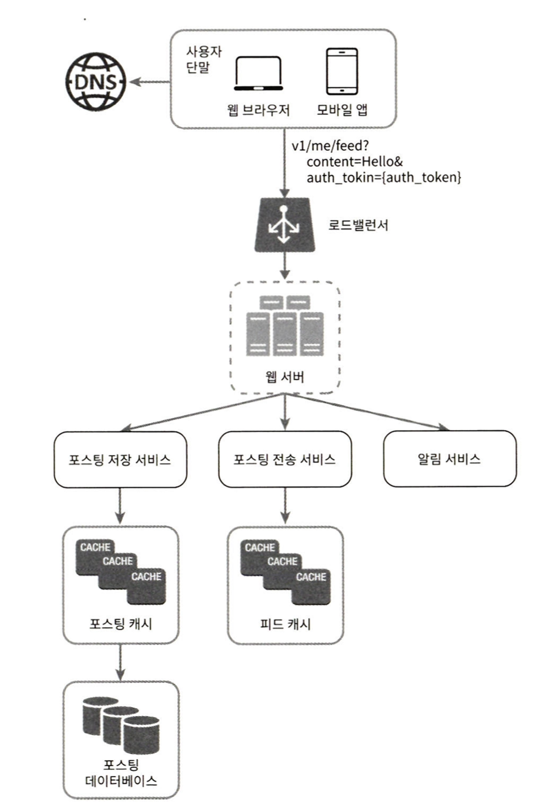
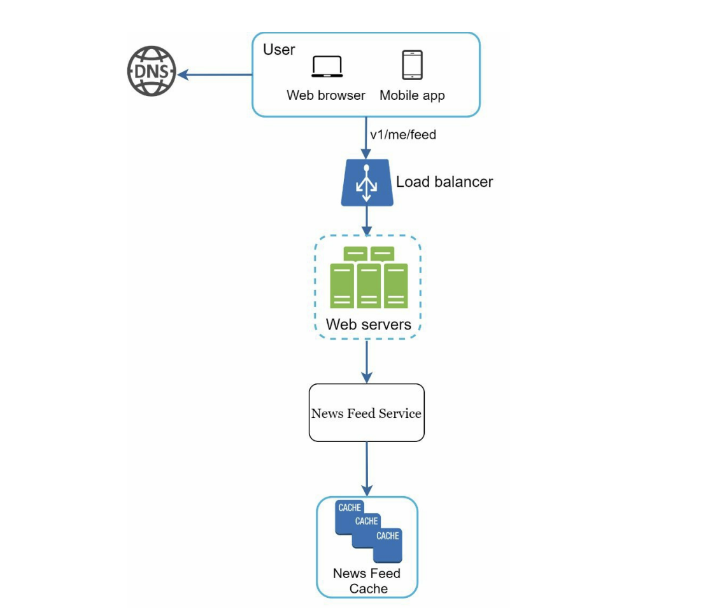
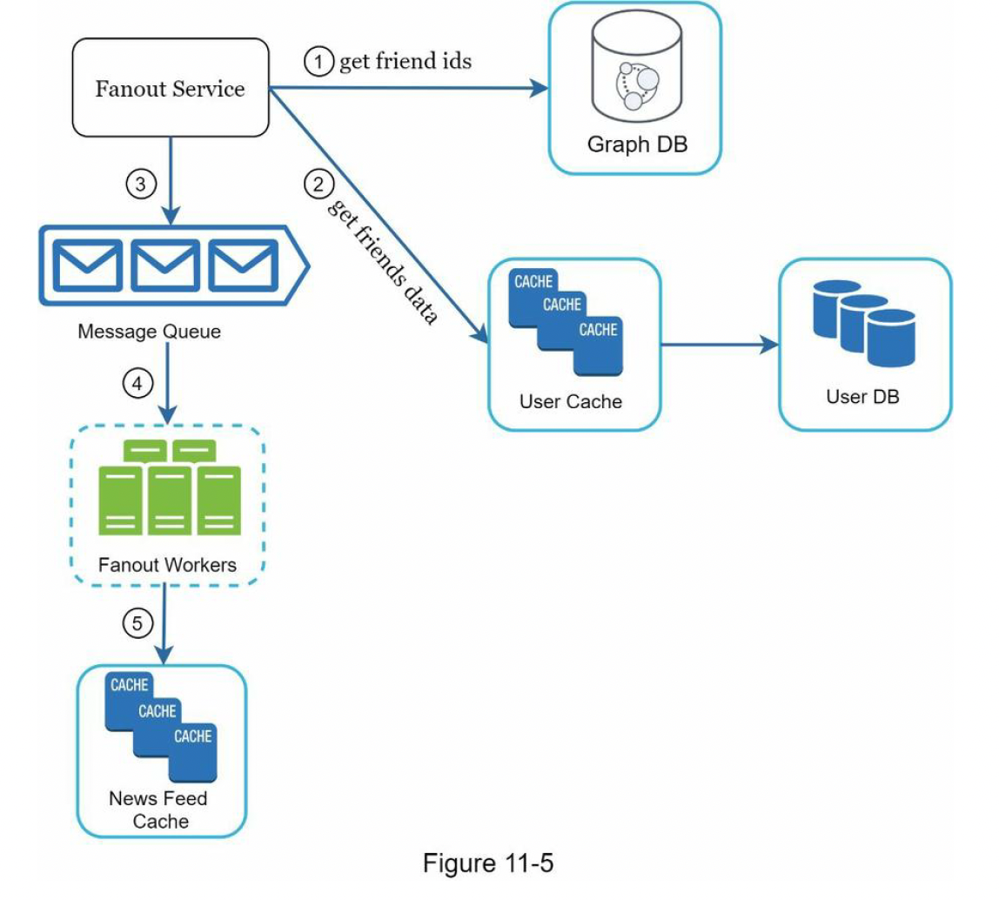
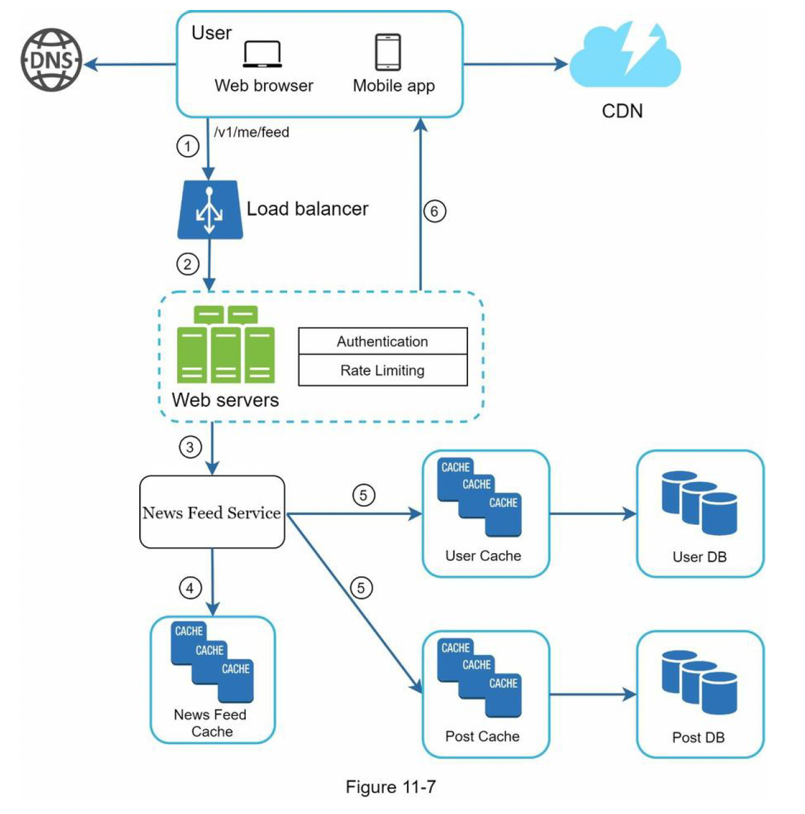
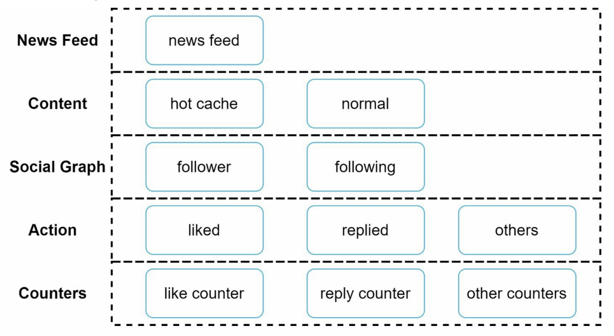

# 뉴스 피드 시스템 설계

# 1단계 문제 이해 및 설계 범위 확정

- 모바일 앱과 웹 둘 다 지원한다.
- 사용자는 뉴스 피드 페이지에 새로운 스토리를 올릴 수 있어야 하고 친구들이 올리는 스토리를 볼 수 있다.
- 뉴스 피드는 시간 흐름 역순으로 표시한다.
- 최대 5000명의 친구를 가질 수 있다.
- 매일 천만 명이 방문한다.
- 이미지나 비디오 등의 미디어 파일이 포함될 수 있다.

# 2단계 개략적 설계안 제시 및 동의 구하기

(1) 피드 발행 (2) 뉴스 피드 생성 두 가지 부분으로 나뉘어 있다.

- 피드 발행 : 사용자가 스토리를 포스팅하면 해당 데이터를 캐시와 데이터베이스에 기록한다. 새 포스팅은 친구의 뉴스 피드에도 전송된다.

- 뉴스 피드 생성 : 뉴스 피드는 모든 친구의 포스팅을 시간 흐름 역순으로 모아서 만든다.

## 뉴스 피드 API

뉴스 피드 API는 클라이언트가 서버와 통신하기 위해 사용하는 수단이다.

### 피드 발행 API

새 스토리를 포스팅하기 위한 API다.

### 피드 읽기 API

뉴스 피드를 가져오는 API다.

## 피드 발행

피드 발행 시스템의 개략적 형태는 다음과 같다.

- 사용자 : 앱이나 브라우저에서 새 포스팅을 올리는 주체다.

- 로드밸런서 : 트래픽을 웹 서버들로 분산한다.

- 웹 서버 : HTTP 요청을 내부 서비스로 중계하는 역할을 담당한다.

- 포스팅 저장 서비스 : 새 포스팅을 데이터베이스와 캐시에 저장한다.

- 포스팅 전송 서비스 : 새 포스팅을 친구의 뉴스 피드에 푸시한다. 뉴스 피드 데이터는 캐시에 보관하여 빠르게 읽어갈 수 있도록 한다.

- 알림 서비스 : 친구들에게 새 포스팅이 올라왔음을 알리거나 푸시 알림을 보내는 역할을 담당한다.

## 뉴스 피드 생성

- 사용자 : 뉴스 피드를 읽는 주체다.

- 로드 밸런서 : 트래픽을 웹 서버들로 분산한다.

- 웹 서버 : 트래픽을 뉴스 피드 서비스로 보낸다.

- 뉴스 피드 서비스 : 캐시에서 뉴스 피드를 가져오는 서비스다.

- 뉴스 피드 캐시 : 뉴스 피드를 렌더링할 때 필요한 피드 ID를 보관한다.

# 3단계 상세 설계

## 피드 발행 흐름 상세 설계

### 웹 서버

웹 서버는 클라이언트와 통신할 뿐 아니라 인증이나 처리율 제한 등의 기능도 수행한다.

또한 스팸과 유해 콘텐츠를 방지하기 위해 한 사용자의 포스팅의 수에 제한을 두어야 한다.

## 포스팅 전송(팬아웃) 서비스

포스팅 전송 즉 팬아웃은 어떤 사용자의 새 포스팅을 그 사용자와 친구 관계에 있는 모든 사용자에게 전달하는 과정이다.

팬아웃에는 쓰기 시점 팬아웃 (Push 모델) 읽기 시점에 팬아웃 (Pull 모델) 이라고 한다.

### 쓰기 시점 팬아웃 (Push 모델)

새로운 포스팅을 기록하는 시점에 뉴스 피드를 갱신하게 된다.
포스팅이 완료되면 해당 사용자의 캐시에 해당 포스팅을 기록한다.

**장점**

- 뉴스 피드가 실시간으로 갱신되며 친구 목록에 있는 사용자에게 즉시 전송된다.

- 새 포스팅이 기록되는 순간에 뉴스 피드가 이미 갱신되므로 뉴스 피드를 읽는 데 드는 시간이 짧아진다.

**단점**

- 친구가 많은 사용자의 경우 친구 목록을 가져오고 그 목록에 있는 사용자 모두의 뉴스 피드를 갱신하는 데 많은 시간이 소요될 수도 있다 (hotkey 라고 부르는 문제다).

- 서비스를 자주 이용하지 않는 사용자의 피드까지 갱신해야 하므로 컴퓨팅 자원이 낭비된다.

### 읽기 시점 팬아웃 모델

요청 기반 모델로 피드를 읽어야 하는 시점에 뉴스 피드를 갱신한다.

사용자가 본인 홈페이지나 타임라인을 로딩하는 시점에 새로운 포스트를 가져오게 된다.

**장점**

- 비활성화된 사용자의 경우에는 로그인하기까지 어떤 컴퓨팅 자원도 소모하지 않는다.

- 데이터를 친구 각각에 푸시하는 작업이 필요없으므로 핫키 문제도 생기지 않는다.

**단점**

- 뉴스 피드를 읽는 데 많은 시간이 소요될 수 있다.

이 두가지 방법을 결합하여 장점은 취하고 단점은 버리는 전략을 취할 수 있다.

뉴스 피드를 가져올 수 있도록 하는 것은 아주 중요하므로 대부분의 사용자에 대해서는 푸시 모델을 사용한다.

친구나 팔로어가 아주 많은 사용자의 경우에는 팔로어로 하여금 해당 사용자의 포스팅을 필요할 때 가져가도록 하는 풀 모델을 사용하여 시스템 과부하를 방지한다.

안정 해시를 통해 요청과 데이터를 보다 고르게 분산하여 핫키 문제를 줄인다.

### 팬아웃 서비스 동작 방식

1. 그래프 데이터베이스에서 친구 ID 목록을 가져온다.

2. 사용자 정보 캐시에서 친구들의 정보를 가져온다.

3. 친구 목록과 새 스토리의 포스팅 ID를 메시지 큐에 넣는다.

4. 팬아웃 작업 서버가 메시지 큐에서 데이터를 꺼내어 뉴스 피드 데이터를 뉴스 피드 캐시에 넣는다.

뉴스 피드 캐시는 <포스팅 ID, 사용자 ID> 의 순서쌍을 보관하는 매핑 테이블이라고 볼 수 있다.

사용자 정보와 포스팅 정보 전부를 이 테이블에 저장하지 않고 ID만 보관하는 이유는 메모리 요구량이 지나치게 늘어날 수 있기 때문이다.

이 캐시의 크기에 제한을 두며 어떤 사용자가 뉴스 피드에 올라온 수 천개의 스토리를 전부 훑어보는 일이 벌어질 확률은 지극히 낮다.

따라서 메모리 사용량을 줄여도 캐시 미스가 일어날 확률은 낮다.

## 피드 읽기 흐름 상세 설계

이미지와 비디오와 같은 미디어 콘텐츠는 CDN에 저장하여 빨리 읽어갈 수 있다.

1. 사용자가 뉴스 피드를 읽으려는 요청을 보낸다.

2. 로드밸런서가 요청을 웹 서버 가운데 하나로 보낸다.

3. 웹 서버는 피드를 가져오기 위해 뉴스 피드 서비스를 호출한다.

4. 뉴스 피드 서비스는 뉴스 피드 캐시에서 포스팅 ID 목록을 가져온다.

5. 뉴스 피드에 표시할 내용을 사용자 캐시와 포스팅 캐시에서 가져와 완전한 뉴스 피드를 만든다.

6. 생성된 뉴스 피드를 JSON 형태로 클라이언트에게 보낸다. 클라이언트는 해당 피드를 렌더링한다.

## 캐시 구조

캐시를 다섯 계층으로 나눈다.

- 뉴스 피드 : 뉴스 피드의 ID를 보관한다.

- 콘텐츠 : 포스팅 데이터를 보관한다. 인기 콘텐츠는 따로 보관한다.

- 소셜 그래프 : 사용자 간 관계 정보를 보관한다.

- 행동 : 포스팅에 대한 사용자의 행위에 관한 정보를 보관한다.

- 횟수 : 좋아요, 응답 수, 팔로잉 수 등의 정보를 보관한다.

# 4단계 마무리

뉴스 피드는 발행과 생성 두 부분으로 구성되어 있다.

설계 면접 문제는 정답이 없다 회사마다 독특한 제약이나 요구조건이 있기 때문에 시스템을 설계할 때는 그런 점을 고려해야만 한다.

설계를 진행하고 기술을 선택할 때는 그 배경에 어떤 타협적 결정들(trade-off)이 있었는지 잘 이해하고 설명할 수 있어야 한다.

## 추가로 논의할 내용

- Scale Out vs Scale Up
- SQL vs NoSQL
- Master-Slave 다중화
- Replica 에 대한 읽기 연산
- 일관성 모델 (consistency model)
- 데이터베이스 샤딩
- 웹 계층을 무상태로 운영하기
- 가능한 한 많은 데이터를 캐시할 방법
- 여러 데이터 센터를 지원할 방법
- 메시지 큐를 사용하여 컴포넌트 사이의 결합도 낮추기
- 핵심 메트릭에 대한 모니터링
