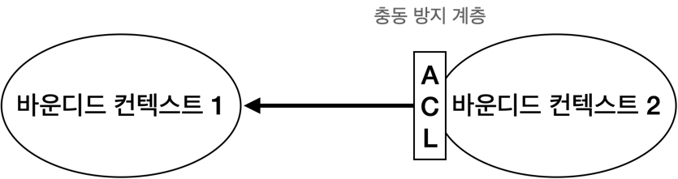
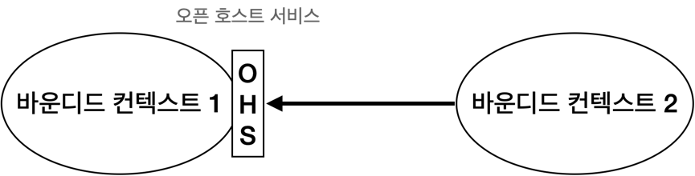
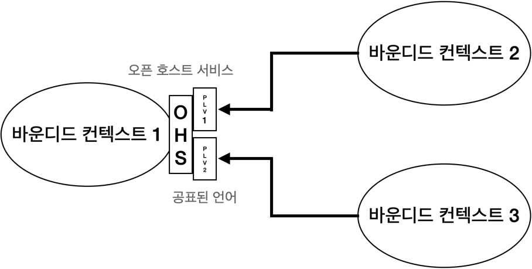

# 바운디드 컨텍스트 연동
바운디드 컨텍스트 패턴은 유비쿼터스 언어의 일관성을 유지할 뿐만 아니라 모델링도 가능하게 한다.
모델의 목적 즉 경계를 명시하지 않고는 모델을 구축할 수 없다.
경계가 언어의 책임을 구분 짓는다.
하나의 바운디드 컨텍스트 내의 언어는 특정 문제를 해결하는 비즈니스 도메인을 모델링한다.
다른 바운디드 컨텍스트가 동일한 비즈니스 엔티티를 대표할 수 있지만 이는 다른 문제를 해결하는 비즈니스 도메인을 모델링한다.

한편 다른 바운디드 컨텍스트의 모델은 서로 독립적으로 발전하고 구현될 수 있다.
그러나 바운디드 컨텍스트 자체는 독립적이지 않다.
시스템의 요소가 전체의 목적을 이루기 위해 상호작용해야 하듯이, 바운디드 컨텍스트의 구현도 마찬가지다.
서로 독립적으로 발전할 수 있지만 상호작용해야 한다.
바운디드 컨텍스트 사이에는 항상 접점이 있는데 이것을 컨트랙트라고 부른다.

컨트랙트의 필요성은 바운디드 컨텍스트의 모델과 언어의 차이에서 비롯된다.
각 컨트랙트는 하나 이상의 당사자에 영향을 끼치므로 서로 조율해서 컨트랙트를 정의해야 한다.
바운디드 컨텍스트가 다르면 사용하는 유비쿼터스 언어도 다른데 연동이 필요한 경우에는 어떤 언어를 사용해야 할까?

바운디드 컨텍스트 간의 관계와 연동을 정의하는 도메인 주도 설게 패턴에 대해 알아보자.
이러한 패턴은 바운디드 컨텍스트에서 작업하는 팀 간의 협력적 특성에 의해 주도된다.
이런 패턴을 협력, 사용자-제공자, 그리고 분리형 노선 세 그룹으로 나눠서 살펴보자.

## 협력형 패턴 그룹
협력형 그룹의 패턴은 소통이 잘 되는 팀에서 구현된 바운디드 컨텍스트와 관련이 있다.
이 패턴이 적합한 요건은 팀의 커뮤니케이션과 협업의 수준에 있다.

### 파트너십 패턴
파트너십 모델에서 바운디드 컨텍스트 간의 연동은 애드혹 방식으로 조정한다.
한 팀은 다른 팀에게 API의 변경을 알리고 다른 팀은 충돌 없이 이를 받아들인다.

여기서 연동의 조정은 양방향에서 한다.
어떤 팀도 컨트랙트를 정의하는 데 쓰는 언어를 강요하지 않는다.
양 팀은 차이점을 함께 해결하고 가장 적절한 솔루션을 선정한다.
또한 발생할 수 있는 연동의 문제를 해결하는데 협력한다.
서로 방해하지 않는다.

성공적인 연동을 위해서는 잘 구축된 협업 실무, 헌신, 팀 간의 잦은 동기화가 필수다.
기술적 관점에서 보면 변경사항의 지속적인 통합이 필요하다.

### 공유 커널 패턴
바운디드 컨텍스트가 모델의 경계임에도 불구하고 하위 도메인이 여러 바운디드 컨텍스트에서 구현되는 경우가 있다.
공유 커널과 같은 공유 모델은 모든 바운디드 컨텍스트의 필요에 따라 설계된다.
공유 모델은 이를 사용하는 모든 바운디드 컨텍스트에 걸쳐서 일관성을 유지해야 한다.

- 공유 범위
겹치는 형태의 모델은 해당되는 바운디드 컨텍스트의 수명주기도 서로 엮이게 한다.
공유 모델의 변경은 다른 모든 바운디드 컨텍스트에 즉시 영향을 준다.
그러므로 변경의 연쇄 영향을 최소화하려면 양쪽의 겹치는 모델을 제한해서 바운디드 컨텍스트에서 공통으로 구현돼야 하는 모델 일부분만 노출하도록 해야 한다.
공유 커널은 바운디드 컨텍스트 간에 제공될 의도가 있는 연동 관련 컨트랙트와 자료구조만으로 구성하는 것이 이상적이다.

- 구현
공유 커널의 소스코드의 모든 변경이 이를 사용하는 모든 바운디드 컨텍스트에 즉시 반영되도록 구현된다.

만약 조직에서 단일 저장소를 사용한다면 여러 바운디드 컨텍스트는 동일한 소스 파일을 참조할 수 있다.
이것이 불가능하다면 공유 커널을 각 바운디드 컨텍스트의 전용 프로젝트로 떼어내면 연결 라이브러리처럼 바운디드 컨텍스트에서 참조할 수 있다.
어떤 방식이든 공유 커널에 대한 변경이 생길 때마다 영향을 받는 모든 바운디드 컨텍스트와 연동 테스트를 수행해야 한다.

공유 커널은 여러 바운디드 컨텍스트에 속하기 때문에 변경은 지속적으로 통합돼야 한다.
공유 커널의 변경사항을 관련된 모든 바운디드 컨텍스트로 전파하지 않으면 모델의 일관성이 깨진다.

### 공유 커널을 사용해야 하는 경우
공유 커널 패턴의 적용 여부를 결정하는 가장 중요한 기준은 중복 비용과 조율 비용의 비율이다.
이 패턴을 적용한 바운디드 컨텍스트 간에 가장 의존관계를 만들기 때문에 두 바운디드 컨텍스트가 공유하는 코드베이스에 대한 변경을 조율하려는 노력보다 공유하는 모델에 대한 변경을 통합할 때 드는 노력이 더 클 경우에 적용한다.

통합 비용과 중복 비용의 차이는 모델의 변동성에 달렸다.
변경이 잦을수록 통합 비용은 높아진다.
그러므로 자연스럽게 공유커널은 핵심 하위 도메인처럼 많이 변하는 하위 도메인에 적용된다.

공유 커널을 사용하는 데는 명분이 필요하다.
바운디드 컨텍스트의 원칙에 위배되기 때문이다.

일반적으로 조직의 커뮤니케이션 또는 협업이 어려워서 파트너십 패턴을 구현하기 어려울 때다.

공유 커널 패턴을 적용하는 또 다른 일반적인 적용 사례는 일시적으로 레거시 시스템을 점진적으로 현대화할 경우다.
이런 상황에서는 시스템을 서서히 바운디드 컨텍스트로 분해해서 공유 코드베이스로 만드는 것이 실용적인 중간 솔루션이 될 수 있다.

공유 커널은 동일 팀에서 소유하고 구현한 바운디드 컨텍스트를 연동하는 경우에 잘 맞는다.
이 경우 파트너십 패턴처럼 즉흥적으로 바운디드 컨텍스트를 연동하면 시간이 흐르면서 컨텍스트의 경계가 희미해질 수 있다.
이 경우에 바운디드 컨텍스트의 연동 컨트랙트를 명시적으로 정의하는 데 공유 커널을 사용할 수 있다.

## 사용자-제공자 패턴 그룹
제공자는 사용자에게 서비스를 제공한다.
서비스 제공자는 업스트림이고 고객 또는 사용자는 다운스트림이다.

협력 그룹의 경우와는 다르게 업스트림과 다운스트림은 서로 독립적으로 성공할 수 있다.
그러나 대부분의 경우 업스트림 또는 다운스트림의 팀이 연동 컨트랙트를 주도하는 권력의 불균형이 존재한다.
이를 보여주는 순응주의자, 충돌 방지 계층, 오픈 호스트 서비스 패턴을 살펴보자.

### 순응주의자 패턴
힘의 균형이 서비스를 제공하는 업스트림 팀에 있는 경우가 있다.
사용자의 요구를 지원할 동기가 없는 경우가 그렇다.
제공자의 모델에 따라 정의된 연동 컨트랙트를 제공할 뿐이므로 사용자의 선택지는 이를 받아들이거나 떠나거나 둘 중 하나다.
다운스트림 팀이 업스트림 팀의 모델을 받아들이는 바운디드 컨텍스트의 관계를 순응주의자 패턴이라고 부른다.

업스트림 팀이 노출한 컨트랙트가 예를 들어 산업 표준이거나 잘 구축된 모델 또는 다운스트림 팀의 요건에 충분하다면 다운스트림 팀이 자율성 일부를 포기하는 결정은 정당화될 수 있다.

## 충돌 방지 계층 패턴
다운스트림 바운디드 컨텍스트가 순응하지 않는 경우 충돌 방지 계층을 통해 업스트림 바운디드 컨텍스트의 모델을 스스로 필요에 맞게 가공할 수 있다.

충돌 방지 계층 패턴은 제공자의 모델을 따르는 것을 원치 않거나 순응에 필요한 노력이 가치가 없을 경우를 다룬다.

- 다운스트림 바운디드 컨텍스트가 핵심 하위 도메인을 포함할 경우
핵심 하위 도메인은 각별한 주의가 필요하다.
제공자의 모델이 자칫 문제 도메인에 대한 모델링을 방해할 수 있다.

- 업스트림 모델이 사용자의 요건에 비효율적이거나 불편한 경우
바운디드 컨텍스트가 혼란에 순응하면 그 자체로 위험에 빠지게 된다.
이런 경우는 레거시 시스템과 연동할 때 종종 발생한다.

- 제공자가 컨트랙트를 자주 변경하는 경우
사용자는 잦은 변경으로 모델을 보호하기를 원한다.
충돌 방지 계층이 있으면 제공 모델의 변경은 변환 장치에만 영향을 미친다.

모델링 관점에서 볼 때 다운스트림 사용자가 제공자의 모델을 변환하면 자신의 바운디드 컨텍스트와 상관없는 외부의 개념으로부터 다운스트림 사용자를 안전하게 보호할 수 있다.

## 오픈 호스트 서비스 패턴
이 패턴은 힘이 상요자 측에 있을 경우를 처리한다.
제공자는 사용자를 보호하고 가능한 최고의 서비스를 제공하는 데 관심이 있다.

구현 모델의 변경으로부터 사용자를 보호하기 위해 업스트림 제공자는 퍼블릭 인터페이스와 구현 모델을 분리한다.
이를 통해 외부에 제공되는 퍼블릭 모델과 그 내부 구현을 다른 속도로 발전시킬 수 있다.

위 그림에서 제공자의 퍼블릭 인터페이스는 자신의 유비쿼터스 언어를 따르는 대신 연동 지향 언어를 통해 사용자에게 더 편리한 프로토콜을 노출하려한다.
이런 퍼블릭 프로토콜을 공표된 언어라고 한다.

한편 오픈 호스트 서비스 패턴은 충돌 방지 계층 패턴의 반대다.
사용자 대신 제공자가 내부 모델 번역을 구현한다.

바운디드 컨텍스트의 구현 모델과 연동 모델을 분리하면 업스트림 바운디드 컨텍스트는 다운스트림 컨텍스트에 영향을 주지 않으면서 자신의 구현을 자유롭게 발전시킬 수 있다.
물론 이것은 수정된 구현 모델을 사용자가 이미 사용하는 공표된 언어로 번역할 수 있을 때만 가능하다.

또한 연동 모델을 분리하면 업스트림 바운디드 컨텍스트는 이미 공표된 언어의 여러 버전을 동시에 노출할 수 있어서 사용자가 점진적으로 새로운 버전으로 이관할 수 있게 한다.

## 분리형 노선
마지막으로 살펴볼 협업 옵션은 전혀 협력하지 않는 것이다.
분리형 노선 패턴에는 팀에 협업 의지가 없거나 협엽할 수 없는 경우와 같이 다양한 이유가 있다.

### 커뮤니케이션 이슈
협업을 회피하는 일반적인 이유는 조직의 규모와 내부 정치 요인으로 인한 커뮤니케이션의 어려움 때문이다.
팀이 협업과 합의에 어려움을 겪고 있다면 여러 바운디드 컨텍스트 내에서 기능을 중복해서 가져가고 각자의 길을 가는 것이 더 비용 효과적이다.

### 일반 하위 도메인
중복된 하위 도메인의 특성도 협업 없이 분리된 길을 가야 하는 이유가 될 수 있다.
만일 일반 하위 도메인이 일반 솔루션과 연동하는 것이 쉽다면 각 바운디드 컨텍스트 태에서 각자 연동하는 것이 비용 효과적일 수 있다.

### 모델의 차이
바운디드 컨텍스트의 모델 간의 차이도 협업 없이 분리된 길을 가야 하는 이유가 될 수 있다.
모델이 너무 달라서 순응주의자 관계가 불가능하고 충돌 방지 계층을 구현하는 것도 기능 중복보다 비용이 더 클 수 있다.
이런 경우에는 팀이 각자의 길을 가는 것이 더 비용 효과적이다.

## 컨텍스트 맵
컨텍스트 맵은 시스템의 바운디드 컨텍스트와 연동을 시각적으로 표현한다.
시각적 표기법은 다양한 수준에서 중요한 전략적 통찰력을 제공한다.

- 거시적 설계 관점
컨텍스트 맵은 시스템의 구성요소와 구현하는 모델의 개요를 제공한다.

- 커뮤니케이션 패턴
컨텍스트 맵은 시스템의 구성요소 간의 커뮤니케이션 패턴을 묘사한다.
예를 들어 어떤 팀이 협력하고 충돌 방지 계층과 분리형 노선 패턴과 같은 덜 친밀한 연동 패턴을 선호하는지 보여준다.

- 조직적 문제
컨텍스트 맵은 조직적 문제에 대해 통찰력을 제공한다.
가령 특정 업스트림 팀의 다운스트림 사용자가 모두 충돌 방지 계층을 구현하는 데 의존하거나 분리형 노선 패턴의 모든 구현이 한 팀에 집중된다면 이는 무엇을 의미할까?

### 유지보수
컨텍스트 맵은 프로젝트 초기부터 도입해서 새로운 바운디드 컨텍스트와 기존 요소에 대한 수정을 반영하는 것이 이상적이다.
컨텍스트 맵은 여러 팀이 작업한 정보를 담기 때문에 다 함께 유지보수하는 것이 제일 좋다.
각 팀은 자신이 담당하는 외부 바운디드 컨텍스트 연동에 대해 갱신한다.
컨텍스트 맵은 컨텍스트 매퍼 같은 도구를 사용해서 코드로 관리할 수 있다.

### 한계
컨텍스트 맵을 작성하는 것은 어려운 작업이다.
여러 하위 도메인에 걸친 시스템의 바운디드 컨텍스트에는 작동하는 여러 연동 패턴이 있을 수 있다.
게다가 바운디드 컨텍스트가 단일 하위 도메인에 국한되더라도 예를 들어, 하위 도메인의 모듈이 다른 통합 전략을 필요로 하는 경우가 여전히 여러 통합 패턴이 있을 수 있다.

# 결론
바운디드 컨텍스트는 서로 독립적이지 않다.
서로 상호작용해야 한다.

- 파트너십
바운디드 컨텍스트는 애드혹 방식으로 연동된다.
- 공유 커널
두 개 이상의 바운디드 컨텍스트가 모든 바운디드 컨텍스트가 공유하는 제한적으로 겹치는 모델을 공유해서 연동한다.
- 순응주의자
사용자는 서비스 제공자의 모델에 순응한다.
- 충돌 방지 계층
사용자는 서비스 제공자의 모델을 사용자의 요건에 맞게 번역한다.
- 오픈 호스트 서비스
서비스 제공자는 사용자의 요건에 최적화된 모델인 공표된 언어를 구현한다.
- 분리형 노선
협력과 연동보다 특정 기능을 중복으로 두는 것이 더 저렴한 경우다.

바운디드 컨텍스트 간의 연동은 컨텍스트 맵으로 표현된다.
이를 통해 시스템의 거시적 설계 관점, 커뮤니케이션 패턴 그리고 조직 문제에 대한 통찰력을 얻을 수 있다.
