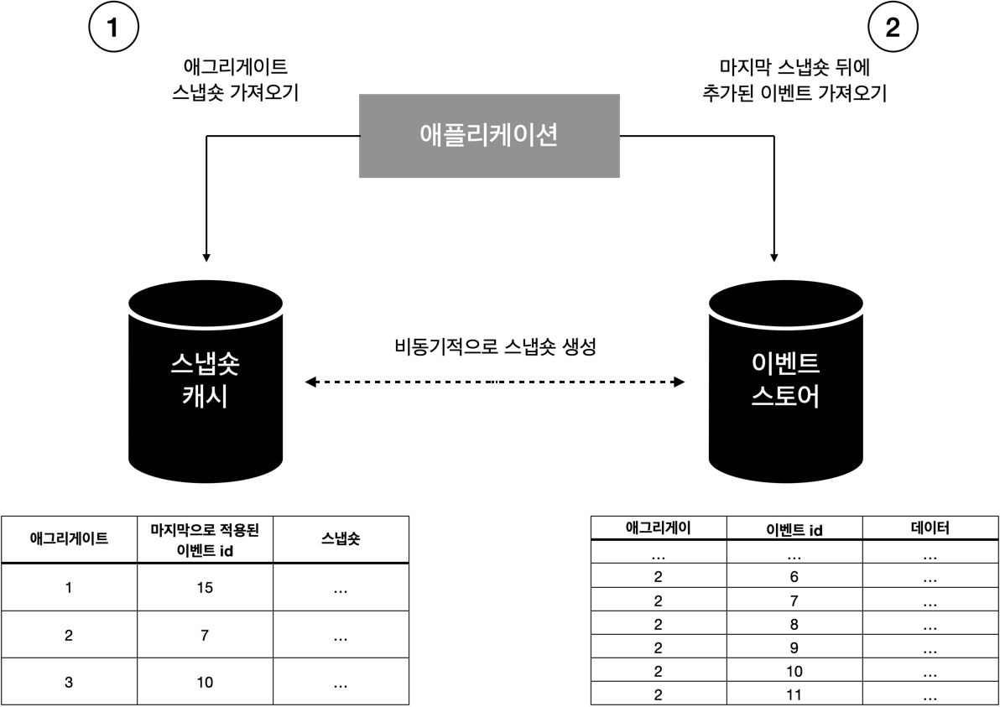
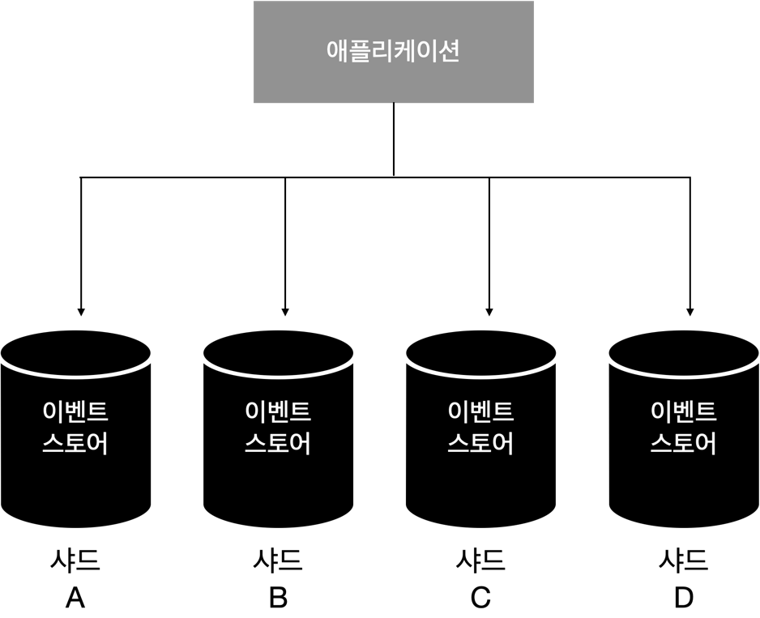

# 시간 차원의 모델링

이벤트 소싱 도메인 모델 패턴은 도메인 모델 패턴과 동일한 전제를 기반으로 한다.
도메인 모델 패턴은 복잡한 비즈니스 로직을 갖는 핵심 하위 도메인에 적용된다.
이벤트 소싱 도메인 모델 패턴은 도메인 모델과 동일한 전술적 패턴을 사용한다.

하지만 이 두가지 구현 패턴은 애그리게이트의 상태를 저장하는 방식이 다르다.
이벤트 소싱 도메인 모델은 이벤트 소싱 패턴을 사용하여 애그리게이트 상태를 관리한다.
즉 애그리게이트의 상태를 유지하는 대신 모델은 각 변경사항을 설명하는 도메인 이벤트를 생성하고 애그리게이트 데이터에 대한 원천 데이터로 사용한다.

이번 장은 이벤트 소싱의 개념을 소개하는 것으로 시작한다.
그다음 이벤트 소싱을 도메인 모델 패턴과 결합하여 이벤트 소싱 도메인 모델로 만드는 방법을 다룬다.

# 이벤트 소싱

테이블의 스키마와 테이블에 저장된 데이터를 분석하는 것만으로도 수집할 수 있는 정보가 상당히 많다.
데이터를 모델링할 때 어떤 유비쿼터스 언어가 사용되었는지 추측할 수도 있다.
하지만 테이블의 데이터는 현재 상태를 문서화하지만 현재 상태에 도달한 이력에 대한 이야기는 누락되었다.
데이터의 수명주기 동안 어떤 일이 발생했는지 분석할 수도 없다.

비즈니스 관점에서 데이터를 분석하고 경험을 기반으로 프로세스를 최적화하는 것이 중요하다.
누락된 정보를 채우는 방법 중 하나는 이벤트 소싱을 사용하는 것이다.

이벤트 소싱 패턴은 데이터 모델에 시간 차원을 도입한다.
애그리게이트의 현재 상태를 반영하는 스키마 대신 이벤트 소싱 기반 시스템은 애그리게이트의 수명주기의 모든 변경사항을 문서화 하는 이벤트를 유지한다.

이벤트 소싱 패턴에서는 도메인 이벤트로부터 원하는 시점의 데이터를 쉽게 추출할 수 있다.
예를 들어 버전 5에서 엔티티의 상태가 필요한 경우 처음 5개의 이벤만 적용하면 된다.

이벤트 소싱 패턴은 검색과 데이터 분석에도 사용될 수 있다.

# 원천 데이터

이벤트 소싱 패턴이 동작하려면 객체 상태에 대한 모든 변경사항이 이벤트로 표현되고 저장되어야 한다.
이러한 이벤트는 시스템의 원천 데이터가 된다.

시스템의 이벤트를 저장하는 데이터베이스는 유일하고 강력하게 일관된 저장소인 시스템의 원천 데이터다.
이벤트를 저장하는 데 사용되는 데이터베이스를 지칭하는 이름이 이벤트 스토어다.

# 이벤트 스토어

이벤트 스토어는 추가만 가능한 저장소이므로 이벤트를 수정하거나 삭제할 수 없다.
이벤트 소싱 패턴을 구현하려면 이벤트 스토어가 최소한 다음의 기능을 지원해야 한다.
즉 특정 비즈니스 엔티티에 속한 모든 이벤트를 가져오고 이벤트를 추가하는 것이다.

```java
class IEventStore {
    IEnumerable<Event> Fetch(Guid instanceId);

    void Append(Guid instanceId, Event[] newEvents, int expectedVersion);
}
```

Append 메서드의 expectedVersion 인수는 낙관적 동시성 제어를 구현하는 데 필요하다.
새 이벤트를 추가할 때 의사결정의 기반이 되는 엔티티 버전도 지정한다.
버전이 유효하지 않으면 즉 예상 버전 이후에 새 이벤트가 추가된 경우 이벤트 스토어는 동시성 예외를 발생시킨다.
대부분의 시스템에서는 다음 장에서 논의할 CQRS 패턴을 구현하기 위해 추가 엔드포인트가 필요하다.

# 이벤트 소싱 도메인 모델

원래 도메인 모델은 애그리게이트의 상태 표현 방식을 유지 관리하고 선택 도메인 이벤트를 내보낸다.
이벤트 소싱 도메인 모델은 애그리게이트의 수명주기를 모델링하기 위해 독점적으로 도메인 이벤트를 사용한다.
애그리게이트 상태에 대한 모든 변경사항은 도메인 이벤트로 표현돼야 한다.

이벤트 소싱 애그리게이트에 대한 각 작업은 다음 단계를 따른다.

- 애그리게이트의 도메인 이벤트를 로드한다.
- 이벤트를 비즈니스 의사결정을 내리는데 사용할 수 있는 상태로 프로젝션해서 상태 표현을 재구성한다.
- 애그리게이트의 명령을 실행하여 비즈니스 로직을 실행하고 결과적으로 새로운 도메인 이벤트를 생성한다.
- 새 도메인 이벤트를 스토어에 커밋한다.

## 왜 '이벤트 소싱 도메인 모델'일까?

이벤트를 사용하여 상태 전환을 나타내는 것은 도메인 모델의 구성요소가 있든 없든 가능하다.
따라서 필자는 도메인 모델 애그리게이트의 수명주기 변경을 나타내기 위해 이벤트 소싱을 사용하고 있음을 명시적으로 보여주는 방법이다.

# 장점

애그리게이트의 현재 상태만을 데이터베이스에 유지하는 기존 모델에 비해 이벤트 소싱 도메인 모델은 애그리게이트를 모델링하는 데 더 많은 노력이 필요하다. 그러나 이 패턴은 많은 시나리오에서 고려할 만한 가치가 있을
정도로 중요한 장점이 있다.

### 시간 여행

도메인 이벤트를 사용하여 애그리게이트의 현재 상태를 재구성할 수 있는 것처럼 도메인 이벤트는 애그리게이트의 모든 과거 상태를 복원하는 데도 사용할 수 있다. 즉 애그리게이트의 모든 과거 상태를 필요할 때 언제든
재구성할 수 있다.

시간 여행은 시스템의 동작을 분석하고 시스템의 의사결정을 검사하고 비즈니스 로직을 최적화할 때 종종 필요하다.

과거 상태를 재구성하는 또 다른 일반적인 유스케이스는 소급 디버깅이다.
애그리게이트를 정확히 버그과 관찰됐을 때의 상태로 되돌릴 수 있다.

### 심오한 통찰력

핵심 하위 도메인을 최적화하는 것이 비즈니스에 전략적으로 중요하다.
이벤트 소싱은 시스템의 상태와 동작에 대한 깊은 통찰력을 제공한다.
이벤트 소싱은 이벤트를 다른 상태 표현 방식으로 변환할 수 있는 유연한 모델을 제공한다.
기존 이벤트의 데이터를 활용하여 추가 통찰력을 제공할 새로운 프로젝션 방법을 언제든지 추가할 수 있다.

### 감사 로그

영속적인 도메인 이벤트는 애그리게이트 상태에 발생한 모든 것에 대한 강력하게 일관된 감사 로그를 나타낸다.
법률에 따라 일부 비즈니스 도메인은 이러한 감사 로그를 반드시 구현해야 하며 이벤트 소싱은 이를 즉시 제공한다.

이 모델은 화폐 또는 금전 거래를 관리하는 시스템에 잘 이용된다.
이를 통해 시스템의 의사결정과 계정 간의 자금 흐름을 쉽게 추적할 수 있다.

### 고급 낙관적 동시성 제어

고급 낙관적 동시성 모델은 읽기 데이터가 기록되는 동안 다른 프로세스의 의해 덮어 쓰여지는 경우 예외를 발생시킨다.

이벤트 소싱을 사용할 때 기존 이벤트를 읽고 새 이벤트를 작성하는 사이에 정확히 무슨 일이 일어났는지 더 깊은 통찰력을 얻을 수 있다.
이벤트 스토어에 동시에 추가된 정확한 이벤트를 추출하고 새로운 이벤트가 시도된 작업과 충돌하는지 또는 추가 이벤트가 관련이 없고 계속 진행하는 것이 안전한지에 대한 비즈니스 도메인 주도 의사결정을 내릴 수 있다.

# 단점

지금까지는 이벤트 소싱 도메인 모델이 비즈니스 로직을 구현하기 위한 궁극의 패턴처럼 보이므로 가능한 자주 사용해야 할 것처럼 보인다. 물론 이는 비즈니스 도메인의 요구사항이 설계 의사결정을 주도하도록 하는 원칙에
모순된다. 따라서 이 패턴이 제시하는 몇 가지 문제에 대해 논의해 보자.

### 학습 곡선

패턴이 데이터를 관리하는 기존 기술과 엄청난 차이가 있다는 것은 명백한 단점이다. 패턴을 성공적으로 구현하려면 팀 교육과 새로운 사고 방식에 익숙해지는 시간이 필요하다. 팀이 지금까지 이벤트 소싱 시스템을 구현한
경험이 없다면 학습 곡선을 고려해야 한다.

### 모델의 진화

이벤트 소싱 모델을 발전시키는 것은 어려울 수 있다.
이벤트 소싱의 정의를 엄밀하게 따지면 이벤트는 변경할 수 없다.
그렇다면 이벤트의 스키마를 조정해야 하는 경우는 어떻게 해야 할까?
그 과정은 테이블의 스키마를 변경하는 것만큼 간단하지 않다.

### 아키텍처 복잡성

이벤트 소싱을 구현하면 수많은 이키텍처의 유동적인 부분이 도입되어 전체 설계가 더 복잡해진다.

당면한 작업에 이 패턴을 적용할 당위성이 없으며 대신 더 단순한 설계로 해결할 수 있는 경우라면 제시한 모든 문제는 더 심각해진다.

# 자주 묻는 질문

이벤트 소싱 패턴을 소개할 때 엔지니어는 종종 몇 가지 일반적인 질문을 한다.

## 성능

### 이벤트에서 애그리게이트 상태를 재구성하면 시스템 성능에 부정적인 영향을 준다. 이벤트가 추가되면서 성능이 저하된다. 이것이 어떻게 작동할 수 있을까?

이벤트를 상태 표현 방식으로 프로젝션하려면 실제로 컴퓨팅 성능이 필요하며 애그리게이트 목록에 더 많은 이벤트가 추가됨에 따라 그 필요성은 더 커진다.

프로젝션 과정이 성능에 미치는 영향 즉 수백 또는 수천 개의 이벤트 작업 효과를 벤치마킹하는 것이 중요하다.
벤치마킹 결과는 애그리게이트의 예상 수명과 비교해서 의사결정해야 한다.
즉 이벤트의 평균 수명 동안 기록될 것으로 예상되는 이벤트 수와 비교해서 누적될 이벤트 목록의 규모를 예측해야 한다.

대부분의 시스템에서 애그리게이트당 10,000 개 이상의 이벤트가 있을 경우 성능 저하가 눈에 띄게 나타난다.
그러나 대다수의 시스템에서 애그리게이트의 평균 수명은 100개 이벤트를 초과하지 않는다.

상태를 프로젝션하는 것이 성능에 문제가 되는 경우는 드물지만 스냅숏 패턴 같은 다른 패턴을 적용할 수도 있다.
이 패턴은 다음 단계를 구현한다.

- 프로세스는 이벤트 스토어에서 새 이벤트를 지속적으로 순회하고 해당 프로젝션을 생성하고 캐시에 저장한다.
- 애그리게이트에 대한 작업을 실행하려면 메모리 내 프로젝션이 필요하다. 이러한 경우
    - 프로세스는 캐시에서 현재 상태의 프로젝션을 가져온다.
    - 프로세스는 이벤트 스토어에서 스냅숏 버전 이후에 발생한 이벤트를 가져온다.
    - 추가 이벤트는 메모리 내 스냅숏에 적용된다.



스냅숏 패턴은 적용에 대한 당위성 증명이 필요한 최적화 과정이라는 점을 상기하자.
시스템의 애그리게이트가 10,000 개 이상의 이벤트를 저장하지 않는 경우 스냅숏 패턴을 구현하는 것은 시스템을 복잡하게 만들 뿐이다. 그러므로 계속해서 스냅숏 패턴을 구현하기 전에 한 걸음 물러서서 애그리게이트의
경계를 다시 확인하는 것이 필요하다.

### 이 모델은 엄청난 양의 데이터를 생성한다. 확장할 수 있을까?

이벤트 소싱 모델은 쉽게 확장할 수 있다. 모든 애그리게이트 관련 작업은 단일 애그리게이트 컨텍스트에서 수행되므로 이벤트 스토어는 애그리게이트 ID로 분할할 수 있다. 애그리게이트의 인스턴스에 속하는 모든 이벤트는
단일 샤드에 있어야 한다.



## 데이터 삭제

### 이벤트 스토어는 추가 전용 데이터베이스지만 물리적으로 데이터를 삭제해야 하는 경우에는 어떻게 할까? 예를 들어 GDPR을 준수하기 위해 물리적으로 데이터 삭제가 필요한다.

이러한 요구사항은 잊어버릴 수 있는 페이로드 패턴으로 해결할 수 있다. 즉 모든 민감 정보는 암호화된 형식으로 이벤트에 포함한다. 암호화 키는 외부 키-값 저장소인 키 저장소에 저장한다. 여기서 키는 특정
애그리게이트의 ID이고 값은 암호화 키다. 민감 데이터를 삭제해야 하는 경우 키 저장소에서 암호화 키를 삭제한다. 결과적으로 이벤트에 포함된 민감 정보에 더 이상 접근할 수 없다.

## 이렇게 하면 안될까요?

### 텍스트 파일에 로그를 작성하여 감사 로그로 사용할 수 없는 이유는 무엇일까?

실시간 데이터 처리 데이터베이스와 로그 파일 모두에 데이터를 쓰는 것은 오류가 발생하기 쉬운 작업이다.
그것은 본질적으로 데이터베이스와 파일이라는 두 가지 저장 장치에 대한 트랜잭션이다. 첫 번째 작업이 실패하면 두 번째 작업을 롤백해야 한다. 예를 들어 데이터베이스 트랜잭션이 실패하면 아무도 이전 로그 메시지를
삭제하지 않는다. 따라서 이러한 로그는 결국 일관성이 없어진다.

### 상태 기반 모델을 계속 사용할 수 없지만 동일한 데이터베이스 트랜잭션에서 로그를 로그 테이블에 추가할 수없는 이유는 무엇일까?

인프라 관점에서 이 접근 방식은 상태와 로그 레코드 간의 일관된 동기화를 제공한다.
그러나 여전히 오류가 발생하기 쉽다.
미래에 코드베이스에서 작업할 엔지니어가 적절한 로그 레코드를 추가하는 것을 잊어버리면 어떻게 될까?

또한 상태 기반 표현 방식을 원천 데이터로 사용할 때 추가 로그 테이블의 스키마는 일반적으로 빠르게 혼돈에 빠진다. 모든 필수 정보가 올바른 형식으로 작성되도록 강제할 방법은 없다.

### 상태 기반 모델을 계속 사용할 수 없지만 레코드의 스냅숏을 만들어 전용 '이력' 테이블에 복사하는 데이터베이스 트리거를 추가할 수 없는 이유는 무엇일까?

이 접근 방식은 이전 방식의 단점을 극복한다. 즉 로그 테이블에 레코드를 추가하기 위해 명시적으로 수동 호출이 필요하지 않다. 결과 기록에는 어떤 필드가 변경되었는지에 대한 사실만 포함한다. '왜' 필드가
변경되었는지와 같은 비즈니스 컨텍스트를 잃게 된다. 이 같은 변경에 이력 정보가 없으면 부가적인 모델을 프로젝션하는 역량이 상당히 제한된다.

# 결론

이번 장에서는 이벤트 소싱 패턴과 도메인 모델의 애그리게이트에서 시간 차원 모델링을 적용하는 방식에 대해 설명했다.

이벤트 소싱 도메인 모델에서 애그리게이트 상태에 대한 모든 변경사항은 일련의 도메인 이벤트로 표현한다. 이는 상태 변경이 데이터베이스 레코드를 업데이트하는 좀 더 전통적인 접근 방식과 대조적이다. 결과 도메인 이벤트는 애그리게이트의 현재 상태를 프로젝션하는 데 사용할 수 있다. 또한 이벤트 기반 모델은 이벤트를 특정 작업에 최적화된 여러 표현 모델로 프로젝션할 수 있는 유연성을 제공한다.

이 패턴은 분석과 최적화를 위해 또는 법적으로 감사 로그를 요구하기 때문에 시스템 데이터에 대한 심오한 통찰력이 필요한 경우에 적합하다.

이번 장에서는 비즈니스 로직을 모델링하고 구현하는 다양한 방법을 살펴봤다.
