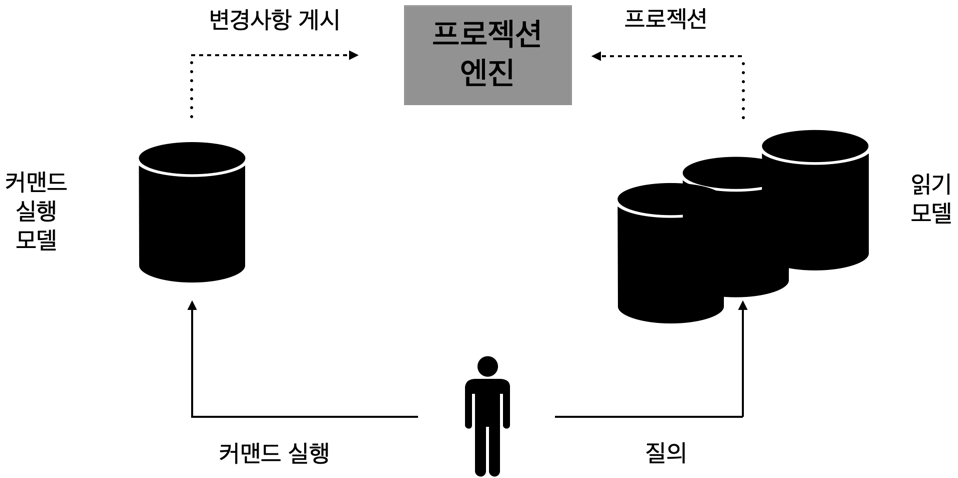
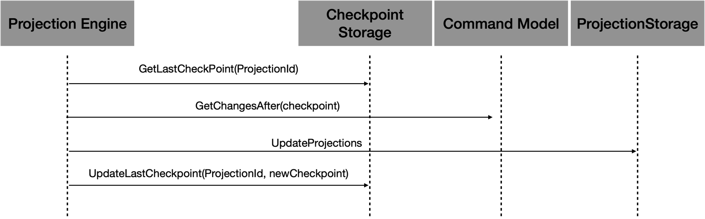
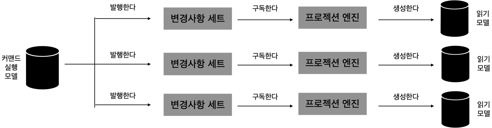
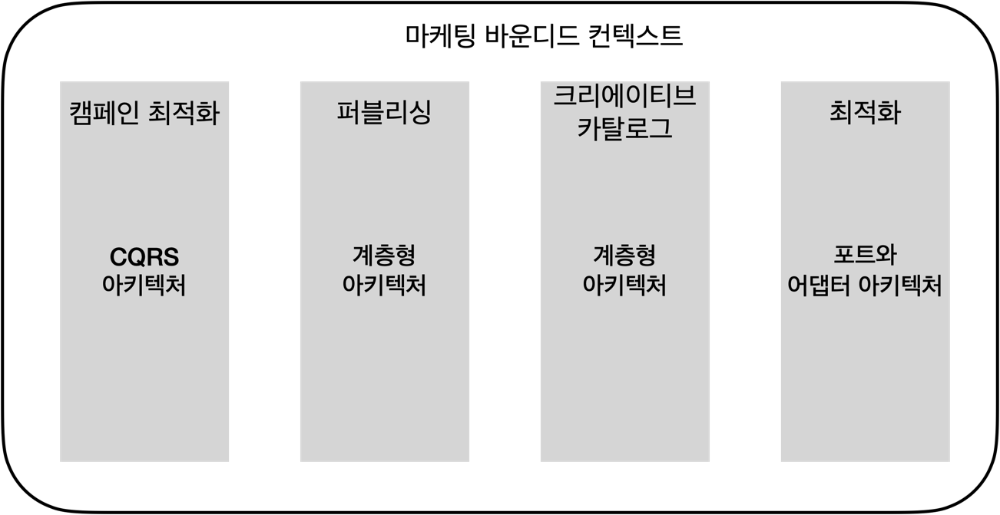

# 비즈니스 로직과 아키텍처 패턴

비즈니스 로직은 소프트웨어에서 가장 중요한 요소이다.
하지만 소프트웨어 시스템에는 다른 요소도 많다.
코드베이스는 기능 또는 비기능 요구사항을 구현하기 위한 많은 책임을 담당한다.
또한 사용자와 상호작용해서 입력을 받고 결과를 제공하며 다양한 저장소에 상태를 저장하고 외부 시스템 및 정보 제공자와 연동도 해야 한다.

코드베이스가 처리해야 할 다양한 관심사로 인해 비즈니스 로직이 다양한 구성요소에 흩어지기 쉽다.
예를 들어 어떤 로직은 사용자 인터페이스 또는 데이터베이스에 구현되거나 다양한 구성요소에 중복될 수 있다.
관심사를 구현할 때 엄격하게 구성하지 않으면 코드베이스의 변경이 어려워진다.
비즈니스 로직이 변경될 때 코드베이스의 어떤 부분이 영향을 받는지 분명하지 않을 수 있다.
또한 겉으로 보기에 관련 없는 부분에 기대치 않게 변경이 영향을 미칠 수 있다.
반대로 변경해야 할 부분을 놓치기도 쉽다.
이 모든 문제는 코드베이스의 유지보수 비용을 크게 증가시킨다.

아키텍처 패턴은 코드베이스의 다양한 측면에 대한 구성 원칙을 도입하고 이들 사이의 명확한 경계를 제시한다.
예를 들어 비즈니스 로직이 어떻게 시스템의 입력과 출력 그리고 다른 기반 구성요소와 연결되는가와 같은 것이 코드베이스의 다양한 측면 중 하나다.

코드베이스를 조직하는 적절한 방법 혹은 올바른 아키텍처 패턴을 선택하는 것은 단기적으로는 비즈니스 로직 구현을 지원하고 장기적으로 유지보수를 돕기 위해 매우 중요하다. 그것을 가능하게 해주는 세 가지 주요 아키텍처
패턴인 계층형 아키텍처, 포트와 어댑터, 그리고 CQRS에 대해 알아보자.

# 계층형 아키텍처

계층형 아키텍처는 가장 일반적인 아키텍처 패턴 중 하나다.
코드베이스를 수평 계층으로 조직하고 각 계층은 사용자와 상호작용, 비즈니스 로직의 구현, 그리고 데이터의 저장과 같은 기술적 관심사 중 하나를 다룬다.

고전적인 계층형 아키텍처는 프레젠테이션 계층, 비즈니스 로직 계층, 데이터 접근 계층의 세 가지 계층으로 구성된다.

## 프레젠테이션 계층

프레젠테이션 계층은 사용자와 상호작용을 위한 프로그램의 사용자 인터페이스를 구성한다.
이 패턴의 원래 형태에서 이 계층은 웹 인터페이스 또는 데스크톱 인터페이스와 같은 그래픽 인터페이스를 나타낸다.

하지만 현대 시스템에서 프로젠테이션 계층은 프로그램 동작을 촉발하는 모든 동기식 또는 비동기식 수단과 같은 좀 더 광범위한 범주를 포함한다.

- 그래픽 사용자 인터페이스
- 커맨드 라인 인터페이스
- 다른 시스템과 연동하는 프로그래밍 API
- 메시지 브로커에서 이벤트에 대한 구독
- 나가는 이벤트를 발행하는 메시지 토픽

이 모든 것은 시스템이 외부 환경으로부터 요청을 받고 결과를 소통하는 수단이다.
엄빌히 말하면 프레젠테이션 계층은 프로그램의 퍼블릭 인터페이스다.

## 비즈니스 로직 계층

이 계층은 프로그램의 비즈니스 로직을 구현하고 묶는 것을 담당한다.
이곳에 비즈니스 의사결정을 구현한다.
에릭 에반스는 이 계층이 소프트웨어의 중심이라고 했다.

액티브 레코드 또는 도메인 모델과 같은 비즈니스 로직 패턴을 이 계층에서 구현한다.

## 데이터 접근 계층

데이터 접근 게층은 영속성 메커니즘에 접근할 수 있게 해준다.
원래 패턴에서는 이 계층이 시스템의 데이터베이스를 가리킨다.
그러나 프레젠테이션 계층의 경우처럼 현대 시스템에서는 이 계층이 좀 더 넓은 범위의 책임을 진다.

첫째, 여러 데이터베이스를 사용하는 시스템이 보편화 됐다.
둘째 정보 저장용으로 전통적인 데이터베이스뿐만 아니라 다양한 매체가 있다.
마지막으로 이 계층은 프로그램의 기능을 구현하는 데 필요한 다양한 외부 정보 제공자와 연동하는 것을 포함한다.

## 계층간 커뮤니케이션

계층은 톱다운 커뮤니케이션 모델에 따라 연동한다.
각 계층은 바로 아래 계층에만 의존한다.
이렇게 하면 구현 관심사의 결합성을 낮추고 계층 간에 공유할 지식을 줄인다.
프레젠테이션 계층은 비즈니스 로직 계층만 참조하고 데이터 접근 계층의 설계 의사결정을 알지 못한다.

## 변종

계층형 아키텍처 패턴을 확장해서 서비스 계층을 추가하는 것을 흔히 볼 수 있다.

## 서비스 계층

서비스 계층은 프로그램의 프레젠테이션 계층과 비즈니스 로직 계층 사이의 중간 역할을 한다.
프레젠테이션 계층과 하부의 비즈니스 로직의 결합을 제거하기 위해 이 조율 로직을 서비스 계층으로 이동할 수도 있다.

아키텍처 패턴의 컨텍스트에서 서비스 계층은 논리적 경계라는 것이 중요하다.
이것은 물리적 서비스가 아니다.

서비스 계층은 비즈니스 로직 계층으로의 관문 역할을 한다.
즉 하부 계층을 조율하는 데 필요한 것들을 감싸서 퍼블릭 인터페이스의 메서드에 상응하는 인터페이스로 노출한다.

서비스 계층을 명시적으로 갖추면 몇 가지 장점이 생긴다.

- 동일한 서비스 계층을 여러 퍼블릭 인터페이스에서 재사용할 수 있다.
- 모든 관련 메서드를 한곳에 모으면 모듈화가 개선된다.
- 프레젠테이션 계층과 비즈니스 로직 계층의 결합도를 낮춘다.
- 비즈니스 기능을 테스트하기 쉬워진다.

다만 서비스 계층이 항상 필요한 것은 아니다.
예를 들어, 비즈니스 로직이 트랜잭션 스크립트로 구현된 경우 이미 시스템의 퍼블릭 인터페이스를 구성하는 일련의 메서드를 노출하므로 기본적으로 서비스 계층 역할을 한다.
이 경우 서비스 계층의 API는 어떤 복잡성을 추상화하거나 감싸지 않고 단순히 트랜잭션 스크립트의 퍼블릭 인터페이스를 되풀이한다.
따라서 서비스 계층 또는 비즈니스 로직 계층 중 하나면 충분하다.

반면 액티브 레코드 패턴을 사용하는 경우처럼 비즈니스 로직 패턴에서 외부 조율을 해야 할 경우 서비스 게층이 필요하다. 이 경우 서비스 게층은 트랜잭션 스크립트 패턴을 구현하되 이것이 실제 동작하는 액티브 레코드는
비즈니스 로직 계층에 둔다.

## 계층형 아키텍처를 사용하는 경우

비즈니스 로직과 데이터 접근 계층 간에는 의존성이 있다.
따라서 비즈니스 로직이 트랜잭션 스크립트 또는 액티브 레코드 패턴을 사용하여 구현된 시스템에 계층형 아키텍처 패턴이 적합하다.

반면 도메인 모델을 구현하는 데 게층형 아키텍처 패턴을 적용하는 것은 어렵다.
도메인 모델에서는 비즈니스 엔티티가 하부의 인프라스트럭처에 대해 의존성이 없어야 하고 그것을 몰라야 하기 때문이다. 계층형 아키텍처의 톱다운 의존성에 이런 요구사항을 충족하려면 몇 가지 난관을 극복해야 한다.
여전히 계층형 아키텍처를 적용해서 구현할 수 있지만 도메인 모델의 구현에는 다음에 논의할 패턴이 더 적합하다.

# 포트와 어댑터

포트와 어댑터 아키텍처는 계층형 아키텍처의 단점을 해결하고 좀 더 복잡한 비즈니스 로직을 구현하는 데 적합하다.
흥미롭게도 두 패턴은 매우 비슷하다.

## 용어

본질적으로 프레젠테이션 계층과 데이터 접근 계층 모두 데이터베이스, 외부 서비스, 사용자 인터페이스 프레임워크 등의 외부 구성요소와 연동하는 것을 표현한다. 하지만 이와 같은 기술적 구현 상세는 시스템의 비즈니스
로직을 반영하지 못하므로 이 같은 모든 인프라 관심사를 단일 인프라스트럭처 계층으로 통합했다.

## 의존성 역전 원칙

의존성 역전 원칙에서 비즈니스 로직을 구현하는 상위 수준의 모듈은 하위 수준의 모듈에 의존해서는 안된다고 말한다.
그러나 전통적인 계층형 아키텍처에서 비즈니스 로직 계층은 인프라스트럭처 계층에 의존한다.
DIP를 준수하기 위해 의존성을 역전시키면 비즈니스 로직 계층은 프레젠테이션 계층과 데이터 접근 계층에 끼어 있는 대신 중심적인 역할을 맡는다.
더이상 시스템의 인프라스트럭처 구성요소에 의지하지 않는다.
마지막으로 시스템의 퍼블릭 인터페이스를 위한 관무으로서 애플리케이션 계층을 추가하자.
마치 게층형 아키텍처에서의 서비스 계층처럼 애플리케이션 계층은 시스템이 노출하는 모든 오퍼레이션을 설명하고 이를 실행할때 시스템의 비즈니스 로직을 조율한다.

도메인 모델, 이벤트 소싱 도메인 모델 패턴의 구현 요건에 따라 비즈니스 로직은 어떠한 하위 계층에도 의존하지 않는다.

왜 이것을 포트와 어댑터라 부를까? 이 질문에 답하려면 인프라스트럭처 구성요소가 어떻게 비즈니스 로직과 연동하는지 살펴봐야 한다.

## 인프라 구성요소의 연동

포트와 어댑터 아키텍처의 핵심 목적은 인프라스트럭처 구성요소로부터 시스템의 비즈니스 로직을 분리하는 것이다.

인프라스트럭처 구성요소를 직접 참조하고 호출하는 대신, 비즈니스 로직 계층은 인프라스트럭처 계층이 구현해야 할 포트를 정의한다. 인프라스트럭처 계층은 어댑터를 구현한다. 즉 다양한 기술을 사용하기 위해 정의된 포트의
인터페이스를 구체적으로 구현한다.

추상 포트는 인프라스트럭처 계층에서 의존성 주입 또는 부트스트래핑을 통해 구체적인 어댑터로 나타난다.

## 변형

포트와 어댑터 아키텍처는 헥사고날 아키텍처 어니언 아키텍처 그리고 클린 아키텍처로 알려졌다.
이 모든 패턴이 동일한 설계 원칙에 기반하고 동일한 구성요소를 가지며 동일한 관계를 가진다 해도 계층형 아키텍처에서와 마찬가지로 용어는 다음과 같이 다를 수 있다.

- 애플리케이션 계층 = 서비스 계층 = 유스케이스 계층
- 비즈니스 로직 계층 = 도메인 계층 = 핵심 계층

그럼에도 불구하고 이런 패턴은 개념적으로 다른 것으로 잘못 취급될 수 있다.
이 또한 유비쿼터스 언어의 중요성을 보여주는 하나의 예다.

## 포트와 어댑터를 사용하는 경우

모든 기술적 관심사로부터 비즈니스 로직을 분리하는 것이 포트와 어댑터 아키텍처의 목적이므로 이 아키텍처는 도메인 모델 패턴을 사용하여 구현한 비즈니스 로직에 매우 적합하다.

# CQRS

CQRS 패턴은 포트와 어댑터와 동일한 비즈니스 로직과 인프라스트럭처 관심사에 기반한다.
하지만 시스템의 데이터를 관리하는 방식이 다르다.
이 패턴을 사용하면 여러 영속 모델에 시스템의 데이터를 표현할 수 있다.

## 폴리그랏 모델링

대부분의 경우 단일 비즈니스 도메인 모델로 시스템의 모든 요구사항을 해결하기는 불가능하지는 않지만 어려울 수 있다. 예를 들어 OLTP 와 OLAP 에서는 시스템 데이터의 다양한 표현이 필요할 수 있다.

여러 모델로 작업하는 또 다른 이유는 다양한 언어를 사용하는 영속성 개념과 관련이 있다.
완벽한 데이터베이스는 없다.
그래그 영은 모든 데이터베이스는 제각기 고유한 결점이 있다고 했다.
즉 확장성이나 일관성 또는 지원하는 질의 모델 간에 균형이 필요하다.
완전한 데이터베이스의 대안으로 폴리그랏 영속성 모델이 있다.
이는 다양한 데이터 관련 요구사항을 구현하기 위해 여러 데이터베이스를 사용하는 것이다.
예를 들어 단일 시스템에서 실시간 데이터 처리 데이터베이스로 도큐먼트 저장소를 사용하거나 분석/보고용으로 칼럼 저장소 그리고 견고한 검색 기능을 위해 검색 엔진을 사용할 수 있다.

마지막으로 CQRS 패턴은 이벤트 소싱과 밀접하게 관련이 있다.
원래 CQRS는 이벤트 소싱 모델의 질의 한계를 극복하려고 정의됐다.
즉 한 번에 하나의 애그리게이트 인스턴스에 대한 이벤트를 질의할 수 있다.
CQRS 패턴은 프로젝션된 모델을 물리적으로 데이터베이스에 머터리얼라이즈해서 유연한 질의에 사용할 수 있게 해준다.

하지만 이번 장에서는 이벤트 소싱과 CQRS를 별개로 본다.
비록 다른 구현 패턴을 사용하여 비즈니스 로직이 구현됐더라도 CQRS 패턴이 유용할 수 있다는 것을 보여주고자 한다.

### 구현

이름에서 알 수 있듯이 이 패턴은 시스템 모델의 책임을 분리시킨다. 여기에는 커맨드 실행 모델과 읽기 모델 두 유형이 있다.

### 커맨드 실행 모델

CQRS에는 시스템의 상태를 수정하는 오퍼레이션을 전담으로 수행하는 단일 모델이 있다.
이 모델은 비즈니스 로직을 구현하고 규칙을 검사하며 불변성을 강화하는 데 사용된다.
커맨드 실행 모델은 시스템의 원천인 강력한 일관성을 가진 데이터를 표현하는 유일한 모델이다.
비즈니스 엔티니의 일관적 상태를 읽을 수 있어야 하고 갱신할 때 낙관적 동시성을 지원해야 한다.

### 읽기 모델 (프로젝션)

시스템은 사용자에게 데이터를 보여주거나 다른 시스템에 정보를 제공하기 위해 필요한 만큼 모델을 정의할 수 있다.

읽기 모델은 캐시에서 언제든 다시 추출할 수 있는 프로젝션이다.
이는 견고한 데이터베이스 일반 파일 또는 인메모리 캐시에 위치할 수 있다.
잘 구현된 CQRS에서는 모든 프로젝션의 모든 데이터를 삭제하고 처음부터 재생성할 수 있다.
또한 지금 예측하지 못한 미래에 새로운 프로젝션을 시스템에 확장하는 것도 가능하다.

마지막으로 읽기 모델은 읽기 전용이다.
시스템의 어떠한 오퍼레이션도 읽기 모델의 데이터를 직접 수정할 수 없다.

## 읽기 모델의 프로젝션

읽기 모델이 작동하려면 시스템은 커맨드 실행 모델에서 변경을 모든 읽기 모델로 프로젝션해야 한다.

읽기 모델의 프로젝션은 관계형 데이터베이스의 머터리얼라이즈 뷰의 개념과 유사하다.
즉 원천 테이블이 갱신되면 변경사항은 미리 작성된 뷰에 반영되어야 한다.

### 동기식 프로젝션

동기식 프로젝션은 격차 해소 구독 모델을 통해 OLTP 데이터의 변경사항을 가져온다.

- 프로젝션 엔진이 OLTP 데이터베이스로부터 마지막에 처리했던 체크포인트 이후에 추가되거나 갱신된 레코드를 조회한다.
- 프로젝션 엔진이 조회된 데이터를 이용해서 시스템의 읽기 모델을 재생성 또는 갱신한다.
- 프로젝션 엔진은 마지막으로 처리 레코드의 체크포인트를 저장한다. 이 값은 다음 처리 때 추가되거나 갱신된 레코드를 조회하는 데 사용된다.

격채 해소 구독이 작동하려면 커맨드 실행 모델이 추가되거나 갱신되는 모든 데이터베이스 레코드를 체크포인트로 관리해야 한다.
또한 저장 메커니즘도 체크포인트 기반으로 레코드를 조회하는 것을 지원해야 한다.

체크포인트는 데이터베이스의 기능을 사용해 구현할 수 있다.
예를 들어 추가되거나 갱신되는 행에 대해 SQL 서버의 rowversion 칼럼을 활용해 유일하고 순차적으로 증가하는 숫자를 생성할 수 있다.
이 같은 기능을 지원하지 않는 데이터베이스의 경우 수정되는 각 레코드에 카운터를 증가시켜 추가하는 맞춤 솔루션을 구현할 수 있다.
체크포인트 기반의 질의가 일관된 결과를 반환하도록 보장하는 것이 중요하다.

마지막에 반환된 레코드의 체크포인트가 10이라면 다음 번 실행에서 새로운 요청은 10보다 낮은 값을 가지면 안된다. 낮은 값을 갖게 되면 프로젝션 엔진이 이 값을 건너뛰게 되고 일관성 없는 모델이 만들어진다.

동기식 프로젝션 메서드에서 새로운 프로젝션을 추가하고 기존의 것을 처음부터 다시 생성하는 것은 쉽다.
후자의 경우 할 일은 단지 체크포인트를 0으로 초기화하는 것 뿐이다.
그러면 프로젝션 엔진이 레코드를 읽고 처음부터 프로젝션을 다시 만들 것이다.

## 비동기식 프로젝션

비동기식 프로젝션 시나리오에서 커맨드 실행 모델은 모든 커밋된 변경사항을 메시지 버스에 발행한다.
시스템의 프로젝션 엔진은 발행된 메시지를 구독하고 읽기 모델을 갱신하는 데 사용한다.

## 도전과제

비동기식 프로젝션 방식의 확실한 확장성과 성능의 장점에도 불구하고 분산 컴퓨팅에서 문제가 발생하기가 더 쉽다.
메시지의 순서가 잘못되거나 중복 처리되면 읽기 모델에 일관성 없는 데이터가 프로젝션된다.

또한 이 방식은 새로운 프로젝션을 추가하거나 이미 존재하는 것을 재생성하는 것이 어렵다.
그러므로 가능하면 동기식 프로젝션 방식을 구현하고 그 위에 선택적으로 비동기식 프로젝션 방식을 추가하는 것을 권장한다.

## 모델 분리

CQRS 아키텍처에서 시스템 모델이 담당하는 책임은 그 타입에 따라 분리된다.
커맨드는 강한 일관성을 가진 커맨드 실행 모델에서만 동작한다.
질의는 읽기 모델과 커맨드 실행 모델을 포함하여 그 어떤 시스템의 영속 상태를 직접 수정할 수 없다.

CQRS 기반 시스템에 대한 일반적인 오해는 커맨드가 데이터를 수정만 할 수 있고, 데이터를 오직 표현 용도로 읽기 모델을 통해서만 조회할 수 있다는 것이다. 다시 말해 커맨드 실행 메서드는 어떤 데이터도 반환해서는
안된다는 것이다.
하지만 이것은 잘못된 것이다. 이런 접근 방식은 우발적 복잡성을 만들고 좋지 않은 사용자 경험을 유발한다.

커맨드는 실행이 성공했는지 또는 실패했는지를 항상 호출자에게 알려야 한다.
실패했다면 왜 실패했는가?
유효성 검사 또는 기술적 문제가 있었는가?
이런 정보가 있어야 호출자가 커맨드를 어떻게 수정할지 알 수 있다.
그러므로 대부분의 경우 커맨드는 데이터를 반환해야 한다.
예를 들어 시스템의 사용자 인터페이스에서 커맨드의 결과를 수정해서 반영해야 하는 경우 그렇다.
이렇게 하면 사용자의 동작에 대한 즉각적인 피드백으로 좀 더 쉽게 시스템을 사용하게 해줄 뿐만 아니라 반환값을 사용자의 다음 워크플로에 활용해서 불필요한 데이터 왕복을 없앨 수 있다.

이 방법의 유일한 단점이자 한계는 반환 데이터가 강한 일관성 모델에서 비롯되어야 한다는 것이다.
즉 데이터가 궁극적으로 일관성을 갖는 프로젝션의 경우에는 데이터에 대한 즉각적인 갱신은 기대할 수 없다.

# CQRS를 사용해야 하는 경우

CQRS 패턴은 여러 모델 궁극적으로 다양한 종류의 데이터베이스에 저장된 동일한 데이터와 작동할 필요가 있는 애플리케이션에 유용하다.
운영의 관점에서 보면 이 패턴은 당면한 과제에 가장 효과적인 모델을 사용하고 비즈니스 도메인 모델을 지속적으로 개선하는 도메인 주도 설게의 핵심 가치를 지원한다.
한편 인프라스트럭처 관점에서는 CQRS가 다양한 종류의 데이터베이스의 장점을 활용할 수 있게 해준다.
예를 들어 커맨드 실행 모델을 저장을 위한 관계형 데이터베이스, 전문 검색을 위한 검색 인덱스, 빠른 데이터 검색을 위한 사전 랜더링된 플랫 파일 등이 있으며 이러한 모든 스토리지 메커니즘이 신뢰성 있게 동기화된다.

또한 CQRS는 이벤트 소싱 도메인 모델에도 적합하다.
이벤트 소싱 모델에서는 애그리게이트의 상태에 기반한 레코드 조회가 불가능하지만 CQRS는 상태를 질의할 수 있는 데이터베이스에 상태를 프로젝션하므로 이것이 가능하다.

# 범위

앞서 논의한 패턴 즉 계층형 아키텍처, 포트와 어댑터, CQRS는 시스템 전체에 적용하는 구성 원칙으로 취급하면 안 된다. 이것은 전체 바운디드 컨텍스트를 위한 고수준의 아키텍처 패턴도 아니다. 다양한 하위 도메인을
포함하는 바운디드 컨텍스트를 생각해보자.

하위 도메인에는 핵심, 지원, 일반의 다양한 타입이 있다. 동일한 타입의 하위 도메인도 다양한 비즈니스 로직과 아키텍처 패턴이 필요할 수 있다. 바운디드 컨텍스트에 단일 아키텍처를 강요하면 의도치 않은 우발적
복잡성을 유발할 것이다.

우리의 목적은 실제 필요성과 비즈니스 전략에 따라 설계 의사결정을 내리는 것이다.
시스템을 수평으로 분할하는 계층 외에도 수직으로 나누는 것을 추가로 도입할 수도 있다.
비즈니스 하위 도메인을 묶는 모듈의 논리적 경계를 분명하게 정의하고 각각에 맞는 적합한 도구를 사용하는 것이 중요하다.

적절한 수직 경계는 모놀리식 바운디드 컨텍스트를 모듈화하고 커다란 진흙 덩어리가 되는 것을 방지하는 데 도움을 준다. 이와 같은 논리적 경계는 좀 더 세분화된 바운디드 컨텍스트의 물리적 경계로 리팩터링될 수 있다.

# 결론

계층형 아키텍처는 기술적으로 관심사에 따라 코드베이스를 분해한다.
이 패턴은 비즈니스 로직과 데이터 접근 구현을 결합시키므로 액티브 레코드 기반 시스템에 적합하다.

포트와 어댑터 아키텍처는 관계를 역전시킨다.
비즈니스 로직을 중심에 두고 모든 인프라스트럭처와 의존성을 분리한다.
이 패턴은 도메인 모델 패턴을 구현하는 비즈니스 로직에 적합하다.

CQRS 패턴은 여러 모델에서 동일한 데이터를 표현하낟.
이 패턴은 이벤트 소싱 도메인 모델에 기반한 시스템에 적합하지만 다양한 영속 모델을 사용할 필요가 있는 어떤 시스템에도 사용할 수 있다.
