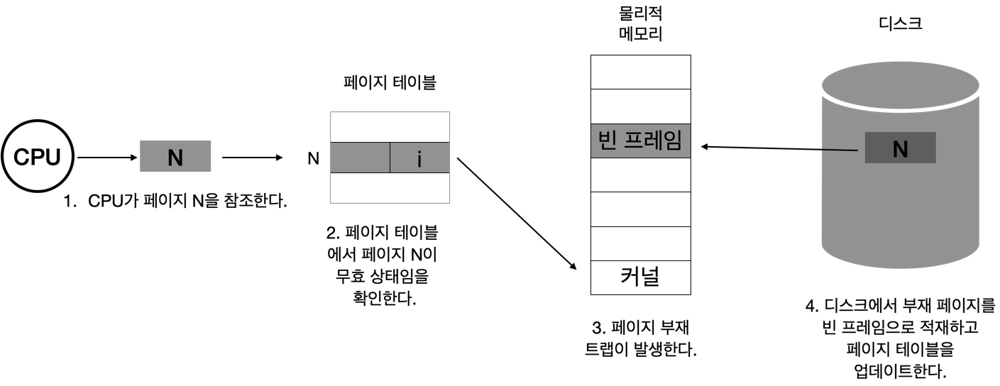

메모리의 연장 공간으로 디스크의 스왑 영역이 사용될 수 있다.
운영체제는 프로그램이 물리적 메모리를 고려할 필요 없이 자기 자신만이 메모리를 사용하는 것처럼 가정해 프로그램하는 것을 지원한다.
이렇게 되면 프로그램은 0번지부터 시작하는 자기 자신만의 메모리 주소 공간을 가정할 수 있는데 이러한 메모리 공간을 가상메모리라고 부른다.
즉 가상메모리는 프로세스마다 각각 0번지부터의 주소 공간을 가지게 되며 이들 공간 중 일부는 물리적 메모리에 적재되고 일부는 디스크의 스왑 영역에 존재하게 된다.

프로세스의 주소 공간을 메모리로 적재하는 단위에 따라 가상메모리 기법은 요구 페이징 방식과 요구 세그먼테이션 방식으로 구현될 수 있다.

# 1. 요구 페이징
요구 페이징이란 프로그램 실행 시 프로세스를 구성하는 모든 페이지를 한꺼번에 메모리에 올리는 것이 아니라 당장 사용될 페이지만을 올리는 방식을 말한다.
따라서 요구 페이징 기법에서는 특정 페이지에 대해 CPU의 요청이 들어온 후에야 해당 페이지를 메모리에 적재한다.

요구 페이징 기법은 당장 실행에 필요한 페이지만을 메모리에 적재하기 때문에 메모리 사용량이 감소하고 프로세스 전체를 메모리에 올리는데 소요되는 입출력 오버헤드도 줄어든다.
이는 사용되지 않을 주소 영역에 대한 입출력까지 수행하던 기존 방식에 비해 응답시간을 단축시킬 수 있으며 시스템이 더 많은 프로세스를 수용할 수 있게 해준다.
또한 물리적 메모리의 용량 제약을 벗어날 수 있도록 한다는 점이다.

가상메모리 기법에서는 프로세스가 실행되는 동안 일부 페이지만 메모리에 올라와 있고 나머지 페이지는 디스크 스왑 영역에 존재한다.
이러한 시스템에서는 특정 프로세스를 구성하는 페이지 중에서 어떤 페이지가 메모리에 존재하고 어떤 페이지가 메모리에 존재하지 않는지 구별하기 위한 방안이 필요하다.
요구 페이징에서는 유효-무효 비트를 두어 각 페이지가 메모리에 존재하는지 표시하게 된다.
이 비트는 각 프로세스를 구성하는 모든 페이지에 대해 존재해야 하므로 페이지 테이블의 각 항목별로 저장된다.

프로세스가 실행되기 전에는 모든 페이지의 유효-무효 비트가 무효값으로 초기화되어 있지만 특정 페이지가 참조되어 메모리에 적재되는 경우 해당 페이지의 유효-무효 비트는 유효값으로 바뀌게 된다.
그리고 메모리에 적재되어 있던 페이지가 디스크의 스왑영역으로 쫓겨날 때에는 유효-무효 비트가 다시 무효값을 가지게 된다.
CPU가 참조하려는 페이지가 현재 메모리에 올라와 있지 않아 유효-무효 비트가 무효로 세팅되어 있는 경우를 Page Fault 가 일어났다고 말한다.

## 1) 요구 페이징의 페이지 부재 처리
CPU가 무효 페이지에 접근하면 MMU가 페이지 부재 트랩을 발생시키게 된다.
그러면 CPU의 제어권이 커널모드로 전환되고 운영체제의 페이지 부재 처리루틴이 호출되어 다음과 같은 순서로 페이지 부재를 처리한다.
즉 부재 상태의 페이지를 메모리에 적재하기에 앞서 운영체제는 해당 페이지에 대한 접근이 적법한지를 먼저 체크하게 된다.
해당 페이지에 대한 접근이 적법한 것으로 판명된 경우 물리적 메모리에서 비어 있는 프레임을 할당받아 그 공간에 해당 페이지를 읽어온다.
만약 비어 있는 프레임이 없다면 기존에 메모리에 올라와 있는 페이지 중 하나를 디스크로 쫓아낸다.
이와 같은 행위를 스왑 아웃시킨다라고 한다.

## 2) 요구 페이징의 성능
요구 페이징 기법의 성능에 가장 큰 영향을 미치는 요소는 페이지 부재의 발생 빈도이다.
페이지 부재가 일어나면 요청된 페이지를 디스크로부터 메모리로 읽어오는 막대한 오버헤드가 발생하기 때문이다.
즉 페이지 부재가 적게 발생할수록 요구 페이징의 성능은 향상될 수 있다.

페이지 부재가 일어나면 많은 오버헤드가 필요하게 된다.
먼저 메모리에 올라와 있는 페이지 중 하나의 페이지를 선택해 디스크로 스왑 아웃시킨 후 스왑 영역에서 요청된 페이지를 메모리로 읽어와야 한다.
페이지를 다 읽어왔으면 인터럽트를 통해 프로세스가 실행을 재개할 수 있는 상태로 바꾸어주고 자신의 차례가 되면 문맥교환을 통해 다시 CPU를 얻을 수 있게 된다.
이러한 과정에는 디스크 입출력과 각종 오버헤드가 포함되어 시간이 오래 걸린다.
유효 접근시간이 짧을수록 요구 페이징 기법 성능은 향상된다.

# 2. 페이지 교체
페이지 부재가 발생하면 요청된 페이지를 디스크에서 메모리로 읽어와야 한다.
이때 물리적 메모리에 빈 프레임이 존재하지 않을 수 있다.
이 경우 메모리에 올라와 있는 페이지 중 하나를 디스크로 쫓아내서 메모리에 빈 공간을 확보하는 작업이 필요하다.
이것을 페이지 교체라고 한다.
페이지 교체를 할 때에 어떠한 프레임에 있는 페이지를 쫓아낼 것인지 결정하는 알고리즘을 교체 알고리즘이라고 한다.

## 1) 최적 페이지 교체
페이지 부재율을 최소화하기 위해서는 페이지 교체시 물리적 메모리에 존재하는 페이지 중 가장 먼 미래에 참조될 페이지를 쫓아내면 된다.
이 알고리즘은 미래에 어떤 페이지가 어떠한 순서로 참조될지 미리 알고 있다는 전제하에 알고리즘을 운영하므로 실제 시스템에서 온라인으로 사용할 수 있는 알고리즘은 아니다.

## 2) FIFO 알고리즘
페이지 교체 시 물리적 메모리에 가장 먼저 올라온 페이지를 우선적으로 내쫓는다.
페이지의 향후 참조 가능성을 고려하지 않고 물리적 메모리에 들어온 순서대로 내쫓을 대상을 선정하기 때문에 비효율적인 상황이 발생할 수 있다.

## 3) LRU 알고리즘
메모리 페이지의 참조 성향 중 중요한 한 가지 성질로 시간지역성이라는 것이 있다.
이 성질은 최근에 참조된 페이지가 가까운 미래에 다시 참조될 가능성이 높은 성질을 말한다.
LRU 알고리즘은 이와 같은 성질을 활용해서 페이지 교체 시 가장 오래전에 참조가 이루어진 페이지를 쫓아낸다.

## 4) LFU 알고리즘
페이지의 참조 횟수로 교체시킬 페이지를 결정한다.
물리적 메모리 내에 존재하는 페이지 중에서 과거에 참조 횟수가 가장 적었던 페이지를 쫓아내고 그 자리에 새로 참조될 페이지를 적재한다.
최저 참조 횟수를 가진 페이지가 여러 개 존재하는 경우에는 임의로 하나를 선정해 그 페이지를 쫓아낸다.

LFU 알고리즘은 Incache-LFU 와 Perfect-LFU 의 서로 다른 방식으로 구현할 수 있다.
Incache-LFU 는 페이지가 물리적 메모리에 올라온 후부터의 참조 횟수를 카운트하는 방식이다.
Perfect-LFU는 메모리에 올라와 있는지 여부와 상관없이 그 페이지의 과거 총 참조 횟수를 카운트한다.

LFU 알고리즘은 LRU 알고리즘보다 오랜 시간 동안의 참조 기록을 반영할 수 있다는 장점이 있다.
하지만 LFU는 시간 페이지 참조의 변화를 반영하지 못하고 LRU 보다 구현이 복잡하다는 단점이 있다.

## 5) 클럭 알고리즘
LRU와 LFU 알고리즘은 페이지의 참조 시각 및 참조 횟수를 소프트웨어적으로 유지하고 비교해야 하므로 알고리즘의 운영에 시간적인 오버헤드가 발생한다.
클럭 알고리즘은 하드웨어적인 지원을 통해 이와 같은 알고리즘의 운영 오버헤드를 줄인 방식이다.
클럭 알고리즘은 LRU를 근사시킨 알고리즘으로 NUR 또는 NRU 알고리즘으로도 불린다.
클럭 알고리즘은 오랫동안 참조되지 않은 페이지 중 하나를 교체한다.
즉 최근에 참조되지 않은 페이지를 교체 대상으로 선정한다는 측면에서 LRU와 유사하지만 교체되는 페이지의 참조 시점이 가장 오래되었다는 것을 보장하지는 못한다.
하지만 이 알고리즘은 하드웨어적인 지원으로 동작하기 때문에 LRU에 비해 페이지 관리가 훨씬 빠르고 효율적으로 이루어진다.

클럭 알고리즘은 교체할 페이지를 선정하기 위해 페이지 프레임들의 참조비트를 순차적으로 조사한다.
참조비트는 각 프레임마다 하나씩 존재하며 그 프레임 내의 페이지가 참조될 때 하드웨어에 의해 1로 자동으로 세팅된다.
여기서 클럭 알고리즘은 참조비트가 1인 페이지는 0으로 바꾼 후 그냥 지나가고 참조비트가 0인 페이지는 교체한다.
모든 페이지 프레임을 다 조사한 경우 첫 번째 페이지 프레임부터 조사 작업을 반복한다.

# 3. 페이지 프레임 할당

# 4. ...

# 5. 스레싱
프로세스가 원활하게 수행되기 위해서는 일정 수준 이상의 페이지 프레임을 할당받아야 한다.
이와 같은 최소한의 페이지 프레임을 할당받지 못할 경우 성능상의 심각한 문제가 발생할 수 있다.
짐중적으로 참조되는 페이지들의 집합을 메모리에 한꺼번에 적재하지 못하면 페이지 부재율이 크게 상승해 CPU 이용률이 급격히 떨어진다.
이와 같은 현상을 스레싱이라고 부른다.

운영체제는 CPU의 이용률이 낮을 경우 메모리에 올라와 있는 프로세스의 수가 적기 때문이라고 판단한다.
준비 큐에 프로세스가 하나라도 있으면 CPU는 그 프로세스를 실행하므로 쉬지 않고 일하게 된다.
그런데 CPU 이용률이 낮다는 것은 준비 큐가 비는 경우가 발생한다는 뜻이다.
따라서 CPU 이용률이 낮으면 프로세스의 수를 늘리게 된다.
그런데 프로세스의 수가 과도하게 높아지면 각 프로세스에게 할당되는 메모리 양이 지나치게 감소하게 된다.
그렇게 되면 각 프로세스는 원활하게 수행되기 위해 필요한 최소한의 페이지 프레임도 할당받지 못하는 상태가 되어 페이지 부재가 빈번히 발생한다.
페이지 부재가 발생하면 디스크 I/O 작업을 수반하므로 문맥교환을 통해 다른 프로세스에게 CPU가 이양된다.
이때 다른 프로세스 역시 할당받은 메모리 양이 지나치게 적으면 페이지 부재가 발생할 수밖에 없다.
그러면 또 다른 프로세스에게 CPu가 할당된다.
결국에는 준비 큐에 있는 모든 프로세스에게 CPU가 한 차례씩 할당되었는데도 모든 프로세스가 다 페이지 부재를 발생시켜 시스템은 페이지 부재를 처리하느라 매우 분주해지고 CPU 이용률은 급격히 떨어진다.
이 상황에서 운영체제는 메모리에 올라와 있는 프로세스의 수가 적어 이러한 현상이 발생했다고 판단하고 프로세스를 메모리에 추가하게 된다.
이로 인해 프로세스당 할당된 프레임 수가 더욱 감소하고 페이지 부재는 더욱 빈번히 발생한다.
이 경우 프로세스들은 서로의 페이지를 교체하며 스왑인과 스왑아웃을 지속적으로 발생시키고 CPU는 대부분의 시간에 일을 하지 않게 된다.
이러한 상황을 스레싱이라고 부른다.

CPU이용률을 높이는 동시에 스레싱 발생을 방지하는 방법에는 워킹셋 알고리즘과 페이지 부재 빈도 알고리즘이 있다.

## 1) 워킹셋 알고리즘
워킹셋 알고리즘은 짐중적으로 참조되는 페이지들의 집합을 지역성 집합이라고 하는데 이러한 지역성 집합이 메모리에 동시에 올라갈 수 있도록 보장하는 알고리즘이다.
워킹셋 알고리즘에서는 프로세스가 일정 시간 동안 원활히 수행되기 위해 한꺼번에 메모리에 올라와 있어야 하는 페이지들의 집합을 워킹셋이라고 정의하고 프로세스의 워킹셋을 구성하는 페이지들이 한꺼번에 메모리에 올라갈 수 있는 경우에만 그 프로세스에게 메모리를 할당한다.
만약 그렇지 않으면 프로세스에게 할당된 페이지 프레임들을 모두 반납시킨 후 프로세스의 주소 공간 전체를 디스크로 스왑 아웃시킨다.
이와 같은 방법을 통해 워킹셋 알고리즘은 프로세스의 수를 조절하고 스레싱을 방지한다.

## 2) 페이지 부재 빈도 알고리즘
페이지 부재 빈도 알고리즘은 프로세스의 페이지 부재율을 주기적으로 조사하고 이 값에 근거해서 각 프로세스에 할당할 메모리 양을 동적으로 조절한다.
어떤 프로세스의 페이지 부재율이 시스템에서 미리 정해놓은 상한값을 넘게 되면 이 프로세스에게 할당된 프레임의 수가 부족하다고 판단하여 이 프로세스에게 프레임을 추가로 더 할당한다.
이때 추가로 할당할 빈 프레임이 없다면 일부 프로세스를 스왑 아웃시켜 메모리에 올라가 있는 프로세스의 수를 조절한다.
반면 프로세스의 페이지 부재율이 하한값 이하로 떨어지면 이 프로세스에게 필요 이상으로 많은 프레임이 할당된 것으로 간주해 할당된 프레임의 수를 줄인다.
이런 방식으로 메모리 내에 존재하는 모든 프로세스에 필요한 프레임을 다 할당한 후에도 프레임이 남는 경우 스왑 아웃되었던 프로세스에게 프레임을 할당함으로써 MPD를 높인다.
