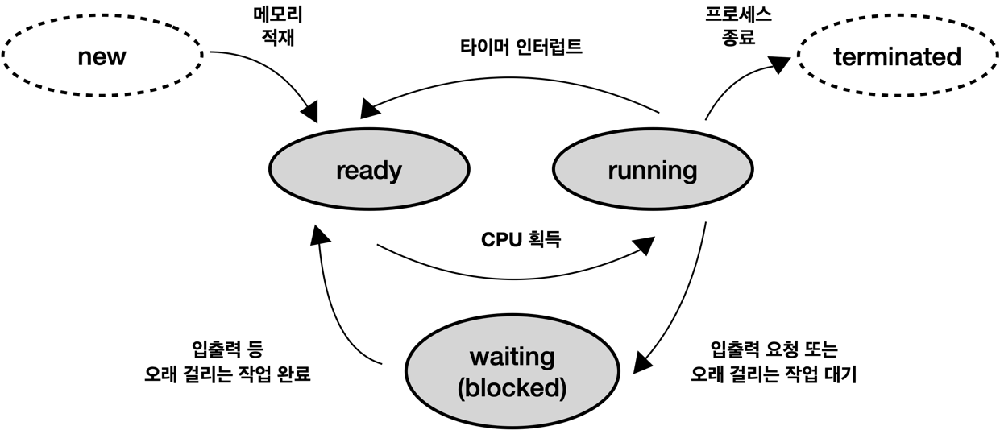

# 1. 프로세스의 개념
프로세스란 실행 중인 프로그램을 뜻한다.
디스크에 실행파일 형태로 존재하던 프로그램이 메모리에 올라가서 실행되기 시작하면 프로세스가 된다.
프로세스는 CPU를 획득해 자신의 코드를 수행하기도 하고 때로는 CPU를 반환하고 입출력 작업을 수행하기도 한다.
그러다가 자신의 임무를 다 수행하고 나면 종료되어 사라지게 된다.
일반적으로 잡이라는 용어와 프로세스를 혼용해 사용하기도 한다.

프로세스의 문맥이란 프로세스가 현재 어떤 상태에서 수행되고 있는지 정확히 규명하기 위해 필요한 정보를 의미한다.
여러 프로세스가 함께 수행되는 시분할 시스템 환경에서는 타이머 인터럽트에 의해 짧은 시간 동안 CPU를 사용한 후 빼앗겼다가 추후에 다시 CPU를 획득하는 식으로 CPU 관리가 이루어진다.
따라서 CPU를 다시 획득해 명령의 수행을 재개하는 시점이 되면 이전 CPU 보유 시기에 어느 부분까지 명령을 수행했는지 직전 수행 시점의 정확한 상태를 재현할 필요가 있다.
이때 정확한 재현을 위해 필요한 정보가 바로 프로세스의 문맥이다.
즉 프로세스의 문맥은 그 프로세스의 주소 공간(코드, 데이터, 스택 상태)을 비롯해 레지스터에 어떤 값을 가지고 있었는지와 시스템 콜 등을 통해 커널에서 수행한 일의 상태, 그 프로세스에 관해 커널이 관리하고 있는 각종 정보 등을 포함하게 된다.

프로세스의 문맥의 분류
- 하드웨어 문맥 
하드웨어 문맥은 CPU의 수행 상태를 나타내는 것으로 프로그램 카운터값과 각종 레지스터에 저장하고 있는 값들을 의미한다.

- 프로세스의 주소 공간 
프로세스는 코드, 데이터, 스택으로 구성되는 자기 자신만의 독자적인 주소 공간을 가지고 있다. 

- 커널상의 문맥 
프로그램이 수행되어 프로세스가 되면 운영체제는 프로세스를 관리하기 위한 자료구조를 유지한다.
PCB와 커널스택이 이에 해당하며 이 또한 프로세스의 문맥을 구성하는 중요한 요소가 된다.

# 2. 프로세스의 상태

프로세스의 상태는 실행(Running), 준비(Ready), 봉쇄(blocked, wait, sleep) 의 세가지로 구분할 수 있다. 

실행 상태는 프로세스가 CPU를 보유하고 기계어 명령을 실행하고 있는 상태를 가리킨다. 일반적인 컴퓨터 시스템 내에 CPU는 하나뿐이므로 컴퓨터 내에서 여러 프로세스가 동시에 수행된다고 해도 실제로 실행 상태에 있는 프로세스는 매 시점 하나뿐이다.

준비 상태는 프로세스가 CPU만 보유하면 당장 명령을 실행할 수 있지만 CPU를 할당받지 못한 상태를 가리킨다.

봉쇄 상태는 CPU를 할당받더라도 당장 명령을 실행할 수 없는 프로세스의 상태를 말한다. 봉쇄 상태의 예로는 프로세스가 요청한 입출력 작업이 진행 중인 경우를 들 수 있다.

이와 같이 프로세스의 상태를 구분하는 이유는 컴퓨터의 자원을 효율적으로 관리하기 위해서이다.

이밖에 프로세스가 생성 중이거나 종료 중인 일시적 상태를 시작(new) 상태, 완료(terminated) 상태라고 부르기도 한다.

시작 상태는 프로세스가 시작되어 그 프로세스를 위한 각종 자료구조는 생성되었지만 아직 메모리 획득을 승인받지 못한 상태이다. 

완료 상태는 프로세스가 종료되었으나 운영체제가 그 프로세스와 관련된 자료구조를 완전히 정리하지 못한 상태를 말한다.

하나의 프로세스는 항상 앞서 설명한 상태 중의 어느 한 상태에 머물러 있게 된다. 그리고 그 상태는 시간이 흐름에 따라 변하게 된다.

이처럼 실행시킬 프로세스를 변경하기 위해 원래 수행 중이던 프로세스의 문맥을 저장하고 새로운 프로세스의 문맥을 세팅하는 과정을 문맥교환이라고 한다. 문맥교환이 일어나는 경우는 타이머 인터럽트가 발생하는 경우 외에도 실행 상태에 있던 프로세스가 입출력 요청 등으로 봉쇄 상태로 바뀌는 경우를 들 수 있다. 이때 준비 상태에 있는 프로세스들 중에서 CPU를 할당받을 프로세스를 선택한 후 실제로 CPU의 제어권을 넘겨받는 과정을 CPU 디스패치(dispatch)라고 한다.

## CPU 문맥교환 과정

- 준비 상태에서 CPU를 할당받은 경우

프로세스가 실행 상태에 있다는 것은 CPU를 할당받고 기계어 명령을 하나씩 수행해나가는 것을 의미한다.
그런데 경우에 따라서는 디스크에서 파일의 내용을 읽어와야 하는 명령이 포함될 수 있다.
입출력이 안료될 때까지 CPU를 반환한 다음 디스크 입출력 서비스를 기다리며 봉쇄 상태로 바뀌게 된다. 그러면 CPU를 기다리는 준비 상태의 프로세스들 중에서 CPU 스케줄러가 적절한 프로세스를 하나 선정해 CPU를 할당하게 된다. 준비 상태의 프로세스는 CPU만 획득하면 곧바로 명령을 수행할 수 있으므로 이번에 CPU를 할당받은 프로세스는 실행 상태로 변경되어 자신의 코드를 CPU에서 실행하게 된다.

- 입출력을 요청한 프로세스

입출력을 요청한 프로세스는 디스크 입출력을 기다리는 큐에 줄 서 있다가 자기 차례가 되어 디스크 컨트롤러부터 서비스를 받고 나면 (원하는 데이터를 로컬버퍼로 읽어오고 나면) 디스크 컨트롤러가 CPU에게 인터럽트를 발생시켜 입출력이 완료되었다는 사실을 알린다. 그러면 CPU는 어떤 프로세스를 실행하고 있다가 인터럽트가 발생한 것을 확인하고 그에 대응하는 루틴을 수행한다. 이 루틴이 진행되는 동안 CPU에서 수행되던 프로세스의 상태는 사용자모드 실행 상태에서 커널모드 실행 상태로 바뀐다. 비록 인터럽트 처리루틴이 직전에 실행중이던 프로세스와는 무관한 업무를 담고 있기는 하지만 인터럽트 처리를 우리는 편의상 직전 프로세스의 문맥에서 실행된 것으로 간주한다. 다시 말해 프로세스가 실행되던 중에 인터럽트가 발생하면 인터럽트가 발생한 원인과 관계없이 인터럽트를 당한 프로세스가 사용자모드에서 실행되다가 커널모드로 진입한 것으로 간주하게 된다는 것이다. 디스크 컨트롤러가 발생시킨 인터럽트는 입출력이 완료된 프로세스의 상태를 봉쇄 상태에서 준비 상태로 바꾼 후 장치의 로컬버퍼에 있는 내용을 메모리로 이동시키는 일련의 업무를 수행한다.

이렇게 인터럽트 처리가 끝나면 인터럽트 처리루틴 이전에 수행되던 프로세스에게 CPU를 다시 할당해 그 프로세스의 직전 수행 시점 이후의 코드가 실행된다. 경우에 따라서는 인터럽트 당한 프로세스에게 CPU를 다시 할당하지 않고 입출력이 완료된 프로세스가 더 우선순위가 높은 프로세스인 경우 문맥교환을 통해 CPU 제어권을 이양시킬 수도 있다. 즉 인터럽트 발생 전에 수행되던 프로세스가 아니라 방금 입출력을 끝낸 프로세스에게 CPU를 할당하는 경우도 있다는 것이다.

# 3. PCB
PCB란 운영체제가 시스템 내의 프로세스들을 관리하기 위해 프로세스마다 유지하는 정보들을 담는 커널 내의 자료구조를 뜻한다.

**PCB 구성요소**
- 프로세스의 상태
- pc의 값
- cpu 레지스터의 값
- cpu 스케줄링 정보
- 메모리 관리 정보
- 자원 사용 정보
- 입출력 상태 정보

프로세스의 상태는 CPU를 할당해도 되는지 여부를 결정하기 위해 필요하다.

프로그램 카운터값은 다음에 수행할 명령의 위치를 가리킨다.

CPU 레지스터값은 CPU 연산을 위해 현 시점에 레지스터에 어떤 값을 저장하고 있는지를 나타낸다.

CPU 스케줄링 정보와 메모리 관리 정보는 각각 그 프로세스의 CPU 스케줄링과 메모리 할당을 위해 필요한 정보이다.

자원 사용 정보는 사용자에게 자원 사용 요금을 계산해 청구하는 등의 용도로 사용된다.

입출력 상태 정보는 프로세스가 오픈한 파일 정보 등 프로세스의 입출력 관련 상태 정보를 나타낸다.

# 4. 문맥교환
뮨맥교환이란 하나의 사용자 프로세스로부터 다른 사용자 프로세스로 CPU의 제어권이 이양되는 과정이다.

사용자 프로세스가 CPU를 할당받고 실행되던 중에 타이머 인터럽트가 발생하면 CPU의 제어권은 운영체제에게 넘어가게 된다.
그러면 타이머 인터럽트 처리루틴으로 가서 직전까지 수행 중이던 프로세스의 문맥을 저장하고 새롭게 실행시킬 프로세스에게 CPU를 이양한다.
이 과정에서 원래 수행 중이던 프로세스는 준비 상태로 바뀌고 새롭게 CPU를 할당받은 프로세스는 실행 상태가 된다.
그러면 운영체제는 타이머 인터럽트 처리루틴으로 가서 직전까지 수행중이던 프로세스의 문맥을 저장하고 새롭게 실행시킬 프로세스에게 CPU를 이양한다.
이 과정에서 원래 수행 중이던 프로세스는 준비 상태로 바뀌고 새롭게 CPU를 할당받은 프로세스는 실행 상태가 된다.
문맥교환 중에 원래 CPU를 보유하고 있던 프로세스는 프로그램 카운터값 등 프로세스의 문맥을 자신의 PCB에 저장하고 새롭게 CPU를 할당받을 프로세스는 예전에 저장했던 자신의 문맥을 PCB로부터 실제 하드웨어로 복원시키는 과정을 거친다.
문맥교환은 타이머 인터럽트가 발생하는 경우 외에 실행 중이던 프로세스가 입출력 요청이나 다른 조건을 충족하지 못해 CPU를 회수당하고 봉쇄 상태가 되는 경우에도 발생할 수 있다.

프로세스가 실행 상태일 때 시스템 콜이나 인터럽트가 발생하면 CPU의 제어권이 운영체제로 넘어와 원래 실행 중이던 프로세스의 업무를 잠시 멈추고 운영체제 커널의 코드가 실행된다. 이 경우에도 CPU의 실행 위치 등 프로세스의 문맥 중 일부를 PCB에 저장하게 되지만 이러한 과정을 문맥교환이라고 하지는 않는다. 이는 하나의 프로세스의 실행모드만이 사용자모드에서 커널모드로 바뀌는 것일 뿐 CPU를 점유하는 프로세스가 다른 사용자 프로세스로 변경되는 과정이 아니기 때문이다. 이와 같은 모드 변경에 비해 문맥교환에는 훨씬 많은 오버헤드가 뒤따르게된다.

타이머 인터럽트가 발생하거나 프로세스가 입출력 요청 시스템 콜을 하여 봉쇄 상태에 들어가는 경우에는 문맥교환이 일어나지만 그 밖의 인터럽트나 시스템 콜 발생 시에는 문맥교환이 일어나지 않고 실행 모드만이 변경될 뿐이다. 즉 사용자모드에서 커널모드로 바뀌어 시스템 콜이나 인터럽트 처리를 하고 다시 동일한 프로세스의 사용자모드로 돌아와 이전에 수행하던 작업을 계속 수행할 뿐이다.
