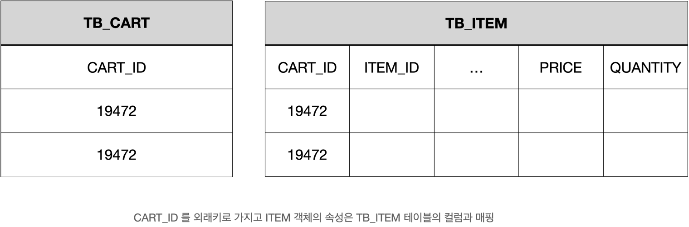

# 도메인 주도 설계

소프트웨어에서 모델은 해결해야 하는 문제를 바라보는 다양한 관심사 중 하나를 선택해서 문제를 설명하는데 꼭 필요한 것만 표현해야 한다.

문제 영역을 관심사별로 분리하면 모델은 전체가 아닌 특정 영역이나 속성으로 한정하기 때문에 잡음을 더 쉽게 제거할 수 있다.

관심사를 잘 분리한 모델은 대상의 핵심을 잘 표현하므로 설명이 장황하거나 복잡해질 필요가 없어 개발자를 포함한 이해 당사자간 효율적인 커뮤니케이션을 가능하게 한다.

잘 설계한 모델은 문제 영역에서 중요한 부분을 명확하게 표현한다.

## 1.1 도메인 로직 패턴

마틴 파울러의 도메인 로직을 구현하는 네 가지 방법은 도메인 주도 설계에서 하위 도메인 분류 (핵심 / 지원 / 일반 하위 도메인) 을 마이크로서비스로 구현할 때 어떤 패턴을 사용할지 결정하는데 도움이 된다.

### 1.1.1 트랜잭션 스크립트 패턴

트랜잭션 스크립트는 클라이언트가 요청한 비즈니스 로직을 하나의 프로시저가 모두 처리합니다.

이 패턴은 기능 대부분을 반복적인 CRUD로 처리할 수 있는 경우에 적합합니다.

### 1.1.2 테이블 모듈 패턴

테이블 모듈은 데이터베이스 테이블 단위로 비즈니스 로직을 처리하는 클래스를 분리합니다.

전체 비즈니스 흐름은 이 클래스가 제공하는 기능을 사용해 처리합니다.

### 1.1.3 서비스 레이어 패턴

서비스 레이어로 부르는 독립된 클래스에 시스템 통합과 전체 흐름을 조정하는 책임을 부여합니다.

서비스 레이어는 애플리케이션이 제공하는 사용 가능한 기능 집합 ( 인터페이스와 오퍼레이션 목록 ) 을 정의합니다.

서비스 레이어는 이를 사용하는 클라이언트에게 애플리케이션 경계로 보입니다.

이 경계가 제공하는 기능 집합은 비즈니스 로직을 캡슐화하므로 클라이언트에 영향을 주지 않으면서 변화를 수용하거나 성능 개선 같은 다양한 활동이 가능해집니다.

서비스 레이어는 비즈니스 로직뿐만 아니라 로깅, 권한 체크와 같은 공통 기능을 구현하기에 가장 적합한 후보이다.

모든 비즈니스 로직을 서비스 레이어 한 곳에 구현하면 가독성이 떨어지고 유지보수하기 어려워지는 한계가 있습니다.

### 1.1.4 도메인 모델 패턴

데이터와 행위를 하나의 객체로 설계하는 도메인 모델 패턴은 복잡한 관계를 여러 객체에 분산시키고 객체간 협력으로 구현합니다.

도메인 모델 패턴에서 서비스 레이어는 도메인 객체에 명령을 전달하기 위한 준비 흐름만 있고 도메인 객체에서 도메인 로직을 수행합니다.

도메인 로직을 도메인 객체에 적절하게 구현하면 다양한 객체지향 설계 원칙을 준수하면서 변경 요청에 유연하게 대응할 수 있습니다.

## 1.2 헥사고날 아키텍처

변화에 빠르게 대응하려면 핵심 기능이 특정 기술에 의존하지 않게 주의를 기울일 필요가 있습니다.

헥사고날 아키텍처에서는 기술과 관계없는 비즈니스 로직과 기술에 의존하는 구성 요소인 어댑터 간 분리를 강조했습니다.

기술에 의존하는 요소인 어댑터는 외부 요청을 수신해 비즈니스 로직을 시작시키는 인바운드 어댑터와

비즈니스 로직을 실행하면서 영구 저장소에 데이터를 저장하거나 시스템과 협력하는 아웃바운드 어댑터로 구분합니다.

도메인 주도 설계도 기술에 의존하지 않는 도메인 객체를 강조하는데 헥사고날 아키텍처의 목표와 같다고 할 수 있습니다.

## 1.3 도메인 주도 설계

에릭 에반스의 도메인 주도 설계에서는 소프트웨어 설계의 방대한 영역을 다룹니다.

도메인 주도 설계는 관심사를 바운디드 컨텍스트로 한정하고 바운디드 컨텍스트 간 관계와 바운디드 컨텍스트 내에서 효과적인 모델링을 위한 실용적인 접근법이라 할 수 있습니다.

### 1.3.1 유비쿼터스 언어

유비쿼터스 언어는 개발 프로세스나 방법론에서 말하는 용어집과 유사합니다.

용어집이 목표 시스템에서 유일한 언어로 정의되는 반면 유비쿼터스 언어는 사용하는 컨텍스트에 따라 의미가 다를 수 있습니다.

유비쿼터스 언어의 의미가 달라지면 바운디드 컨텍스트가 달라진 것이다.

프로젝트 초기 유비쿼터스 언어는 명확하게 정의할 수 없어 대화가 어색할 수 있지만 자주 사용할수록 의미가 명확해집니다.

또한 분석/설계/구현을 분리해서 접근한 소프트웨어 개발은 분석 언어와 구현에 사용한 언어인 클래스간 개연성이 부족해 추적성을 유지하기 어렵습니다.

이 문제를 극복하기 위해 유비쿼터스 언어를 코드베이스까지 사용하고 목표 시스템을 더 깊게 이해하면서 언어를 더 명확하게 정의하고 코드베이스와 끈임없이 일치시켜야 합니다.

### 빌딩 블록

에릭 에반스는 도메인 모델을 작성할 때 사용할 수 있는 기본적인 빌딩 블록을 정의했습니다.

비즈니스와 관련이 있는 도메인 객체는 엔티티, 값 객체, 그리고 서비스 분류 중 하나인 도메인 서비스입니다.

빌딩 블록간 전형적인 호출 흐름을 보여줍니다.

### 1.3.3 엔티티

객체지향 언어를 사용하면서 도메인 객체를 풍부한 행위로 설계하지 않으면 서비스 레이어가 비즈니스 로직인 행위를 처리해야 합니다.

서비스 레이어에 비즈니스 로직을 구현하면 결합도가 높아지고 응집도가 낮아져 유지보수에 도움이 되지 않습니다.

> 수많은 객체는 본질적으로 해당 객체의 속성이 아닌 연속성과 식별성이 이어지느냐를 기준으로 정의된다.
>
> ...
>
> 객체 모델링을 할 때 우리는 객체의 속성에 집중하곤 하는데, 엔티티의 근본적인 개념은 객체의 생명주기 내내 이어지는 추상적인 연속성이며, 이런 추상적인 연속성은 여러 형태를 거쳐 전달된다는 것이다.
>
> ...
>
> 어떤 객체를 일차적으로 해당 객체의 식별성으로 정의할 경우 그 객체를 엔티티라 한다.
>
> -- 에릭 에반스 "도메인 주도 설계" --

엔티티에서 무엇보다 중요한 것은 식별성입니다.

어떤 클래스의 인스턴스를 시스템의 다른 인스턴스와 구분해야 하면 이 클래스를 엔티티로 설계해야 합니다.

객체지향 언어에서 속성에 새로운 값은 할당할 때 '상태가 변한다' 고 합니다.

엔티티는 비즈니스에서 고유함을 가지는 대상으로 상태가 계속 변하지만 식별자는 변하지 않습니다.

또한 엔티티는 변경 요청으로 속성이 추가되거나 삭제돼 최초 설계와 전혀 다른 형태가 되기도 하지만 이 객체가 가지는 속성 중 식별자는 변하지 않습니다.

### 1.3.4 값 객체

엔티티와 달리 개념적으로 식별자가 필요하지 않은 객체도 있습니다.

일반적으로 식별자가 없는 객체는 엔티티를 수식하기 위해 존재하는데 이를 값 객체라고 합니다.

값 객체는 엔티티뿐만 아니라 또 다른 값 객체를 수식하기도 합니다.

도메인에서 사용하는 언어들 중에 엔티티를 수식하는 것을 단순한 속성의 나열이 아닌 값 객체로 선언합니다.

값 객체의 가장 중요한 특징은 불변입니다.

값 객체는 불변이기 때문에 새로운 인스턴스를 생성해서 할당하는 것이 유일한 변경 방법입니다.

값 객체는 엔티티를 수식하므로 외부에서 값 객체에 직접 접근해서 속성을 변경하지 않고 엔티티 객체를 통해서만 변경해야 합니다.

값 객체는 원칙적으로는 불변이지만 특별한 상황에서는 setter 를 이용한 변경을 허용하기도 합니다.

- 값이 자주 변경돼 메모리를 효율적으로 사용하지 못하는 경우

- 객체 생성이나 삭제에 많은 비용이 드는 경우

- 교체로 인해 클러스터링이 제한되는 경우

- 값을 공유할 일이 많지 않거나 클러스터링을 향상시키기 위해 또 다른 기술적인 이유로 공유가 보류된 경우

**값 객체 장점**

비즈니스 규칙을 기능 전체 흐름을 조정하는 서비스 레이어에 구현하면 여러 곳에 코드가 분산되고 중복돼 유지보수에 도움이 되지 않습니다.

도메인 객체에 비즈니스 규칙을 구현하면 코드 중복, 응집도, 유지보수에 도움을 줄 뿐만 아니라 다른 클래스에 의존하지 않고 테스트가 가능합니다.

**엔티티 직접 참조 방지**

일부 서비스에서는 엔티티가 다른 엔티티의 식별자를 참조하게 설계하기도 합니다.

이 모델이 사용자 편의성와 데이터 일관성에 문제를 발생시키지는 않지만 엔티티간의 결합이 생기게 됩니다.

엔티티를 직접 참조하지 않고 값 객체로 설계를 변경해 엔티티가 서로 영향을 주지 않게 분리합니다.

### 1.3.5 서비스

도메인 주도 설계에서는 서비스를 인프라스트럭처 서비스, 애플리케이션 서비스, 도메인 서비스 세 가지로 분류했습니다.

### 1.3.5.1 인프라스트럭처 서비스

인프라스트럭처 서비스는 헥사고날 아키텍처에서 정의한 어댑터입니다.

어댑터는 데이터베이스, 외부 API 호출, 이벤트 발행처럼 기술적인 문제를 다룹니다.

이 서비스를 다른 서비스와 분리하지 못하면 기술과 관련있는 다양한 이슈가 도메인 모델까지 전파돼 온전한 도메인 모델을 유지하기 어렵게 합니다.

### 1.3.5.2 애플리케이션 서비스

애플리케이션 서비스는 대표적으로 트랜잭션 관리, 인프라스트럭처와 상호 작용을 포함한 비즈니스 유스케이스의 흐름을 조정하는 두 개의 책임을 가집니다.

애플리케이션 서비스가 두 가지 책임을 올바르게 처리하면 레이어드 아키텍처에서 도메인 로직을 잘못된 위치에 구현해 유지보수를 어렵게 만드는 것을 방지할 수 있습니다.

**트랜잭션 관리**

애플리케이션 서비스는 클라이언트 요청부터 응답까지 하나의 트랜잭션으로 처리하는 것입니다.

도메인 객체가 작업을 완료하지 못하면 에러를 반환하거나 예외를 던지는 오류 처리 또한 애플리케이션 서비스의 책임입니다.

**비즈니스 유스케이스의 흐름 조정**

애플리케이션 서비스는 데이터를 조회해 도메인 객체를 재구성하고 도메인 객체간 협력으로 비즈니스 로직을 처리합니다.

도메인 객체가 사용하는 정보가 다른 서비스에 있는 경우 이를 획득하기 위해 어댑터를 사용해야 하므로 인프라스트럭처 서비스가 제공하는 메소드를 호출해 결과를 얻어 도메인 객체에 전달하기도 합니다.

도메인 객체가 처리를 완료하면 최종 상태를 데이터베이스에 다시 기록하고 필요시 외부 시스템에 알리기 위해 이벤트를 발행합니다.

### 1.3.5.3 도메인 서비스

에릭 에반스는 "엔티티에 부여하기 적합하지 않은 책임을 도메인 서비스에 부여하라" 고 했습니다.

도메인 서비스는 말 그대로 도메인을 위해 존재하는 객체이므로 기술에 의존성이 없는 POJO 로 구현해야 합니다.

도메인 서비스는 전달받은 파라미터만 사용해 비즈니스 로직을 수행하고 그 결과를 반환하는 무상태라는 공통적인 특징을 가집니다.

**반 버논의 도메인 서비스를 사용해야 할 때 고려할 세 가지 휴리스틱**

1. 중요한 비즈니스 프로세스를 수행할 때

계좌 이체는 입금, 출금, 잔액조회 같은 계좌의 책임이 아니라 두 계좌간 연속적인 입금과 출금입니다.

계좌 이체는 TransferMoneyService 라는 도메인 서비스로 정의하고 이체가 성공하면 그 결과인 TransferMoney 엔티티를 반환합니다.

반 버논은 무분별한 도메인 서비스 사용이 빈약한 도메인 모델을 초래하기 때문에 꼭 필요한 경우가 아니라면 자제할 것을 강조합니다.

도메인 서비스의 무분별한 사용을 방지하기 위해 결과적 일관성을 사용할 수 있습니다.

2. 어떤 컴포지션에서 다른 컴포지션으로 도메인 객체를 변환할 때

특정 도메인 객체를 사용하기 위해 다른 도메인 객체나 DTO 로 변환하거나 반대로 DTO 를 도메인 객체로 변환하는데 사용합니다.

엔티티를 값 객체로 변환할 때 도메인 서비스를 사용할 수 있습니다.

3. 하나 이상의 도메인 객체에서 요구하는 입력 값을 계산할 때

예를 들어 전화 상담원의 일일 총 통화시간을 계산할 때 애플리케이션 서비스에서 통화 목록을 조회한 후 반복문을 이용해 누적 값을 계산할 수 있습니다.

하지만 총 통화 시간 계산은 비즈니스와 밀접하게 연관되어 있으므로 애플리케이션 서비스의 책임으로 부여하기에 부적절합니다.

반대로 "통화" 라는 엔티티에 계산 책임을 부여하면 다른 엔티티에 의존성을 가져야 하고 이는 불필요한 의존성을 가지므로 이 또한 적절하지 않습니다.

총 통화 시간처럼 도메인과 밀접하게 관련된 기능이면서 엔티티나 값 객체에 어울리지 않는 책임을 도메인 서비스에 부여합니다.

## 1.3.6 모듈

모듈은 설계자가 의도한 기준으로 도메인 객체들을 분류한 것으로 자바 언어에서는 패키지를 사용합니다.

모듈은 모델링 초기 설계자의 통찰력으로 결정합니다.

시간이 지나 도메인을 더 깊게 이해하면 더 명확한 기준을 찾아 조정하기도 합니다.

## 1.4 라이프사이클

### 1.4.1 애그리게이트

애그리게이트는 도메인 객체들의 연관 관계에서 불변식을 보장해야하는 단위입니다.

애그리게이트는 엔티티와 값 객체로 구성하는데 여러 개의 엔티티와 값 객체를 포함할 수 있습니다.

**애그리게이트 루트**

애그리게이트를 대표하는 엔티티를 애그리게이트 루트라고 합니다.

다수의 엔티티로 애그리게이트를 구성할 때 애그리게이트 루트를 제외한 다른 엔티티는 애그리게이트 내에서 식별할 수 있는 식별자를 가집니다.

**애그리게이트 주의점**

애그리게이트가 정의하는 범위 밖에서는 애그리게이트 루트를 통해서만 애그리게이트의 상태를 변경해야 합니다.

즉 애그리게이트가 제공하는 기능은 애그리게이트 루트가 제공하는 메소드에서 시작해야 하고 실행이 완료되면 애그리게이트를 구성하는 객체들 간에 불변식을 유지해야 합니다.

**애그리게이트 경계**

도메인 주도 설계에서 애그리게이트는 도메인 서비스와 더불어 명확하게 규명되지 않은 패턴이어서 얼핏보면 엔티티와 값 객체를 식별하면서 애그리게이트의 불변식 경계를 정의하는 것이 어렵지 않아 보입니다.

하지만 애그리게이트는 비즈니스 케이스를 잘 살펴 거대한 경계를 갖지 않게 주의를 기울여야 합니다.

명확하게 규명되지 않은 패턴이라 설계자가 문제 영역을 바라보는 시각의 차이로 인해 바운디드 컨텍스트를 어떻게 정의하느냐에 따라 애그리게이트의 범위가 정해지기 때문입니다.

### 1.4.2 애그리게이트와 단위 테스트

비즈니스 로직을 애그리게이트에 두면 비즈니스 로직을 처리하는 협력 대상도 기술에 중립적인 POJO 클래스로 한정하는 효과가 있습니다.

POJO 프로그래밍의 장점은 스프링처럼 프로그램이 실행되는 환경에 의존성이 없어 자유로운 단위 테스트가 가능합니다.

### 1.4.3 애그리게이트 설계 규칙

애그리게이트 설계에 적용할 수 있는 4가지 휴리스틱

1. 비즈니스 불변식을 애그리게이트로 한정

2. 작은 애그리게이트로 설계

3. 다른 애그리게이트는 식별자로 참조

4. 애그리게이트간 변화는 결과적 일관성을 이용

### 1.4.4 팩토리

애그리게이트를 생성하는 방법이 복잡하거나 애그리게이트 내부를 너무 많이 드러내는 경우 팩토리를 이용해 캡슐화합니다.

> 복잡한 객체와 애그리게이트의 인스턴스를 생성하는 책임을 별도의 객체로 옮겨라.
> 이 객체 자체는 도메인 모델에서 아무런 책임도 맡지 않을 수도 있지만 여전히 도메인 설계의 일부를 구성한다.
> 
> 모든 복잡한 객체 조립 과정을 캡슐화하는 동시에 클라이언트가 인스턴스화되는 개체의 구체 클래스를 참조할 필요가 없는 인터페이스를 제공하라. 
> 전체 애그리게이트를 하나의 단위로 생성해서 그것의 불변식이 유지되게 하라.
> 
> -- 에릭 에반스 "도메인 주도 설계" --

도메인 객체의 생명주기를 고려했을 때 생성은 한번이지만 객체가 소멸되기까지 상태는 계속 변합니다.

즉 객체의 생성과 생성 이후의 행위는 크게 관계가 없다고 할 수 있습니다.

따라서 객체의 복잡한 생성 과정을 도메인 객체와 분리하면 도메인을 이해하고 변경하는 것이 훨씬 수월해 집니다.

팩토리는 어디에나 존재할 수 있지만 애그리게이트 루트, 팩토리 패턴을 사용한 전용 클래스가 가장 적합합니다.

애그리게이트가 불변식을 유지하는 단위이므로 팩토리가 새로운 애그리게이트를 생성한 후에도 불변식을 유지해야 합니다.

### 1.4.5 리포지토리

대부분 쿼리를 이용해 도메인 객체를 재구성하는 경우 이 객체를 데이터 컨테이너로 생각합니다.

도메인 객체를 데이터 컨테이너로 생각하면 설계가 객체간의 관계와 협력이 아닌 데이터를 조회하는 쿼리 자체나 쿼리가 반환한 객체의 값을 변경할 때 애플리케이션 서비스에 구현할 가능성이 높아집니다.

리포지토리는 MyBatis 나 JPA 같은 라이브러리 또는 프레임워크를 이용할 때 애그리게이트 단위로 기능을 제공해야 합니다.

리포지토리는 이를 사용하는 클라이언트에게 쿼리를 어떻게 작성하는가와 같은 상세한 구현을 숨기면서 저장하고 조회하는 행위에 집중할 수 있게 합니다.

이런 접근법은 좀 더 도메인 객체를 중심으로 설계하도록 유도하는 효과가 있습니다.

리포지토리가 애그리게이트 단위로 기능을 제공하지 않으면 직접 접근해 상태를 변경할 수 있습니다.

이런 접근을 허용하면 비즈니스 규칙을 적용하는 코드가 누락되거나 여러 곳에 분산돼 오류 발생 가능성이 높아집니다.

리포지토리가 제공하는 메소드는 애그리게이트 단위로 제공하면서 하나의 트랜잭션으로 처리해야 합니다.

**1.4.5.1 단일 테이블**

**1.4.5.2 다중 테이블**

**1.4.5.3 하이브리드 테이블**

## 1.5 추상화된 핵심

엔티티, 값 객체, 서비스, 리포지토리, 애그리게이트 이것들만 사용해 실무에 적용하기에는 한계가 있습니다.

> "모델의 가장 근본적인 개념을 식별해서 그것을 별도의 클래스나 추상 클래스 또는 인터페이스로 추출하라"
> 
> -- 에릭 에반스 추상화된 핵심에서 --

추상화를 통해 모델링을 단순화할 수 있습니다.
