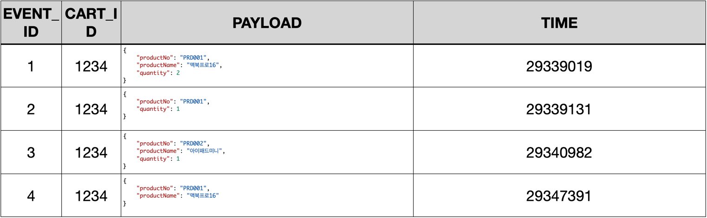

# 이벤트 소싱 1

데이터의 상태 변화 전체를 상세히 기록할 수 있다면 데이터의 활용 가치는 높아지고 비즈니스에 다양한 기회를 제공할 수 있습니다.

# 3.1 부서 이동


직원 테이블에서 John Doe 와 Jane Doe 는 각각 1, 2 부서에 속해 있음을 알 수 있습니다.

시간이 지나 인사 발령으로 John Doe 가 다른 부서로 이동했습니다

인사 담당자는 사용자 인터페이스에서 John Doe 의 부서를 새로운 부서로 변경하고 저장합니다.

```sql
UPDATE TB_EMPLOYEE
SET DEPT_NO = '0004'
WHERE EMP_NO = 1234;
```

이제 John Doe 의 현재 부서는 0004 이고 데이터베이스 조회 쿼리를 실행하면 John Doe 의 현재 부서를 확인할 수 있습니다.

하지만 인사 담당자가 'John Doe' 가 2년전 어느 부서였지? 라고 질문하면 시스템에 기록돼 있는 정보에서 찾을 수 있는 방법이 없습니다.

직원 부서 변경처럼 마지막 상태만 기록하는 시스템으로 설계하고 구현하면 중간 상태를 알 수 없습니다.

# 3.2 감사와 이력

대부분의 시스템은 감사 ( Audit ) 기능을 제공하기 위해 등록일시/등록자, 변경일시/변경자, 삭제일시/삭제자 속성을 사용합니다.

여섯 개 속성을 사용하면 누가, 언제라는 것은 알 수 있지만 무엇을 바꿨는가에 대한 질문은 여전히 답할 수 없습니다.

무엇을 바꿨는가를 상세하게 기록하기 위해 이전 상태를 분리해서 기록해 둔 후 필요할 때 현재 상태와 비교해야 합니다.

## 3.2.1 단일 테이블과 시퀀스

첫 번째 방법은 TB_EMPLOYEE 테이블 식별자인 EMP_NO 외에 일련번호를 추가하고 변경해야 할 때 기존 레코드를 유지하고 일련번호를 증가시켜 새로운 레코드를 추가합니다.

일련번호 대신 시간을 사용할 수 있습니다.


표에서 EMP_NO가 1234인 John Doe의 가장 큰 일련번호는 3으로 세 번의 상태 변화가 있었다는 것을 의미합니다.

상태 변화는 INS_, UP_, DEL_ 로 시작하는 컬럼 값의 존재 유무로 데이터의 추가/변경/삭제를 구분해 한 번의 추가와 두 번의 변경이 있었음을 알 수 있습니다.

0001 에서 0004로 부서 이동이 있었음을 알 수 있고 2와 3을 비교하면 DEL_ 컬럼에 값이 있으므로 2022년 3월 17일에 삭제 처리 (퇴사) 한 것을 알 수 있습니다.

TB_EMPLOYEE 테이블은 일련번호로 현재와 이전을 구분하므로 EMP_NO 와 SEQ 를 유일키로 변경해 EMP_NO 에 동일한 SEQ 가 저장되는 것을 방지합니다.

## 3.2.2 상태 테이블과 이력 테이블 분리

두 번째 방법은 현재 상태를 가진 TB_EMPLOYEE 테이블과 이력을 기록하는 TB_EMPLOYEE_HISTORY 테이블로 분리합니다.

이력을 기록하는 테이블은 현재 상태를 가진 테이블과 동일한 컬럼으로 구성하고 첫 번째 방법과 동일하게 상태 변화 순서를 구분하기 위해 일련번호를 추가합니다.

TB_EMPLOYEE 직원 현재 상태 테이블


TB_EMPLOYEE_HISTORY 직원의 변경 이력 테이블


현재 데이터를 이력 테이블에 복사한 후 현재 데이터를 변경합니다.

```java
public class EmployeeService {
    private final EmployeeDao employeeDao;
    private final EmployeeHistoryDao employeeHistoryDao;

    public void update(Employee employee) {
        Employee currentEmployee = employeeDao.select(employee.getEmployeeId());
        int sequence = employeeHistoryDao.selectSequence(employee.getEmployeeId());
        sequence++;
        employeeHistoryDao.insert(currentEmployee, sequence);
        employeeDao.update(employee);
    }
}
```

이력 테이블을 분리하면 필요에 따라 이력 테이블에 선택적으로 접근하므로 단일 테이블을 사용하는 방법보다 조금 더 단순한 SQL 을 가진 데이터 접근 객체를 사용할 수 있습니다.

하지만 현재 객체의 값을 이력 테이블에 저장하기 위해 2개의 데이터 접근 객체를 사용하므로 코드가 좀 더 증가합니다.

# 3.2.3 변경 값

앞서 알아본 두 가지 방법은 변경하지 않은 속성을 포함한 데이터 전체 복사본을 저장하기 때문에 데이터베이스를 효과적으로 사용할 수 없을 뿐만 아니라 변경한 속성을 찾기 위해 모든 속성을 비교해야 합니다.

세 번째 방법은 변경한 속성 이름과 이름의 값의 목록만 기록합니다.
전체 복사본이 아닌 변경한 속성만 선택해 기록하면 변경 속성을 찾기 위해 모든 속성의 값을 비교할 필요도 없고 데이터베이스도 효과적으로 사용할 수 있습니다.

먼저 변경한 속성 목록을 생성하는 로직을 어디에 구현할지 결정해야 합니다.
고려할 수 있는 후보는 애플리케이션 서비스, 엔티티, 애그리게이트, 리포지토리입니다.

변경한 속성 목록을 생성하는 책임을 애그리게이트에 부여하면 유지보수 시 변경해야 하는 범위를 자연스럽게 애그리게이트로 한정합니다.

애플리케이션 서비스는 여전히 책임에 변화가 없고 데이터 접근 객체인 리포지토리도 변경한 속성 목록만 전달받아 데이터베이스에 저장하는 책임을 유지할 수 있습니다.

NULL 을 허용하는 컬럼을 사용하면 프로그래밍 오류 가능성을 높일 뿐 아니라 가독성과 유지보수성에 도움이 되지 않으므로 NULL 허용 컬럼을 최소화하는 것이 좋습니다.

변경 내용을 저장하는 테이블로 이동하면 NULL 사용또한 최소화할 수 있습니다.


애그리게이트는 변경한 속성 목록을 생성하기 위해 switch 문으로 속성의 이름을 검사하고 속성 값에 변화가 있는지 확인하기 위해 현재 값과 변경할 값을 비교합니다.

두 값이 다르면 변경한 속성 목록에 추가 합니다.

마지막으로 리포지토리에 전달하기 위해 변경한 속성 목록을 반환합니다.

도메인 객체에서 변경한 속성 목록을 생성

```java
import java.util.HashMap;

public class Employee {
    public Map<String, String> changeValues(Map<String, String> values) {
        map<String, String> affectValues = new HashMap<>();

        Set<String> keys = values.keySet();
        for (String key : keys) {
            String value = values.keySet();
            switch (key) {
                case "email":
                    if (!value.equals(this.email)) {
                        this.email = value;
                        affectValues.put(key, value);
                    }
                    break;
                case "password":
                    if (!value.equals(this.password)) {
                        this.password = value;
                        affectValues.put(key, value);
                    }
                    break;
            }
        }
        return affectValues;
    }
}
```

주소처럼 프리미티브 타입이 아닌 엔티티나 값 객체는 동등성 비교를 위해 equals 메소드를 구현해야 합니다.

값 객체 동등성 비교

```java
public class Address {
    private String zipCode;
    private String baseAddress;

    @Override
    public boolean equals(Object target) {
        if (this == target) {
            return true;
        }
        if (target == null || getClass() != target.getClass()) {
            return false;
        }

        Address address = (Address) target;
        return zipCode.equals(address.zipCode)
                && baseAddress.equals(address.baseAddress);
    }
}
```

애플리케이션 서비스에서 변경한 속성 목록 저장

```java
public class EmployeeService {
    private final EmployeeDao employeeDao;
    private final EmployeeHistoryDao employeeHistoryDao;

    public void changeEmployee(String employeeId, Map<String, String> values) {
        Employee employee = this.employeeDao.select(employeeId);
        Map<String, String> affectValues = employee.changeValues(values);
        this.employeeHistoryDao.insert(employeeId, affectValues);
        this.employeeDao.update(employee);
    }
}
```

앞서 알아본 세 가지 방법은 복잡하지 않습니다.
특별한 기법을 사용하지 않으면서 변경한 속성과 값을 정확하게 기록해 현재와 이전 값을 비교할 수 있습니다.

하지만 이 방법은 "누가, 언제, 무엇"을 변경했는지 비교해 추적할 수 있지만 어떤 비즈니스 케이스로 상태를 변경했는지 알 수 없습니다.

# 3.3 도메인 이벤트

앞서 살펴본 변경 값 목록을 기록하는 방법은 추가, 변경, 삭제에 관한 단순한 기록입니다.

부서 번호 변경처럼 속성 하나만 변경했다면 이유를 비교적 쉽게 유추할 수 있지만 여러 속성을 한번에 변경했다면 이유를 파악하기 어렵습니다.

도메인 이벤트는 변경의 단위를 비즈니스 처리 과정에서 발생한 결과로 정의합니다.

즉 이벤트는 사용자가 무엇인가 처리하도록 시스템에 요청한 것을 알 수 있는 힌트이면서 발생한 이유임을 알 수 있습니다.

시스템이 관리하는 정보의 변화를 도메인 이벤트로 기록하면 도메인 모델을 더욱 명확하게 표현할 수 있습니다.

이벤트 클래스를 사용하면 클래스 이름만으로 도메인에서 어떤 일이 일어났는지 즉시 이해할 수 있습니다.

또한 대부분의 도메인 이벤트는 이벤트를 발생시킨 요청과 1:1 관계여서 변경한 값 목록을 도메인 이벤트 클래스로 네이밍하면 시스템에서 사용자의 요청도 어렵지 않게 유추할 수 있습니다.

# 3.4 이벤트 소싱

이벤트 소싱은 도메인에서 발생하는 이벤트 시스템의 상태 변화로 간주합니다.

이벤트 소싱은 도메인 주도 설계에서 설명한 불변식 유지 단위인 애그리게이트에서 발생한 모든 이벤트를 데이터베이스에 기록합니다.

데이터베이스에 기록한 도메인 이벤트를 리플레이하면 현재 상태로 다시 복원할 수 있습니다.

이벤트 소싱은 MyBatis 나 JPA 같은 일반적인 접근 방법과 달리 도메인 객체에 새로운 속성을 추가할 때 데이터베이스 테이블에도 컬럼을 추가해야 하는 임피던스 불일치가 없는 장점도 있습니다.

애그리게이트를 저장하는 리포지토리와 마찬가지로 애그리게이트에서 발생한 이벤트를 데이터베이스에 저장하는 것 또한 원자적이어야 합니다.


외부 요청을 받아 애그리게이트를 찾고 요청을 애그리게이트에 전달합니다.
애그리게이트가 요청을 처리하면 애그리게이트에서 발생한 이벤트를 데이터베이스에 기록하는 일련의 흐름을 하나의 트랜잭션으로 처리해야 합니다.

# 3.5 이벤트 소싱 구현

도메인 이벤트를 기록하고 리플레이하는 메커니즘은 애그리게이트에서 이벤트를 처리하는 몇 가지 코딩 규칙이 필요합니다.

## 3.5.1 데이터 모델

데이터 모델은 개발자에게 익숙한 RDB를 사용합니다.
RDB가 아닌 다른 저장 기술을 사용한다면 기술 특성에 따라 저장 방식을 최적화시킬 수 있습니다.

이벤트 소싱은 애그리게이트 속성을 컬럼으로 관리하지 않고 애그리게이트에서 발생한 도메인 이벤트만 기록합니다.

```sql
CREATE TABLE TB_CART
(
    CART_ID VARCHAR(8),
    PRIMARY KEY (CART_ID)
);

CREATE TABLE TB_CHART_EVENT
(
    EVENT_ID VARCHAR(36),
    CART_ID  VARCHAR(8),
    PAYLOAD  TEXT,
    TIME     LONG,
    PRIMARY KEY (EVENT_ID)
);

ALTER TABLE TB_CHART_EVENT
    ADD CONSTRAINT FK_CART
        FOREIGN KEY (CART_ID) REFERENCES TB_CART (CART_ID)
```

이벤트는 JSON 으로 직렬화해 PAYLOAD 컬럼에 저장합니다.
현재 상태를 복원하는 이벤트 리플레이는 순서가 중요하기 때문에 도메인 이벤트가 발생한 시간을 사용합니다.

## 3.5.2 애그리게이트와 이벤트 저장

카트의 주요 기능은 상품 추가와 삭제, 수량 변경이고 주요 도메인 객체는 Cart와 Item입니다.

Cart는 엔티티이면서 애그리게이트 루트이고 Item 은 값 객체입니다.

카트 도메인 모델


Cart 애그리게이트가 제공하는 메소드를 호출하면 ItemAdded, QuantityChanged, ItemRemoved 도메인 이벤트를 발생시켜야 합니다.

식별한 도메인 이벤트를 클래스로 선언합니다.

도메인 이벤트는 과거에 발생한 사건으로 변경할 수 없는 객체여야 하므로 setter는 제공하지 않습니다.

따라서 도메인 이벤트 인스턴스를 생성하려면 생성자 파라미터로 모든 속성을 전달하고 식별자도 생성자에서 할당해야 합니다.

```java
import java.util.UUID;

public class ItemAdded {
    private String eventId;
    private String productNo;
    private String productName;
    private int quantity;
    private long time;

    private ItemAdded() {
        this.eventId = UUID.randomUUID().toString();
        this.time = System.currentTimeMillis();
    }

    public ItemAdded(String productNo, string productName, int quantity) {
        this();
        this.productNo = productNo;
        this.productName = productName;
        this.quantity = quantity;
    }
}

public class QuantityChanged {
    private String eventId;
    private String productNo;
    private int quantity;
    private long time;

    private QuantityChanged() {
        this.eventId = UUID.randomUUID().toString();
        this.time = System.currentTimeMillis();
    }

    public QuantityChanged(String productNo, int quantity) {
        this();
        this.productNo = productNo;
        this.quantity = quantity;
    }
}

public class ItemRemoved {
    private String eventId;
    private String productNo;
    private long time;

    private ItemRemoved() {
        this.eventId = UUID.randomUUID().toString();
        this.time = System.currentTimeMillis();
    }

    public ItemRemoved(String productNo) {
        this();
        this.productNo = productNo;
    }
}
```

Cart 애그리게이트가 제공하는 메소드를 호출하면 실행 결과인 도메인 이벤트 인스턴스를 생성하고 이벤트 저장소 테이블에 저장하기 전까지 Cart 애그리게이트가 임시로 보관합니다.

Cart 애그리게이트에서 발생한 도메인 이벤트를 보관하기 위해 events 속성을 List 타입으로 선언합니다. Cart가 제공하는 메소드를 실행하고 오류가 없으면 요청에 대응하는 도메인 이벤트를 생성해 events
변수에 추가합니다.

```java
import java.util.ArrayList;
import java.util.Optional;
import javafx.event.Event;

public class Cart {
    private String cartId;
    private List<Item> items;

    private List<Object> events;

    public Cart(String cartId) {
        this.cartId = cartId;
        this.items = new ArrayList<>();

        this.events = new ArrayList<>();
    }

    public void addItem(String productNo, String productName, int quantity) {
        this.items.add(new Item(productNo, productName, quantity));
        ItemAdded event = new ItemAdded(productNo, productName, quantity);

        this.events.add(event);
    }

    public void changeQuantity(String productNo, int quantity) {
        Item foundItem = this.findItem(productNo);
        foundItem.setQuantity(quantity);

        QuantityChanged event = new QuantityChanged(productNo, quantity);
        this.events.add(event);
    }

    public void removeItem(String productNo) {
        Optional<Item> foundItem = this.findItem(productNo);
        if (foundItem.isEmpty()) {
            return;
        }

        this.items.delete(foundItem);

        ItemRemoved event = new ItemRemoved(productNo);
        this.events.add(event);
    }

    public List<Event> getEvents() {
        return this.events;
    }
}
```

애그리게이트가 요청을 실행하고 오류가 없으면 애플리케이션 서비스는 카트 애그리게이트에 임시로 보관한 도메인 이벤트를 데이터베이스에 기록하기 위해 리포지토리를 사용합니다.

애그리게이트는 일관성을 유지해야 하는 단위이므로 CartStore 는 애그리게이트에서 발생한 이벤트를 한번에 저장하거나 조회해서 애그리게이트를 반환하는 메소드를 제공해야 합니다.

```java
public class CartStore {
    public void save(Cart cart) { ...}

    public Cart load(String cartId) { ...}
}
```

애플리케이션 서비스인 CartService 는 애그리게이트가 요청을 처리하면 리포지토리인 CartStore.save 메소드를 호출해 이벤트 저장소에 도메인 이벤트를 기록합니다.

CartService 가 제공하는 세 개의 메소드는 요청을 처리하기 위해 데이터베이스에 존재하는 Cart 를 먼저 조회하는데 식별자인 cartId를 사용합니다.

```java
public class CartService {
    private final CartStore cartStore;

    public void addItem(String cartId, String productNo, String productName, int quantity) {
        Cart foundCart = this.cartStore.load(cartId);
        foundCart.addItem(productNo, productName, quantity);
        this.cartStore.save(foundCart);
    }

    public void changeQuantity(String cartId, String productNo, int quantity) {
        Cart foundCart = this.cartStore.load(cartId);
        foundCart.changeQuantity(productNo, quantity);
        this.cartStore.save(quantity);
    }

    public void removeItem(String cartId, String productNo) {
        Cart foundCart = this.cartStore.load(cartId);
        foundCart.removeItem(productNo);
        this.cartStore.save(foundCart);
    }
}
```

이벤트 저장소는 JPA를 래핑한 Spring Data JPA 를 사용합니다.
애그리게이트와 도메인 이벤트를 저장하기 위해 CartJpo, CartEventJpo 클래스를 JPA 엔티티로 선언합니다.

```java

@Entity
public class CartJpo {
    @Id
    private String cartId;

    public CartJpo(Cart cart) {
        this.cartId = cart.getCartId();
    }
}

@Entity
public class CartEventJpo {
    @Id
    private String eventId; // 이벤트 식별자
    private String cartId; // 카트 애그리게이트에서 발생한 이벤트를 조회할 때 사용
    @Lob
    private String payload; // 도메인 이벤트를 JSON으로 직렬화한 문자열
    private long time; // 도메인 이벤트가 발생한 시각

    public CartEventJpo(Cart cart, ItemAdded event) {
        this.eventId = event
    }

    public CartEventJpo(String cartId, QuantityChagned event) {
        // 생략
    }

    public CartEventJpo(String cartId, ItemRemoved event) {
        // 생략
    }
}
```

시스템을 운영하면서 이벤트 클래스를 추가하거나 기존 클래스에 속성을 변경해야 합니다.
이벤트 타입을 추가할 때 메소드를 오버로드해야 하는 불편함이 있는데 Event로 네이밍한 추상 클래스를 선언하고 구체적인 도메인 이벤트가 이 클래스를 상속하면 중복을 제거할 수 있습니다.

```java
import java.util.UUID;

public abstract class Event {
    private String eventId;
    private long time;

    public Event() {
        this.eventId = UUID.randomUUID().toString();
        this.time = System.currentTimeMillis();
    }

    public String getPayload() {
        return JsonUtil.toJson(this);
    }
}
```

앞서 식별한 도메인 이벤트가 Event 클래스를 상속하도록 변경합니다.

```java
public class ItemAdded extends Event {
}

public class QuantityChanged extends Event {
}

public class ItemRemoved extends Event {
}
```

CartEventJpo 생성자를 애그리게이트와 Event 객체를 파라미터로 갖는 단일 생성자로 변경하고 오버로드한 메소드를 삭제합니다.

```java
public CartEventJpo {
    public CartEventJpo(Cart cart, Event event) {
        this.eventId = event.eventId();
        this.cartId = cart.getCartId();

        this.payload = event.getPayload();
        this.time = event.getTime();
    }
}
```

CartStore.save 메소드는 CartJpo 를 TB_CART 테이블에 저장하고 CartEventJpo 를 TB_CART_EVENT 테이블에 저장합니다.
리포지토리인 CartStore는 일관성 범위인 애그리게이트 단위 트랜잭션을 보장해야 하므로 스프링이 제공하는 @Transactional 어노테이션을 사용해 행위를 하나로 묶습니다.

```java

@Repository
@Transactional
public class CartStore {
    private final CartRepository cartRepository;
    private final CartEventRepository cartEventRepository;

    public void save(Cart cart) {
        this.cartRepository.save(new CartJpo(cart));
        this.cartEventRepository.saveAll(cart.getEvents().stream()
                .map(event -> new CartEventJpo(cart, event))
                .collect(Collect.toList()));
    }
}
```

TB_CART_EVENT 테이블에 기록한 도메인 이벤트 예시


# 3.5.3 커맨드와 이벤트

사용자는 시스템에게 처리하고 싶은 기능 또는 알고 싶은 정보를 요청하고 시스템은 요청을 처리한 결과를 반환합니다.
시스템은 요청을 처리하면서 문제가 발생하면 예외를 던집니다.
일반적으로 소프트웨어에서는 "시스템에 요청한다"고 하는데 요청은 비즈니스 유스케이스를 시작하는 트리거이고 객체의 상태를 변경합니다.

예) John Doe 의 부서 변경은 인사 담당자가 시스템에 부서 변경을 요청한 것인데 업무에서는 "인사발령" 유스케이스이다.

소프트웨어가 어떤 일을 수행하게 하는 의도를 커맨드라고 하고 수행한 결과를 이벤트라고 합니다.
커맨드와 이벤트는 모두 기술적으로 정보를 전달하는 목적을 가진 메시지이지만 일반적으로 커맨드는 동기 이벤트는 비동기로 처리하는 차이가 있습니다.


커맨드는 도메인에서 식별한 동사를 주로 사용합니다.
경우에 따라 커맨드를 먼저 식별하면 이벤트를 수월하게 찾을 수 있습니다.
이벤트는 단순히 커맨드에 의해 발생한 사건이므로 커맨드를 과거형으로 사용할 수 있습니다.
반대로 이벤트에서 시작하는 접근법으로는 이벤트 스토밍이 있습니다.

레이어간 데이터를 전달할때는 프리미티브 타입을 나열하는 방식보다 커맨드 객체를 사용하는 것이 좋습니다.

변경에 따른 영향도를 낮추는 것뿐만 아니라 의도를 명확하게 표현할 수 있습니다.
사용자 변경 요구로 커맨드 속성을 추가해도 애플리케이션 서비스부터 인프라스트럭처 서비스까지 전체 호출 구조에서 오퍼레이션 파라미터에 영향을 주지 않아 변경 범위를 한정시킬 수 있습니다.


```java
public class AddItem {
    private String cartId;

    private String productNo;
    private String productName;
    private int quantity;
}
```

개발자는 무엇인가 정형화시키려고 합니다.
이런 의지가 커맨드와 이벤트를 정의할 때도 작용해 Command 또는 Cmd 와 Event 를 접미어로 사용하는 것을 고려할 수 있습니다.
하지만 도메인 주도 설계 기준으로 접미어는 비즈니스와 관계가 없는 기술적 언어이므로 접미어 사용을 지양하고 도메인에서 사용하는 언어 그대로 사용하는 것이 좋습니다.

## 3.5.4 커맨드와 유효성 검사

비즈니스 전문가는 데이터 타입, 포맷, 필수 입력과 같은 유효성 검사에 크게 신경쓰지 않으므로 이 책임을 애플리케이션 서비스에 부여하기도 합니다.
하지만 시스템이 복잡해지는 만큼 유효성 검사 또한 중요해 졌습니다.
유효성 검사를 기술이 아닌 도메인 영역으로 정의하면 커맨드에서 유효성을 검사해 응집도를 높일 수 있습니다.

## 3.5.5 재수화 (이벤트 리플레이)

애그리게이트 상태 변화 기록인 도메인 이벤트를 데이터베이스에 빠짐없이 기록했으면 이벤트를 리플레이해 애그리게이트의 현재 상태로 복원할 수 있습니다.
도메인 이벤트로 상태를 복원하는 것을 재수화라고 합니다.
이벤트를 기록하기 위해 컨벤션을 정의한 것과 같이 재수화를 위해 도메인 이벤트를 애그리게이트에 반영해 현재 상태로 복원하는 코딩 규칙도 필요합니다.

도메인 주도 설계에서 리포지토리는 도메인 객체 라이프사이클의 중간 단계인 애그리게이트를 재구성하는 책임도 가집니다.
이벤트 스토어인 CartStore 도 리포지토리로 TB_CART 와 TB_CART_EVENT 테이블의 데이터를 조회하고 리플레이해 현재 상태를 구성하는 load 메소드를 제공합니다.
load 메소드는 애그리게이트인 Cart 식별자를 사용하고 5 스텝으로 현재 상태를 복원합니다.

1. 애그리게이트와 매핑한 CartJpo 를 조회한다.


2. 도메인 이벤트와 매핑한 CartEventJpo 목록을 발생한 시간순으로 조회한다.


3. CartJpo 를 Cart 애그리게이트로 변환한다.


4. 조회한 CartEventJpo 를 도메인 이벤트(ItemAdded, ItemRemoved)로 변환한다.


5. Cart 애그리게이트가 제공하는 재수화 메소드를 호출해 이벤트를 리플레이한다.

# 3.6 마이크로서비스 모듈

도메인 주도 설계에서 인지 과부화를 막기 위해 모듈을 사용한다고 했습니다.
이벤트 소싱을 적용한 마이크로서비스에서의 핵심 모듈은 aggregate, command, event, service, stroe 패키지로 구분합니다.

도메인 주도 설계와 이벤트 소싱을 적용하는 마이크로서비스는 식별한 애그리게이트 클래스를 aggregate 패키지에 둡니다.

애그리게이트를 생성하고 폐기할 때까지 영향을 주는 커맨드와 영향을 받은 결과인 이벤트 클래스를 각각 command 와 event 패키지에 둡니다.

애그리게이트에 생성과 변화가 발생한 결과인 도메인 이벤트를 데이터베이스에 저장하고 복원하는 책임을 부여한 이벤트 저장소와 애그리게이트와 이벤트를 테이블과 매핑한 JPA 엔티티 클래스는 store 패키지에 둡니다.
사용하는 데이터베이스 접근 기술에 따라 jpa, cassandra, mongo 와 같이 하위 패키지로 분리할 수 있습니다.


# 3.7 이벤트 소싱과 단위 테스트

도메인 주도 설계 사례와 마찬가지로 이벤트 소싱을 적용해도 대부분의 비즈니스 로직을 애그리게이트, 엔티티, 값 객체 그리고 도메인 서비스에 구현할 수 있습니다.
주요 비즈니스 로직은 도메인 객체에 있기 때문에 도메인 객체만 사용하는 단위 테스트를 구현할 수 있습니다.
시스템 전체 구조가 아닌 도메인 모델만 이해하면 테스트 코드를 작성할 수 있으므로 독립적이고 실용적입니다.
