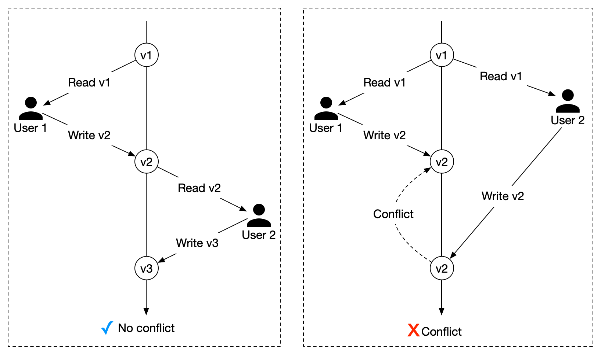

# 이벤트 소싱 2

**이벤트 소싱 장점**

- 이벤트 소싱은 애그리게이트의 상태 변화를 기록할 수 있다는 장점

**이벤트 소싱 단점**

- 이벤트 개수가 많아질수록 리플레이 시간이 증가하고 시스템이 사용할 수 있는 메모리 제약으로 모든 이벤트를 한번에 조회하는데 한계가 있다.

- 같은 애그리게이트를 동시에 변경하는 경우 마지막 커밋이 이전 커밋을 덮어쓰는 문제가 존재한다.

마이크로서비스 아키텍처는 하나의 서비스가 모든 기능을 제공하지 않고 여러 서비스간 협력이 필요한데 레거시 시스템과 협력도 필요합니다.

시스템을 운영하면서 변경요청으로 속성을 추가하거나 삭제하는 이벤트 타입의 변화 또한 고려해야 합니다.

# 4.1 도메인 객체 라이프사이클

애그리게이트의 라이프사이클 중 생성과 소멸에 대해 알아봅니다.

## 4.1.1 애그리게이트 생성

애그리게이트를 구성하는 엔티티와 값 객체는 모두 파라미터를 가지는 메소드를 제공하고 상태가 변할 때 이벤트를 발생시킵니다.

마찬가지로 애그리게이트 생성도 커맨드를 이용하고 도메인 이벤트를 발생시켜야 합니다.

```java
public class CreateCart {
    private String cartId;
}

public class CartCreated extends Event {
    private String cartId;
}

public class Cart {
    public Cart(CreateCart command) {
        this.apply(new CreateCart(command.getId()));
    }

    private void on(CartCreated event) {
        this.cartId = event.getCartId();
    }
}
```

카트 애그리게이트를 생성하기 전에 cartId 로 Cart 가 이미 생성됐는지 확인해야 하는데 이 기능은 애플리케이션 서비스인 CartService의 책임입니다.

Cart 생성자를 호출하기 전에 같은 식별자를 가진 Cart 가 있는지 확인하고 있으면 예외를 던집니다.

```java
public class CartService {
    private final CartStore cartStore;

    public String createCart(CreateCart command) {
        if (this.cartStore.exists(command.getCartId())) {
            throw new IllegalAccessException(command.getId());
        }

        Cart cart = new Cart(command);
        this.cartStore.save(cart);
    }
}

public CartStore {
    public boolean exists (String cartId){
        return this.cartRepository.existsById(cartId);
    }
}
```

## 4.1.2 애그리게이트 삭제

애그리게이트 삭제시 데이터를 직접 삭제하면 애그리게이트 변경 내역인 도메인 이벤트도 모두 사라지므로 사용자의 행위를 추적할 수 없습니다.

데이터 보호 및 규정 요구사항을 충족하기 위해 애그리게이트를 삭제하지 않아도되는 상황에서 도메인 이벤트를 삭제하면 이벤트 소싱의 장점을 포기하는 것과 같습니다.

데이터 관점에서 이벤트 소싱은 직접 삭제하지 않고 삭제됐다고 표기하는 Soft Delete 로 이력을 유지합니다.


삭제됨으로 상태를 변경하는 markDelete 메소드를 애그리게이트에 추가합니다.
이 메소드는 삭제됐음을 의미하는 deleted 속성을 true로 변경하고 Deleted 이벤트를 발행합니다.

삭제하는 비즈니스 규칙이 있다면 markDelete 메소드 로직을 직접 변경해야 합니다.
하지만 markDelete 를 직접 사용하면 이벤트를 발행할 수 없습니다.
따라서 markDelete 메소드 접근자를 private 으로 변경하고 삭제 규칙을 검사하는 delete 메소드를 추가합니다.
추가한 delete 메소드는 삭제 조건을 검사하고 삭제할 수 있을 때 CartDeleted 이벤트를 생성한 후 이벤트 핸들러에서 markDelete 메소드를 호출합니다.

```java
public class Cart {
    private String cartId;
    private boolean deleted;

    public void delete() {
        // 삭제 조건 검사
        this.apply(new CartDeleted(this.cartId));
    }

    private void on(CartDeleted event) {
        this.martDelete();
    }
}
```

# 4.2 동시성과 이벤트 충돌

A와 B가 동시에 수정해 같은 속성을 변경할 때 나중에 처리된 요청이 이전 요청을 덮어쓰는 현상을 데이터베이스에서는 Lost Update 라 합니다.


애그리게이트가 제공하는 커맨드 핸들러를 동시에 호출해 발생한 이벤트가 같은 속성을 덮어쓰는 결과를 만들어 내기도 하지만 서로 다른 이벤트가 같은 속성을 덮어써서 일관성을 유지하지 못하기도 합니다. 이벤트 소싱에서
이와 같은 현상을 이벤트 충돌이라 합니다.

이벤트간 충돌을 해결하려면 동시성 메커니즘을 이해해야 합니다.

### 비관적 잠금

비관적 잠금에서 트랜잭션은 많은 충돌이 발생한다고 가정하고 데이터베이스가 제공하는 잠금 기능을 사용합니다.

데이터베이스 잠금은 어떤 프로세스가 데이터 변경을 목적으로 조회를 요청하고 변경을 완료할 때까지 다른 프로세스가 해당 데이터에 접근하지 못하게 합니다.


### 낙관적 잠금

트랜잭션은 충돌이 발생하지 않는다고 가정하고 데이터를 변경하는 시점에만 잠금을 사용합니다.
낙관적 잠금은 버전 컬럼을 비교해 데이터 조회 후 업데이트를 요청하는 사이에 변경이 있었는지 확인합니다.



낙관적 잠금을 사용하려면 변경 요청 시 사용자 인터페이스가 애그리게이트의 현재 버전 값을 알고 있어야 합니다.

따라서 사용자가 애그리게이트를 조회하면 백엔드는 현재 버전 값을 포함한 결과를 반환 ① 해야 합니다.

사용자가 애그리게이트 내용을 확인하고 변경을 요청하면 사용자 인터페이스는 애그리게이트의 버전을 커맨드에 포함 ② 해 백엔드에 전달합니다.


```java
public class CartService {
    public void addItem(String cartId, long version, String productNo, int quantity) {
        Cart foundCart = this.cartStore.load(cartId);
        if (version != foundCart.getVersion()) {
            throw new AlreadyChangedException();
        }
        foundCart.addItem(productNo, quantity);
        foundCart.setVersion(version++);
        this.cartStore.save(foundCart);
    }
}
```

이벤트 충돌을 감지하기 위해 애플리케이션 서비스에서 버전을 비교하면 많은 코드가 중복되고 유지보수를 어렵게 만듭니다.
이 문제는 JPA 가 제공하는 낙관적 동시성 메커니즘을 활용해 손쉽게 해결할 수 있습니다.

# 4.3 재수화 성능과 스냅샷

재수화는 애그리게이트에서 발생한 도메인 이벤트가 많을수록 시간이 증가하기 때문에 성능에 직접적인 영향을 줍니다.
또한 재수화 동안 일시적으로 도메인 이벤트 인스턴스를 메모리에 올려야 하지만 사용할 수 있는 메모리 사이즈에 한계가 있어 OOM 예외가 발생할 수 있습니다.

재수화 성능을 향상시키면서 메모리를 효율적으로 사용하기 위한 방법이 스냅샷입니다.
스냅샷은 발생한 이벤트들 중 특정 이벤트까지 리플레이한 결과를 저장해 놓은 일종의 메모이제이션입니다.
재수화는 스냅샷이 있으면 스냅샷에서 애그리게이트로 직접 재구성하고 스냅샷을 생성한 시점 이후에 발생한 도메인 이벤트만 리플레이합니다.


## 4.3.1 스냅샷 생성

이벤트 소싱도 하나의 도메인입니다.

따라서 연관 관계를 갖는 값 객체로 Snapshot 클래스를 모델에 추가합니다.

Snapshot 클래스는 특정 시점의 Cart 객체를 JSON 으로 직렬화한 문자열과 스냅샷 생성 시간을 포함합니다.

생성 시간은 스냅샷 생성 이후에 발생한 도메인 이벤트를 조회하는데 사용합니다.

이 시간은 스냅샷을 생성한 시스템의 시간이 아닌 스냅샷 생성에 사용한 마지막 도메인 이벤트가 발생한 시간임에 주의해야 합니다.


이벤트와 마찬가지로 스냅샷도 데이터베이스에 저장합니다.
CartJpo 에 Snapshot 을 저장하기 위한 속성을 추가로 선언합니다.
단순함을 유지하기 위해 CartJpo 에 Snapshot 클래스의 payload를 SNAPSHOT_PAYLOAD 컬럼과 매핑하고 time 을 SNAPSHOT_TIME 컬럼으로 매핑합니다.
속성 개수가 많거나 복잡한 애그리게이트 객체를 직렬화하려면 JSON 문자열이 데이터베이스 컬럼 최대 사이즈보다 길어질 수 있으므로 SNAPSHOT_PAYLOAD 컬럼의 데이터 타입을 CLOB 으로 선언합니다.

```java

@Entity
public class CartJpo {
    @Id
    private String cartId;
    @Lob
    @Column(name = "SNAPSHOT_PAYLOAD")
    private String snapshot;
    private long snapshotTime;
}
```

스냅샷 속성을 매핑한 TB_CART 테이블에 SNAPSHOT_PAYLOAD 와 SNAPSHOT_TIME 컬럼을 추가합니다.

Cart 애그리게이트에 현재 상태를 Snapshot 객체로 반환하는 snapshot 메소드를 추가합니다.

```java
public class Cart {
    public Snaphost snapshot() {
        long time = this.events.get(this.events.size() - 1).time();
        return new Snapshot(JsonUtil.toJson(this), time);
    }
}
```

## 4.3.2 재수화 제외 이벤트

애그리게이트에서 발생한 모든 도메인 이벤트를 리플레이할 필요는 없습니다.
예를 들어 사용자가 로그인하면 Authenticated 또는 loggedIn 이벤트가 발생하지만 리플레이해서 얻을 수 있는 이득은 없습니다.

리플레이할 이벤트와 그렇지 않은 이벤트를 구분하면 리플레이 대상이 아닌 이벤트가 많이 발생하는 애그리게이트에서 성능 향상을 기대할 수 있습니다.

리플레이 대상 이벤트를 구별하는 용도로 Event 추상 클래스에 rehydration 속성을 추가합니다.
애그리게이트에서 발생하는 이벤트 중 리플레이에서 제외할 이벤트가 적으면 생성자에서 기본값을 true 로 할당해 재수화 대상으로 설정하고 구체적인 도메인 이벤트 생성자에서 선택적으로 false 를 할당합니다.

```java
import java.util.UUID;

public abstract class Event {
    private String eventId;
    private long time;
    protected boolean rehydration;

    public Event() {
        this.eventId = UUID.randomUUID().toString();
        this.time = System.currentTimeMillis();
        this.rehydration = true;
    }
}
```

사용자가 로그인을 시도하면 애플리케이션 서비스는 email로 User 를 조회하고 authenticate 메소드를 호출합니다.

```java
public class AuthenticationService {
    public void authenticate(Authenticate command) {
        User user = this.userStore.load(command.getEmail());
        user.authenticate(command);
    }
}
```

Authenticated 도메인 이벤트를 재수화 대상에서 제외시키기 위해 생성자에서 rehydration 속성을 false 로 할당합니다.

```java
public class Authenticated extends Event {
    private String userId;
    private long time;

    public Authenticated(String userId) {
        super();
        this.userId = userId;
        this.rehydration = false;
    }
}
```

이벤트 테이블인 TB_USER_EVENT 와 매핑한 UserEventJpo 에 rehydration 속성을 추가하고 REHYDRATION 컬럼과 매핑합니다.

```java

@Entity
public class UserEventJpo {
    @Id
    private String eventId;
    private String userId;
    private String type;

    @Lob
    private String payload;
    private long time;

    private boolean rehydration;
}
```

이벤트 저장소인 UserStore 가 제공하는 load 메소드에는 영향이 없고 UserEventJpo 를 조회하는 UserEventRepository 에서 rehydration 컬럼의 값이 true 인 레코드만
조회하게, find 로 시작하는 오퍼레이션에 rehydration 파라미터를 추가하고 UserStore 에서 호출할 때 파라미터로 false 를 전달합니다.

```java
public interface UserEventRepository extends JpaRepository<UserEventJpo, String> {
    findByUseridAndRehydrationOrderByTimeAsc(String userId, boolean rehydration);
}
```

# 4.4 스냅샷 생성 전략

스냅샷 생성 원칙은 없지만 주기적인 시간을 초과해 이벤트가 발생했을 때 생성하는 것을 기본 전략으로 사용합니다.
이벤트 발생 빈도가 높은 애그리게이트는 더 짧은 주기로 스냅샷을 생성할 수도 있습니다.
유스케이스를 고려했을 때 3가지 스냅샷 전략 중에서 선택할 수 있습니다.

- 주기적인 시간 - 스냅샷을 생성하고 정해진 시간을 초과해 이벤트가 발생했을 경우


- 매 N번째 이벤트 - 매 N번째 도메인 이벤트가 발생했을 경우


- 도메인 이벤트 - 특정 도메인 이벤트가 발생했을 경우

## 4.4.1 주기적인 시간

스냅샷을 생성한 후 지정된 시간이 초과했을 때 새로운 스냅샷을 생성합니다.
애그리게이트는 지정한 시간을 초과했는지 검사하기 위해 마지막 스냅샷을 생성한 시간을 알아야 합니다.

저장해야 하는 도메인 이벤트 중 마지막 이벤트가 발생한 시간과 스냅샷 생성 시간을 비교해 지정한 시간을 초과했는지 확인합니다.

```java
public class Cart {
    private Optional<Snapshot> snapshot;

    public void takeSnapshot() {
        long eventTime = this.events.get(this.events.size() - 1).time();

        if (snapshot.isEmpty()) {
            this.snapshot = Optional.of(
                    new Snapshot(JsonUtil.toJson(this), currentTime)
            );
        }
        // Snapshot 클래스의 time과 저장해야 하는 마지막 도메인 이벤트 시간을 비교 했을 때  
        // 지정한 시간을 초과했으면 snapshot 객체를 다시 생성 
        if (snapshot.isPresent() && eventTime - snapshot.get().getTime() > 600_000) {
            this.snapshot = Optional.of(
                    new Snapshot(JsonUtil.toJson(this), eventTime)
            );
        }
    }
}
```

## 4.2.2 매 N번째 이벤트

매 N 번째 이벤트가 발생할 때 스냅샷을 생성합니다.
애그리게이트에서 발생한 이벤트 횟수를 기록해놓고 % 연산자를 사용한다.


```java
import java.util.Optional;

public class Cart {
    public List<Event> events;
    private long sequence;

    private Optional<Snapshot> snapshot;

    public void takeSnapshot() {
        long eventTime = this.events.get(this.events.size() - 1).time();
        if (sequence % 10 == 0) {
            this.snapshot = Optional.of(
                    new Snapshot(JsonUtil.toJson(this), eventTime, this.sequence)
            );
        }
    }
}
```

커맨드와 이벤트가 반드시 일대일 관계가 아닐 수 있으므로 % 연간 결과가 0이 아닌 값이 계속되어 스냅샷이 생성되지 못하는 문제를 주의해야 합니다.

## 4.4.3 도메인 이벤트

설계 시 스냅샷을 생성할 이벤트를 결정합니다.

예를 들어 Order 애그리게이트는 배송완료 이벤트가 발생했을 때 스냅샷을 생성합니다.

대부분의 주문은 배송 완료하면 더 이상 이벤트가 발생하지 않고 반품/교환처럼 일부 주문에서만 이후 프로세스와 연관된 이벤트가 발생하기 때문입니다.


```java
import java.util.Optional;
import javafx.event.Event;

public class Order {
    private List<Event> events;
    private Optional<Snapshot> snapshot;
    private long sequence;

    public void takeSnapshot() {
        long eventTime = this.events.get(this.events.size() - 1).time();
        if (hasSnapshotEvent()) {
            this.snapshot = Optional.of(new Snapshot(
                    JsonUtil.toJson(this), eventTime, this.sequence
            ));
        }
    }

    private boolean hasSnapshotEvent() {
        boolean result = false;

        for (Event event : events) {
            if (OrderDelivered.class.isAssignableFrom(event.getClass())) {
                result = true;
                break;
            }
        }

        return result;
    }
}
```

# 4.5 이벤트 소싱과 상수

시스템은 시간이 지나면서 변경이 필요한데 상수 값이 변하기도 합니다.

도메인에 선언한 상수를 이용해 어떤 결과를 도출하는 비즈니스 규칙이 있습니다.

예를 들어 커머스 도메인에서 구매 금액의 특정 비율을 포인트로 적립하는 규칙이 존재한다고 가정합니다.

12월 한달간 특별 포인트로 1% 가 아닌 5%로 적립하는 연말 프로모션을 진행하기로 했고 해당 상수를 0.05로 변경했습니다.

11월, 12월, 1월 모두 구매 이력이 있는 고객의 포인트를 리플레이하면 예상한 포인트가 아닌 이해할 수 없는 결과를 반환합니다.

12월과 1월을 구분해야 하는데 리플레이 하는 시점의 상수를 0.01을 사용했기 때문입니다.

이 문제는 아래와 같이 해결할 수 있습니다.

1. 기간으로 구분한 프로모션 상수 도입하기

기간별로 적립 비율을 계산하도록 구현해 문제를 해결할 수 있다.
하지만 현실적으로 유지보수가 불가능하다.

2. 상수를 포함한 도메인 이벤트 발행하기

상수를 도메인 이벤트에 추가하면 이벤트 핸들러에서 이벤트가 발생했을 당시 적립율 상수로 해당 주문의 적립금을 계산할 수 있다.

3. 계산 결과를 포함하는 도메인 이벤트 발행하기

이벤트를 리플레이할 때 이벤트 핸들러가 다시 포인트를 계산할 필요가 없어 약간의 성능 향상이 가능하다.

4. 적립율과 계산 결과를 도메인 이벤트에 포함시킨다.

적립율과 계산 결과 둘다 존재하므로 다양한 시각에서 데이터를 확인하고 분석할 수 있다.

# 4.6 도메인 이벤트와 버전

사용 중인 도메인 이벤트에 속성을 추가하거나 삭제해야 하기도 합니다.

이벤트에 속성 추가와 삭제처럼 이벤트의 타입이 변하는 사례에 대응하는 방법을 알아봅니다.

## 4.6.1 업캐스팅

일부 요구사항은 이벤트 소싱을 적용한 서비스에서 다양한 문제를 발생시킵니다.

새로운 요구사항이 추가됐고 다음과 같이 두 가지 변화가 필요하다고 가정합니다.

- 새로운 속성을 추가한다.


- 더 이상 사용하지 않는 속성을 제거한다.

이벤트 스토어에 기록한 도메인 이벤트는 과거에 발생한 사건으로 불변이므로 원칙적으로 이벤트 내용을 수정할 수 없습니다.

하지만 요구사항 변경은 피할 수 없고 변경 요청은 이미 선언해 사용 중인 이벤트 클래스에 영향을 줄 수밖에 없습니다.

도메인 이벤트 추가는 리플레이를 위해 주문 애그리게이트에 과거 버전의 이벤트를 처리하는 on 외에 현재 버전의 이벤트를 처리하는 이벤트 핸들러 메소드를 추가해야 합니다.

```java
public class Order {
    private String orderNo;
    private long time;
    private String cause;

    private void on(OrderCanceled event) {
        this.time = System.currentTimeMillis();
    }

    private void on(OrderCanceledV2 event) {
        this.time = System.currentTimeMillis();
        this.cause = event.getCause();
    }
}
```

계속된 변경 요청은 V3, V4 로 네이밍한 도메인 이벤트 타입을 추가하고 주문 애그리게이트는 도메인 이벤트의 버전 수만큼 on 메소드를 추가해야 합니다.

오래돼 더 이상 사용하지 않는 이벤트 핸들러를 삭제하지 못하고 계속 유지해야 합니다.

더 이상 사용하지 않는 이벤트 핸들러를 제거할 수 있는 방법이 필요합니다.

## 4.6.2 업캐스터

이벤트 스토어에 기록한 변경 불가능한 과거 버전의 도메인 이벤트를 현재 버전으로 변환하는 것을 업캐스팅이라 하고 과거 버전의 이벤트를 현재 버전 이벤트로 변환하는 책임을 가진 클래스를 업캐스터라고 합니다.

업캐스터는 과거 이벤트를 변경하지 않고 현재 이벤트로 변환하는 단 한 가지 책임만 가집니다.


업캐스터는 이전 버전의 도메인 이벤트를 현재 버전으로 변환하므로 주문 애그리게이트는 오래된 버전의 도메인 이벤트를 처리하면서 더 이상 사용하지 않는 이벤트 핸들러를 삭제할 수 있습니다.

```java
public class OrderEventUpcaster {
    public static OrderCanceledV3 upcast(OrderCanceled event) {
        return new OrderCanceledV3(event.getOrderNo(), event.getTime);
    }

    public static OrderCanceledV3 upcast(OrderCanceledV2 event) {
        return new OrderCanceledV3(event.getOrderNo(), event.getTime, true);
    }
}
```

응집도를 높이기 위해 동일 이벤트의 버전은 하나의 업캐스터 클래스가 처리하는 것이 좋습니다.

반대 케이스는 테이블의 컬럼을 삭제하는 것과 같습니다.
더 이상 사용하지 않는 속성을 삭제하는 경우에도 같은 방식으로 업캐스팅 코드를 변경할 수 있습니다.

업캐스터는 이벤트 객체에서 속성 이름을 변경하는 경우에도 사용할 수 있습니다.

업캐스터는 도메인 객체가 아닌 데이터와 관련된 기술적인 요소입니다.

기술 요소가 도메인 이벤트를 자세히 알고 있어야 하는 의존성은 문제가 되지 않습니다.

업캐스팅은 이전 또는 오래된 버전의 도메인 이벤트에서 새 버전의 도메인 이벤트로 변환하는 규칙이 존재할 떄만 적용할 수 있습니다.

변환 규칙을 적용할 수 없으면 도메인 이벤트는 버전 변경이 아닌 새로운 이벤트로 선언해야 합니다.

## 4.6.3 중간 이벤트

업캐스터는 오래된 버전 이벤트를 코드베이스에서 완전히 제거할 수 없는 단점이 있습니다.

오래된 버전의 이벤트를 제거하기 위해 중립적인 포맷을 사용할 수 있습니다.

먼저 이벤트 스토어에 이벤트 버전을 저장하고 업캐스팅할 수 있는지 확인하는데 사용합니다.

```sql
CREATE TABLE TB_ORDER_EVENT
(
    EVENT_ID   VARCHAR(255),
    EVENT_TYPE VARCHAR(255),
    REVISION   VARCHAR(10)
);
```

오래된 도메인 이벤트를 처리하기 위해 IntermediateEvent 클래스로 중립적인 포맷을 선언합니다.

이 클래스는 도메인 이벤트의 타입명과 업캐스팅할 내용을 JSON 객체로 보관합니다.

마지막으로 이벤트 버전(revision) 속성도 필요합니다.

```java
import javafx.event.Event;

public class IntermediateEvent {
    private String id;
    private String typeName;
    private ObjectNode payload;
    private String revision;

    public Event toEvent() {
        Event result = null;

        try {
            Class clazz = Class.forName(this.typeName);
            result = (Event) JsonUtil.fromJson(JsonUtil.toJson(payload), clazz);
        } catch (ClassNotFoundException exception) {
            exception.printStackTrace();
        }

        return result;
    }
}
```

도메인 이벤트 버전 속성을 Event 클래스에 추가합니다.
이제 모든 이벤트는 기본 버전으로 1을 가집니다.
주문 이벤트 스토어인 OrderStore 는 이벤트를 저장할 때 revision 을 컬럼에 저장합니다.

```java
public abstract class Event {
    private String revision = "1";
}
```

이제 특정 버전에서 새로운 버전으로 한 번에 하나씩 업캐스팅하는 책임을 가진 인터페이스를 선언합니다.

이 인터페이스는 업캐스팅이 필요한지 확인하는 canUpcast 오퍼레이션과 실제 업캐스팅 로직을 구현하는 cast 오퍼레이션을 포함합니다.

```java
public interface Caster {
    boolean canUpcast(IntermediateEvent event);

    IntermediateEvent cast(IntermediateEvent event);
}
```

마지막으로 Caster 인터페이스를 구현할 객체를 사용해 일련의 업캐스팅을 처리하는 Upcaster 를 리팩토링합니다.

initialize 메소드는 Caster 인터페이스를 구현한 객체의 목록을 초기화해 업캐스팅 환경을 구성합니다.

canUpcast 메소드는 업캐스팅 대상 이벤트임을 확인하는 구체적인 로직을 자식 클래스에서 구현합니다.

upcast 메소드를 호출하면 등록한 caster 를 반복적으로 호출해 최신 이벤트 버전으로 캐스팅합니다.

```java
import java.util.ArrayList;

public abstract class Upcaster {
    private List<Caster> casters;

    public Upcaster() {
        this.casters = new ArrayList<>();
        this.initialize();
    }

    public abstract void initialize();

    public abstract boolean canUpcast(IntermediateEvent event);

    protected void addCaster(Caster caster) {
        this.casters.add(caster);
    }

    public IntermediateEvent upcast(IntermediateEvent intermediateEvent) {
        IntermediateEvent intermediate = intermediateEvent;

        for (Caster caster : casters) {
            intermediate = caster.cast(intermediate);
        }

        return intermediate;
    }
}
```

## 4.6.4 이벤트 마이그레이션

도메인 이벤트는 과거에 발생한 사건이고 불변입니다.
하지만 업캐스팅 로직이 너무 복잡해서 성능에 큰 영향을 준다면 전체 이벤트를 현재 버전으로 마이그레이션하는 전통적인 접근법을 선택할 수 있습니다.

마이그레이션은 데이터베이스에 직접 접근해 프로그래밍 방식으로 수행하거나 ETL 전용 도구를 사용할 수 있습니다.
이 전략은 구 버전 이벤트를 유지하면서 새로운 버전의 이벤트를 추가하는 방식으로 마이그레이션하거나 구 버전을 유지하지 않고 덮어쓰는 방법 중 선택할 수 있습니다.


## 4.6.5 이벤트 버전과 스냅샷

도메인 이벤트의 버전이 변경되면 스냅샷도 영향을 받습니다.
이미 생성한 스냅샷을 업캐스팅하는 것도 비즈니스 규칙에 따라 고려사항이 많아 복잡도가 급격하게 증가합니다.

결과적으로 스냅샷 자체를 업캐스팅하는 것은 불가능에 가깝습니다.
따라서 과거 발생한 전체 도메인 이벤트를 다시 리플레이해 새로운 스냅샷을 만드는 것이 현실적인 방법입니다.

# 4.7 마이크로서비스 모듈

오래된 이벤트를 현재 버전으로 변환하는 Upcaster 객체는 store/upcast 패키지에 둡니다.
초기에는 OrderEventUpcaster 가 모든 이벤트 버전을 캐스팅하지만 특정 이벤트 버전이 너무 많아지면 OrderCanceledUpcaster 처럼 특정 이벤트 버전만 변환하는 전용 Upcaster 로
분리할 수 있습니다.

# 4.8 다건 처리 (반복문) 와 성능

반복문을 사용해 다수 애그리게이트를 처리하는 로직은 애그리게이트 조회와 처리 시 성능 이슈가 발생합니다.

# 4.8.1 병렬 처리

성능 개선은 애그리게이트를 이벤트 저장소에서 조회하거나 반대로 이벤트 저장소에 저장하는데 사용하는 시간이 아닌 애그리게이트 생성, 변경, 삭제를 위한 유효성 검사와 같은 비즈니스 로직으로 한정합니다.

이런 제약을 두는 것은 대부분의 시스템에서 저장소와 관련된 행위를 단일 트랜잭션으로 처리하기 때문입니다.

# 4.8.2 캐싱

이벤트 소싱에서 캐싱은 리플레이 횟수를 감소시킵니다.

다양한 캐싱 알고리즘이 있지만 LRU 를 주로 사용합니다.

# 4.9 데이터 마이그레이션

기존 시스템을 이벤트 소싱을 적용해 구축하는 경우 데이터 마이그레이션을 고려해야 합니다.

마지막 상태만 기록하고 있는 기존 시스템의 데이터를 마이그레이션할 때 Legacy Migrated 와 같은 1회성 이벤트를 사용합니다.

기존 시스템이 데이터 중심으로 설계돼 있으면 테이블과 애그리게이트간 매핑이 필요합니다.

하나의 테이블을 애그리게이트로 정확하게 매핑할 수 있다면 가장 적은 노력으로 마이그레션을 위한 도메인 이벤트로 변환할 수 있습니다.

그렇지 않으면 테이블과 마이그레이션용 도메인 이벤트 변환에 더 많은 노력이 필요합니다.


하나의 테이블을 다수의 마이그레이션 이벤트로 분리하기도 합니다.

고객 테이블에 고객 정보와 개인 환경 설정이 함께 존재하고, 새로운 서비스에 고객과 고객 설정을 애그리게이트로 분리했다면 하나의 테이블에서 두 개의 마이그레이션 이벤트를 생성해야 합니다.


반대로 여러 테이블에 있는 값들을 조합해 하나의 마이그레이션 이벤트로 통합하기도 합니다.

하나의 이벤트로 통합하는 경우는 기존 시스템이 성능 개선을 위해 데이터 중복을 허용하면서 테이블을 분리한 사례에서 자주 볼 수 있습니다.


# 4.10 백업과 아카이빙

이벤트 소싱을 적용하면 짧은 시간 시스템을 운영해도 많은 이벤트를 데이터베이스에 기록합니다.

특히 짧은 라이프사이클을 가지는 애그리게이트를 많이 관리하는 시스템은 삭제 플래그로 변경한 사용하지 않는 데이터가 남아 스토리지를 비효율적으로 사용하게 됩니다.

애그리게이트의 스냅샷 생성에 사용한 이전 이벤트 또한 스토리지를 낭비하는 요인 중 하나입니다.

주기적인 아카이빙을 이용해 스토리지를 효율적으로 활용할 수 있습니다.

이벤트 스토어를 아카이빙하기 위해 실시간 복제를 지원하는 데이터베이스 사용을 고려할 수 있습니다.

# 4.11 이벤트 소싱과 추상화된 핵심

모든 애그리게이트에 이벤트 소싱을 적용하기 위해 코드를 중복시키면 기능 추가나 개선이 필요할 때 모든 애그리게이트 클래스를 찾아 변경해야 합니다.

따라서 기능 또는 구조를 일반화할 필요가 있습니다.

재사용 가능한 이벤트 소싱 라이브러리를 도입해 중복을 제거할 수 있습니다.
