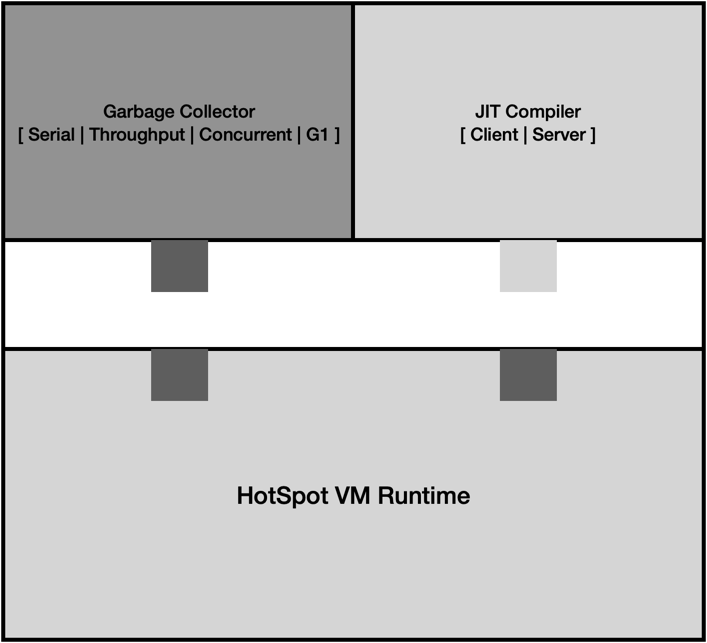

# HotSpot VM은 어떻게 구성되어 있을까?
자바를 만든 Sun에서는 자바의 성능을 개선하기 위해서 Just In Time (JIT) 컴파일러를 만들었고 이름을 HotSpot으로 지었다.
여기서 JIT 컴파일러는 프로그램의 성능에 영향을 주는 지점에 대해서 지속적으로 분석한다.
분석된 지점은 부하를 최소화하고 높은 성능을 내기 위한 최적화의 대상이 된다.

HotSpot VM은 세 가지 주요 컴포넌트로 되어 있다.
- VM 런타임
- JIT 컴파일러
- 메모리 관리자

HotSpot VM 아키텍처

'HotSpot VM 런타임'에 'GC 방식'과 'JIT 컴파일러'를 끼워 맞춰 사용할 수 있다.
이를 위해서 'VM 런타임'은 JIT 컴파일러용 API와 가비지 컬렉터용 API를 제공한다. 
그리고 JVM을 시작하는 런처와 스레드 관리 JNI 등도 VM 런타임에서 제공한다.

# JIT Optimizer 란?
자바는 javac 라는 컴파일러를 사용한다.
이 컴파일러는 소스코드를 바이트 코드로 된 class라는 파일로 변환해준다.
JVM은 항상 바이트 코드로 시작하며 동적으로 기계어에 의존적인 코드로 변환한다.

모든 코드는 초기에 인터프리터에 의해서 시작되고 해당 코드가 충분히 많이 사용될 경우 컴파일할 대상이 된다.
HotSpot VM 에서 이 작업은 각 메서드에 있는 카운터를 통해서 통제되며 메서드에는 두 개의 카운터가 존재한다.

- 수행 카운터 (invocation counter) : 메서드가 시작할 때마다 증가
- 백에지 카운터 (backedge counter) : 높은 바이트 코드 인덱스에서 낮은 인덱스로 컨트롤 흐름이 변경될 때마다 증가

여기서 백에지 카운터는 메서드 루프가 존재하는지를 확인할 때 사용되며 수행 카운터 보다 컴파일 우선순위가 높다.

이 카운터들이 인터프리터에 의해서 증가될 때마다 그 값들이 한계치에 도달했는지를 확인하고 도달했을 경우 인터프리터는 컴파일을 요청한다.

컴파일이 요청되면 컴파일 대상 목록의 큐에 쌓이고 하나 이상의 컴파일러 스레드가 이 큐를 모니터링한다.
만약 컴파일러 스레드가 바쁘지 않을 때는 큐에서 대상을 빼내서 컴파일을 시작한다.
컴파일이 종료되면 컴파일된 코드와 메서드가 연결되어 그 이후부터는 메서드가 호출되면 컴파일된 코드를 사용하게 된다.

# JVM이 시작할 때의 절차
1. java 명령어 줄에 있는 옵션 파싱
2. 자바 힙 크기 할당 및 JIT 컴파일러 타입 지정
3. CLASSPATH와 LD_LIBRARY_PATH 같은 환경 변수 지정
4. 자바의 Main 클래스가 지정되지 않았으면 Jar 파일의 manifest 파일에서 Main 클래스를 확인한다.
5. JNI 표준인 API인 JNI_CreateJavaVM를 사용하여 새로 생성한 non-primordial이라는 스레드에서 HotSpotVM을 생성한다.
6. HotSpotVM이 생성되고 초기화되면 Main 클래스가 로딩된 런처에서는 main() 메서드의 속성 정보를 읽는다.
7. CallStaticVoidMethod는 네이티브 인터페이스를 불러 HotSpotVM에 있는 main() 메서드가 수행된다. 이때 자바 실행 시 Main 클래스 뒤에 있는 값들이 전달된다.

# JVM 종료 절차
1. HotSpot VM이 작동중인 상황에서는 단 하나의 데몬이 아닌 스레드가 수행될 때까지 대기한다.
2. java.lang 패키지에 있는 Shutdown 클래스의 shutdown() 메서드가 수행된다. 이 메서드가 수행되면 자바 레벨의 shutdown hook 이 수행되고 finalization-on-exit이라는 값이 true일 경우에 자바 객체 finalizer를 수행한다.
3. HotSpot VM 레벨의 shutdown hook을 수행함으로써 HotSpot VM의 종료를 준비한다. 이 작업은 JVM_OnExit() 메서드를 통해서 지정된다. 그리고 HotSpot VM의 profiler, stat sampler, watcher, garbage collector 스레드를 종료시킨다. 이 작업들이 종료되면 JVMTI를 비활성화하며 Signal 스레드를 종료시킨다.
4. HotSpot의 JavaThread::exit() 메서드를 호출하여 JNI 처리 블록을 해제한다. 그리고 guard pages 스레드 목록에 있는 스레드를 삭제한다. 이 순간부터는 HotSpot VM에서는 자바 코드를 실행하지 못한다.
5. HotSpot VM 스레드를 종료한다. 이 작업을 수행하면 HotSpot VM에 남아있는 HotSpot VM 스레드들을 safepoint로 옮기고 JIT 컴파일러 스레드들을 중지시킨다.
6. JNI, HotSpot VM, JVMTI barrier에 있는 추적 기능을 종료시킨다.
7. 네이티브 스레드에서 수행하고 있는 스레드들을 위해서 HotSpot의 vm exited 값을 설정한다.
8. 현제 스레드를 삭제한다.
9. 입출력 스트림을 삭제하고 PerfMemory 리소스 연결을 해제한다.
10. JVM 종료를 호출한 호출자로 복귀한다.

# 클래스 로딩 절차
1. 주어진 클래스의 이름으로 클래스 패스에 있는 바이너리로 된 자바 클래스를 찾는다.
2. 자바 클래스를 정의한다.
3. 해당 클래스를 나타내는 java.lang 패키지의 Class 클래스의 객체를 생성한다.
4. 링크 작업이 수행된다. 이 단계에서 static 필드를 생성 및 초기화하고 메서드 테이블을 할당한다.
5. 클래스의 초기화가 진행되며 클래스의 static 블록과 static 필드가 가장 먼저 초기화된다.
