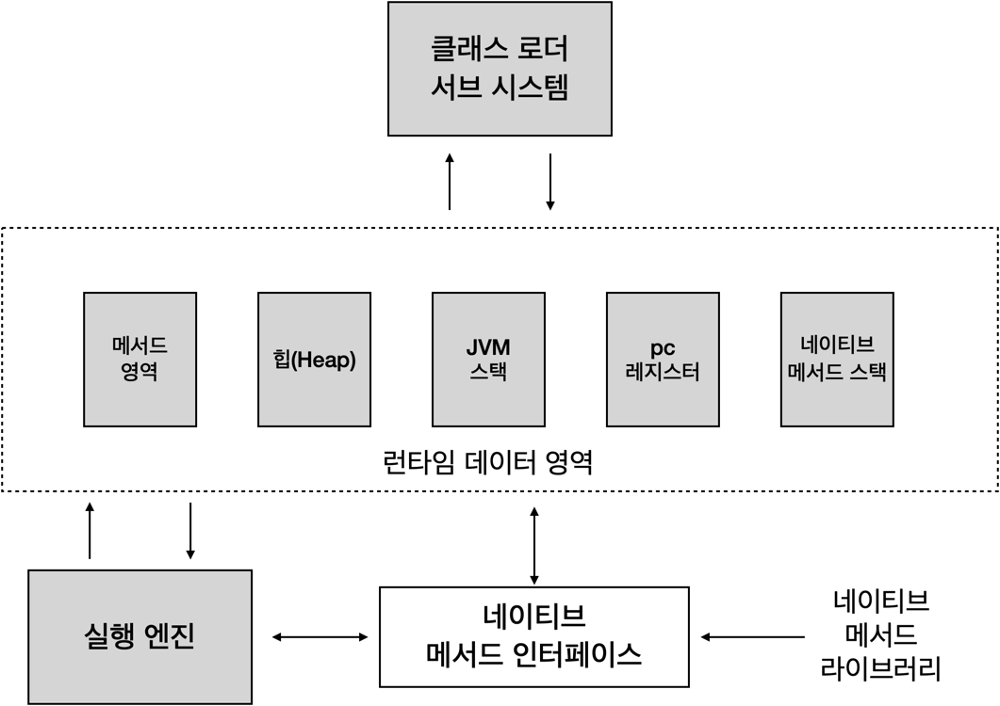

 # 자바의 Runtime Data Area
 

- Heap 메모리

클래스 인스턴스 배열이 이 메모리에 쌓인다.
이 메모리는 공유 메모리 라고도 불리우며 여러 스레드에서 공유하는 데이터들이 저장되는 메모리다.

- Non-heap 메모리

이 메모리는 자바의 내부 처리를 위해서 필요한 영역이다.

- 메서드 영역 : 메서드 영역은 모든 JVM 스레드에서 공유한다.
- JVM 스택 : 스레드가 시작할때 JVM 스택이 생성된다. 이 스택에는 메서드가 호출되는 정보인 프레임이 저장된다. 그리고 지역 변수와 임시 결과, 메서드 수행과 리턴에 관련된 정보들도 포함된다.
- 네이티브 메서드 스택 : 자바 코드가 아닌 다른 언어로 된 코드들이 실행하게 될 때의 스택 정보를 관리한다.
- PC 레지스터 : 자바의 스레드들은 각자의 pc 레지스터를 갖는다. 네이티브한 코드를 제외한 자바 코드들이 수행될 때 JVM의 인스트럭션 주소를 pc 레지스터에 보관한다.

# GC의 원리
GC 작업을 하는 가비지 콜렉터는 다음의 역할을 한다.
- 메모리 할당
- 사용 중인 메모리 인식
- 사용하지 않는 메모리 인식

## 자바의 Heap 메모리 영역

## GC 단계
1. 메모리 객체가 생성되면 Eden 영역에 객체가 지정된다.
2. Eden 영역에 데이터가 꽉 차면 Survivor 영역으로 옮겨간다.
3. Survivor 영역이 차면 GC가 되면서 Eden 영역에 있는 객체와 꽉찬 Survivor 영역에 있는 객체가 비어 있는 Survivor 영역으로 이동한다.
4. 이러한 작업을 반복하면서 Survivor 1과 2를 왔다 갔다 하던 객체들은 Old 영역으로 이동한다.
5. 만약 Survivor 영역의 크기보다 객체의 크기가 크다면 이런 객체들은 Eden 에서 바로 Old 영역으로 이동하게 된다.

# GC의 종류
GC는 크게 마이너 GC와 메이저 GC로 나뉜다.

- 마이너 GC : Young 영역에서 발생하는 GC
- 메이저 GC : Old 영역이나 Perm 영역에서 발생하는 GC

